# Lab 1 - Create and Use an Agent in Copilot Studio

In this lab, you will create a standalone agent using Microsoft Copilot Studio to assist **Contoso Real Estate** in handling property bookings more efficiently. You will define topics, configure Dataverse tables, and publish the agent to allow customers to discover booking information and submit requests online.  

## Lab Overview  

> [!IMPORTANT]
> Microsoft Copilot Studio is a constantly evolving product, with two major releases each year and many incremental updates throughout each calendar year. Whilst every effort has been made to ensure the accuracy of these steps and all screenshots, from time to time, certain instructions or screenshots may no longer resemble the current interface or experience. In case of any issues completing any step, please consult your instructors.

### 🎯 Goal   
- Create the **Dataverse tables** required for storing booking data.  
- Build a **standalone agent** in Copilot Studio for Contoso Real Estate.  
- Configure **Topics** to manage conversation flow for booking logic. 
- **Publish** the agent and make it available for users to interact with.  

### ✅ Prerequisites  

- If using a lab environment provided by your instructors:
   - Completion of all steps in [Lab 0 - Configure Lab Environment](Lab-0-Configure-Environment.md).
- Otherwise, if using your own environment:
   - Access to a Power Apps Developer environment with Copilot Studio enabled.  
   - A valid Copilot Studio license or trial license.  

> [!IMPORTANT]  
> Before starting, ensure your **Development** environment is active, selected, and accessible. All exercises in this lab will be completed in this environment.

### Scenario  

Having successfully setup your development environment for Copilot Studio, you've now been tasked by Contoso Real Estate to develop a digital agent that can streamline the property booking process. Your task is to design an agent that can:  
- Answer frequently asked questions about any booking.  
- Allow customers to request property viewings.  
- Store and manage booking details directly in Dataverse.  

### ⌛ Length  

This lab will take approximately **90 minutes** to complete.

---

## ✍️ Exercise 1: Create Dataverse Tables for Bookings

Our agent will be interacting with information stored in Dataverse which, primarily, will comprise of the various properties Contoso Real Estate currently have in their portfolio. Follow these steps to create a new custom table in Dataverse called **Real Estate Property** to capture this information.

> [!IMPORTANT]  
> Make sure you are working in your **Development** environment you created in Lab 0.

### Task 1: Create the Real Estate Properties table

1. Navigate to the [Power Apps Maker Portal](https://make.powerapps.com).  
2. In your **Development** environment, go to **Tables** -> **Create new tables**.

   

3. On the **Create new tables** page, click on **+ New table** -> **Add columns and data**.

   

5. Rename the table name from **Table1** -> **Real Estate Property** and then click on **Save and exit**. 

   

6. Click on **Save and exit** in the confirmation dialog.

   

7. Once saved, click on the **Custom** tab to find the newly created table there. Click on the **Real Estate Property** table.

   

8. Under the **Real Estate Property columns and data** heading, change the name of the column called **New Column** to **Property Name** and select **Save**.

> [!TIP]
> To rename the column, click on the dropdown next to **New Column** and select **Edit Column**.

   

9. Select the **+** button to add a new column in the **Columns and Data** pane. Then, in the **New column** pane, enter the following values, and then select **Save**:  
     - **Display name:** `Asking Price`  
     - **Data type:** `Currency`  

   

10. Add the following two additional columns:  

   | Display Name | Data Type |
   |---------------|------------|
   | Street | Single line of text *(default)* |
   | City | Single line of text *(default)* |

   

11. Add another column with the following values:  
    - **Display name:** `Bedrooms`  
    - **Data type:** Select **Choice** -> **Choice**  
    - Create the choice values as indicated below:  
      - Select **+ New choice** under **Sync this choice with**.  
      - Under **Choices**, provide the **Display name** as `Bedrooms`.  
      - You will see two entry fields titled **Label** and **Value**. Enter **1** under the Label. Power Apps assigns a value automatically, but you can change it to `1`.  
      - Select **+ New choice** and make `2` the new Label and Value entry.  
      - Select **+ New choice** and make `3` the new Label and Value entry.  
      - Select **+ New choice** and make `4` the new Label and Value entry.  
      - Select **+ New choice** and make `5` the new Label and Value entry.  
      - Select **Save**.  
      - Select the newly added choice **Bedrooms** by clicking the dropdown under **Sync this choice with**.  
      - Click **Save**.  

   

   

12. Select the **+** button to add a new column in the **Columns and Data** pane.  
13. In the **New column** pane, enter the following values, and then select **Save**:  
    - **Display name:** `Bathrooms`  
    - **Data type:** **Choice** -> **Choice**  
    - Create the choice values as indicated below:  
      - Select **+ New choice** under **Sync this choice with**.  
      - Under **Choices**, provide the **Display name** as `Bathrooms`.  
      - You will see two entry fields titled **Label** and **Value**. Enter **1** under the Label. Power Apps assigns a value automatically, but you can change it to `1`.  
      - Select **+ New choice** and make `2` the new Label and Value entry.  
      - Select **+ New choice** and make `3` the new Label and Value entry.  
      - Select **+ New choice** and make `4` the new Label and Value entry.
      - Select **+ New choice** and make `5` the new Label and Value entry.  
      - Select **Save**.  
      - Select the newly created choice **Bathrooms**, and then click **Save** again.  

   

14. Add another column by selecting the **+** button again in the **Columns and Data** pane.  
    - In the **New column** pane, enter the following values, and then select **Save**:  
      - **Display name:** `Client`  
      - **Data type:** Select **Lookup** -> **Lookup**  
      - **Related Table:** Select **Contact** from the dropdown.

   

15. Once all columns are created, under the **Real Estate Property** table, enter the following test data by selecting **Enter text**, **Enter number** etc. for each column:

> [!NOTE]  
> If the required columns are not displayed, adjust the list of visible columns by selecting the **+<number> more** label. Remove and add relevant columns to the view. Remove the highlighted checked items and add all of the columns you want to see.

| Property Name | Asking Price | Bathrooms | Bedrooms | City | Street | Client |
|----------------|--------------|------------|-----------|--------|---------|---------|
| 1100 High Villas | 250,000 | 3 | 2 | Redmond | Main Avenue | Select any contact |

   

   

16. Leave the Power Apps Maker Portal open if you plan to continue to the next task.

**✅ You have successfully added new columns and populated your Real Estate Property table!**

> [!NOTE]  
> Later in the lab, we will configure our agent to send out email notifications automatically whenever new booking requests are made.

### Task 2: Create the Bookings table

Next, we need to create a table to record all the property bookings that customers will potentially make. Proceed to create the table by following the steps below.

1. You should still be in the [Power Apps Maker Portal](https://make.powerapps.com) in your **Development** environment from the previous task. If not, navigate back to it now.
2. From the left navigation pane, select **Tables**, then **New table** -> **Create new tables**.  

   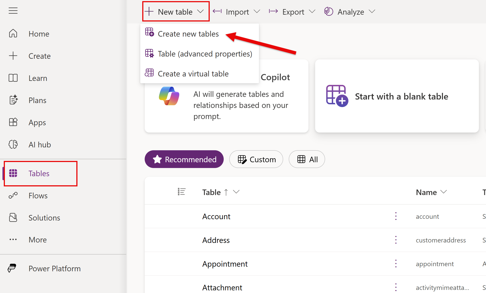

3. On the **Create new tables** screen, select **+ New table** -> **Add columns and data**.  

   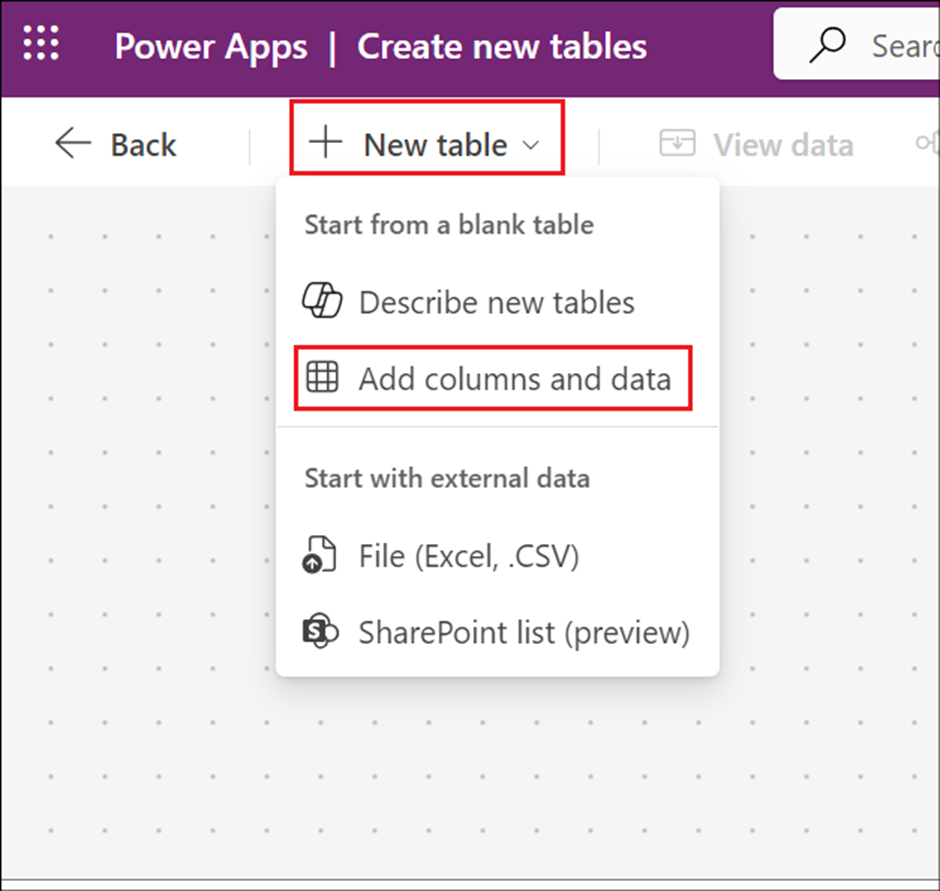

4. Rename the default table name from `Table1` to **Booking Request**, and then click **Save and exit**.  

   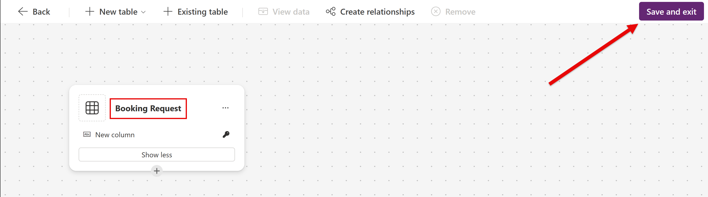

5. In the confirmation dialog, click **Save and exit** again to confirm.  

   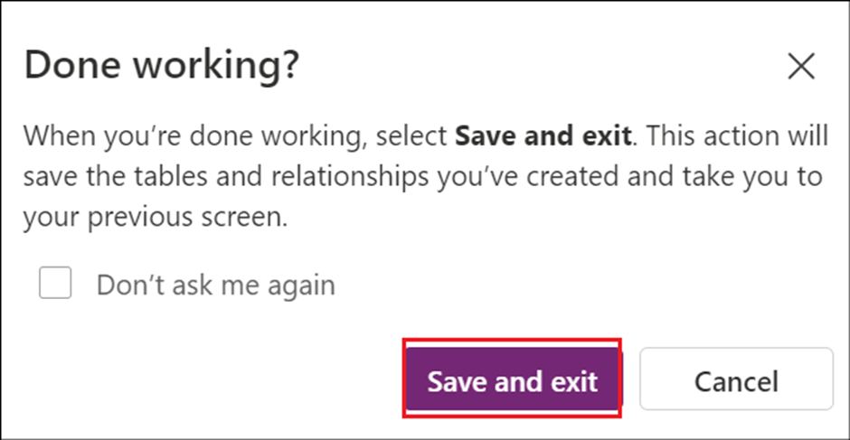

6. Once saved, navigate to the **Custom** tab to find your newly created table. Click on the **Booking Request** table to open its properties.

   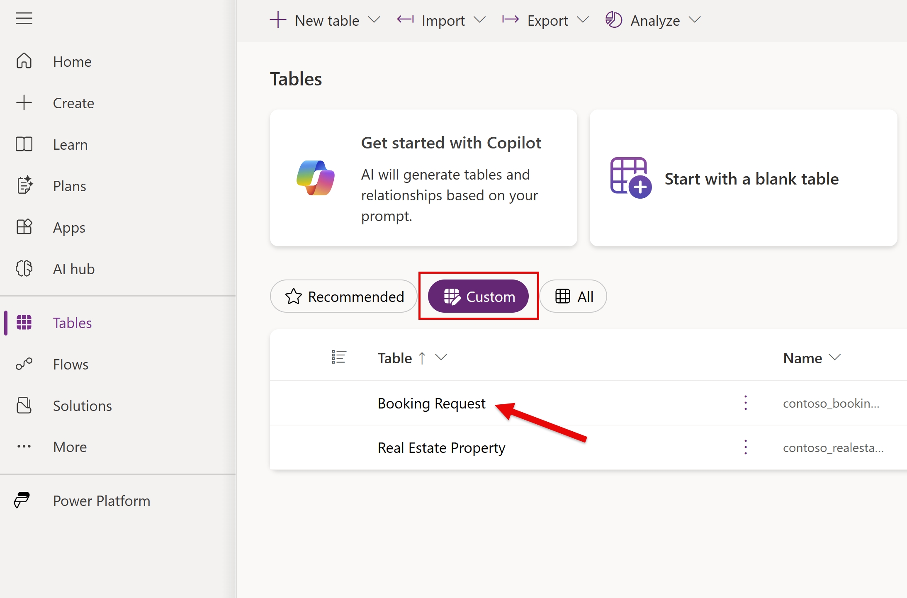

7. Change the name of the default column called **New Column** to **Booking Name** via the following steps:  
   - Click the dropdown next to **New Column**.  
   - Select **Edit Column**.  
   - Update the **Display name** to `Booking Name`.  
   - Select **Save**.  

   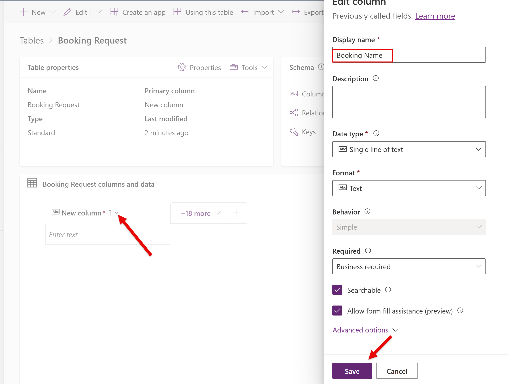

8. Using the **+** symbol next to the list of column names, create the following columns with the specified names and data types, then select **Save** after each one:  

   **Property**  
   - **Display name:** `Property`  
   - **Data type:** Select **Lookup** -> **Lookup**  
   - **Related table:** Select **Real Estate Property** from the dropdown.

   **Viewer Name**  
   - **Display name:** `Viewer Name`  
   - **Data type:** Select **Single line of text**  

   **Viewer Email**  
   - **Display name:** `Viewer Email`  
   - **Data type:** Select **Single line of text**  
   - **Format:** Select **Email**  

   **Booking Date**  
   - **Display name:** `Booking Date`  
   - **Data type:** Select **Date and time**  
   **Notes**  
   - **Display name:** `Notes`  
   - **Data type:** Select **Multiple lines of text**  

   **Booking Number**
   - **Display name**: `Booking Reference`   
   - **Data type**: `Autonumber` 
   - **Prefix**:`BR` 

**Add New Columns**

   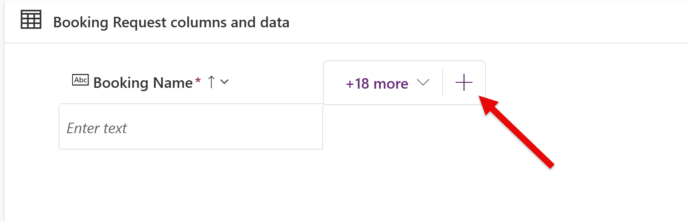

**Booking Reference**

   

**Adding New Column Details**

   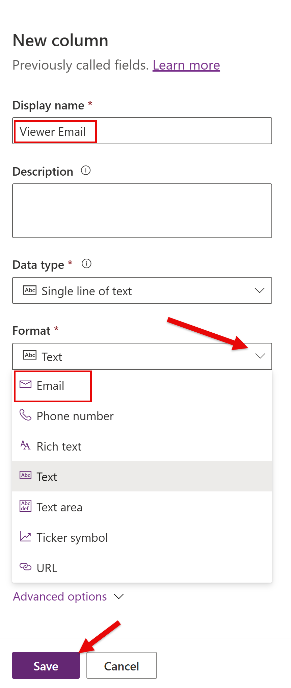

**Table and Column Views**

   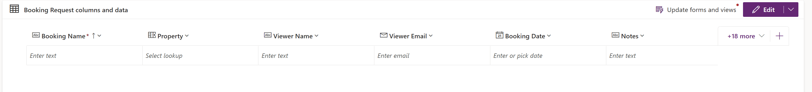

9. Add a **Choice** data type column with the following details:  
   - **Display name:** `Decision`  
   - **Data type:** Select **Choice** -> **Choice**  
   - Create the choice values as follows:  
      - Under **Sync this choice with**, click **+ New Choice**.  
      - Enter the **Display name** as `Decision`.  
      - Add the following entries:  

      | Label | Value |
      |--------|--------|
      | Undecided | 1 |
      | Accepted | 2 |
      | Declined | 3 |

      - Select **Save**.  
      - Under the **Sync this choice with** field, select the newly added choice **Decision**.  
      - Set **Undecided** as the **Default choice**.  
      - Click **Save**. 

   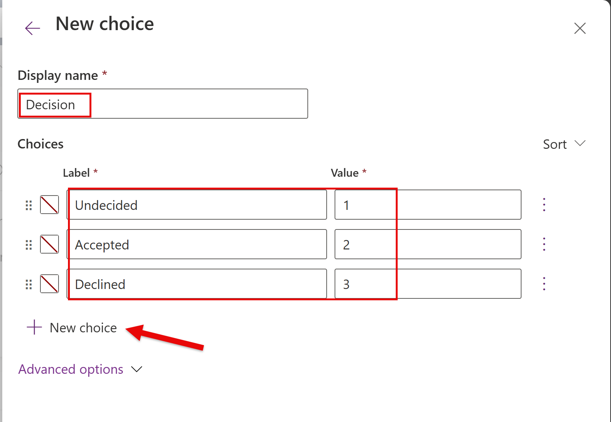

   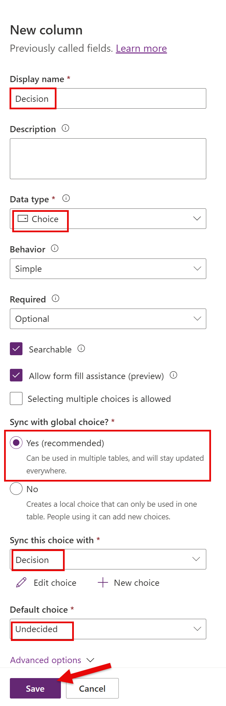

10. Add a Autonumber column type to generate a reference for the request with the following details: 
   - **Display name:** `Booking Reference`  
   - **Data type:** Select **Autonumber**
   - **Prefix:** `BR`
   - Ensure the seed value is set to `1000` and the **minimum number of digits** is `4`

   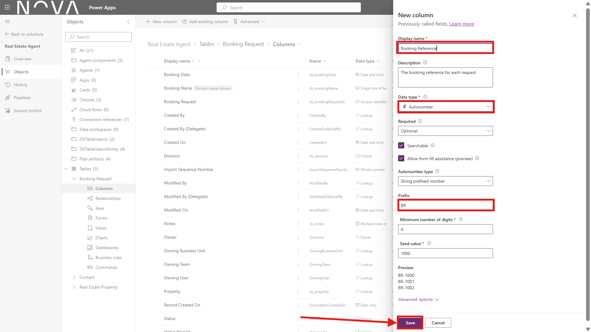

11. Click on **Save**

**✅ You have successfully created the Booking Request table and defined it's columns!**

## ✍️ Exercise 2: Working with Copilot Studio

Now that we have created one of our key knowledge sources, we will move into the Copilot Studio interface to begin building our agent.

### Task 1: Validate Microsoft Copilot Studio Access  

In this task, you will confirm that you have access to **Microsoft Copilot Studio** and the correct environment to build your agent.

1. In a new browser tab, navigate to [Copilot Studio](https://copilotstudio.microsoft.com/).  

2. On the **Choose your country/region** page, keep the default value selected and click **Start free trial**.

   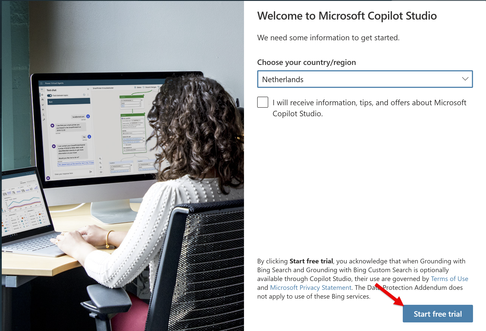

> [!NOTE]
> If you have previously signed into Copilot Studio or have a license assigned already, then step 2 may not appear. You can skip to step 3 in that case.

3. At the top right of the page, select **Environments**, and then select your **Development** environment from the list.

   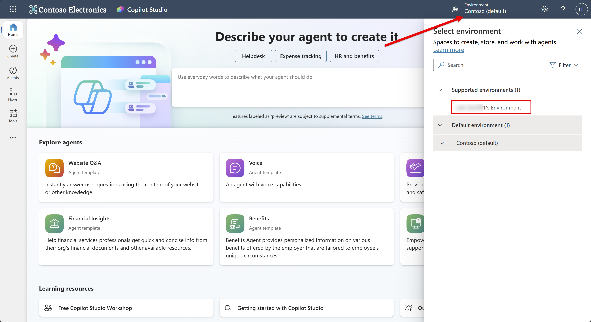

4. If you are greeted with the **Welcome to Copilot Studio!** dialog, select **Skip**.

   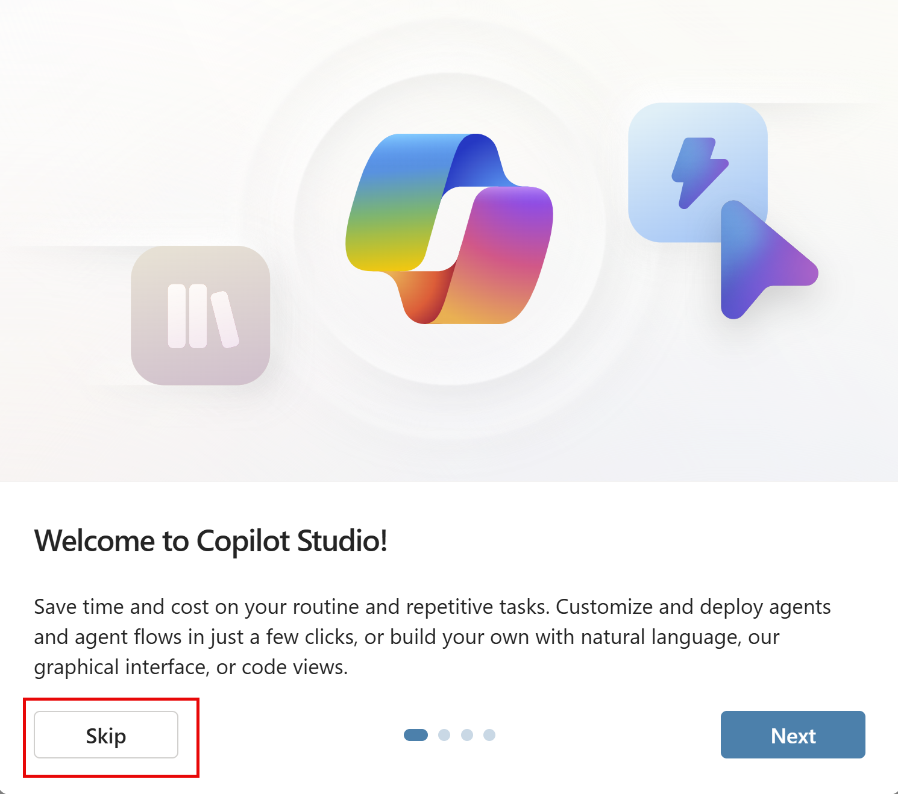

5. Leave Copilot Studio open if you plan to continue to the next task.

**✅ You have successfully validated access to Microsoft Copilot Studio and your development environment.**

### Task 2: Create the Real Estate Booking Service Agent  

Agents represent distinct components in a solution, containing all necessary configurations such as **topics**, **knowledge sources**, **tasks**, and more. Agents are also **solution-aware components**. In this task, you will create a single agent for the current scenario.

1. You should still be in Copilot Studio from the previous task, with your **Development** environment selected. If not, navigate back there now.
2. From the left navigation pane, select **Create**, and then choose the **New agent** tile.  

   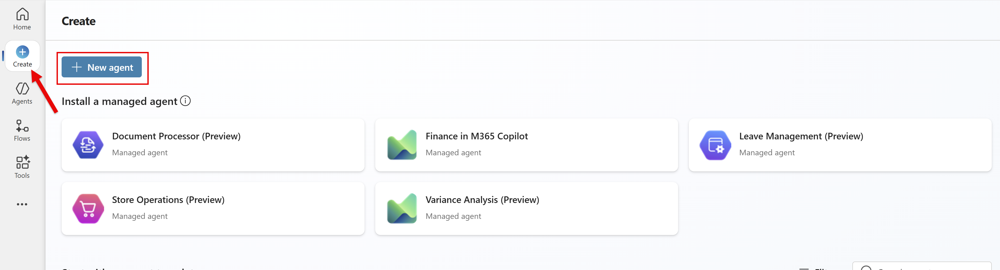

3. Select **Configure**.  

   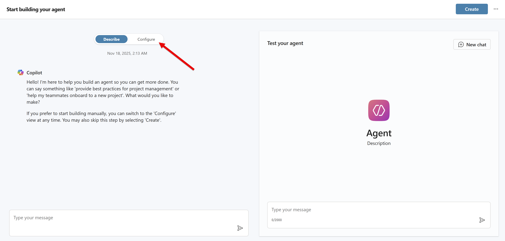

3. Fill in the details below:  
   - **Name:** `Real Estate Booking Service`  
   - **Description:** `Create bookings for real estate properties`  
   - **Instructions:** `Create an agent for topics relating to creating bookings for real estate properties`

   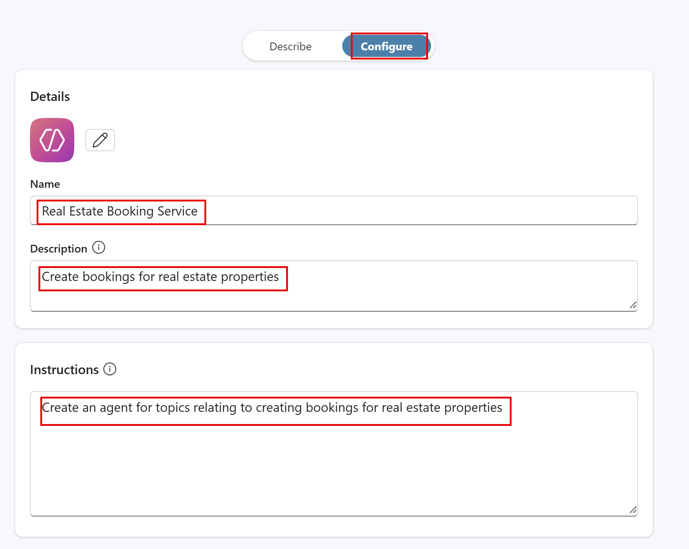  

4. In the top-right corner of the screen, select **Create** to create the agent. This may take a few minutes to complete.

   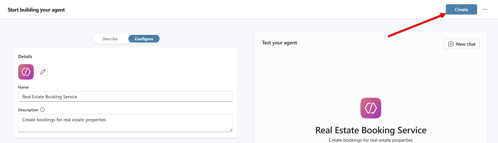

7. Once the agent is created, in the **Test your copilot** pane, type **How do I make a booking?** and press **Enter**. Observe that a generic response is returned, similar to the one illustrated below.

   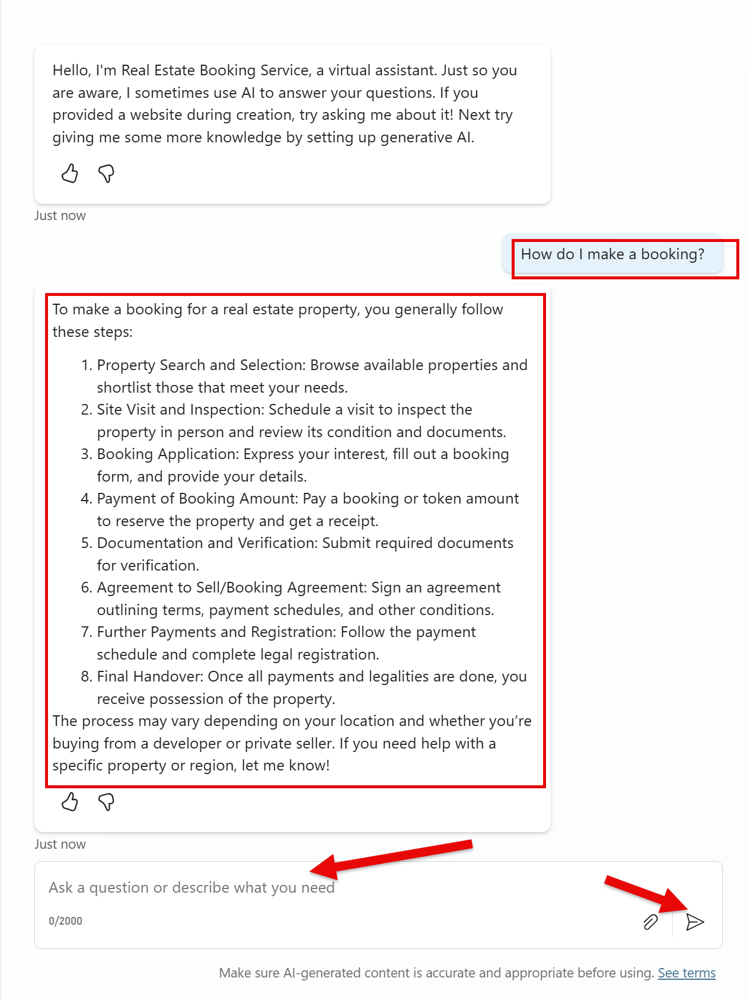

> [!NOTE]
> When an agent does not have access to specific knowledge sources, it will fallback to general knowledge to respond to user queries. This is expected behavior at this stage, as we have not yet configured any specific topics or knowledge sources for the agent. If necessary, [you can disable general knowledge](https://learn.microsoft.com/en-us/microsoft-copilot-studio/knowledge-copilot-studio#allow-the-agent-to-use-general-knowledge) from the **Settings** area, to ensure the agent only responds based on the topics and knowledge sources you define.

8. Leave Copilot Studio open if you plan to continue to the next task.

**✅ You have successfully created the Real Estate Booking Service agent.**

### Task 3: Configure Security  

For this scenario, we plan to test our agent outside the context of **Microsoft 365 Copilot**, **Teams**, and our overall **Entra ID tenant**. As such, we need to adjust the authentication options accordingly.  

> [!IMPORTANT]  
> Always ensure you review and consider the impact of changing these options. With **No authentication** configured, anyone with the URL for your agent can access and use it — including any underlying knowledge sources and tools. 

1. You should still be in Copilot Studio from the previous task, with your **Real Estate Booking Service** agent open. If not, navigate back there now.
2. In the top-right of the screen, select **Settings**.

   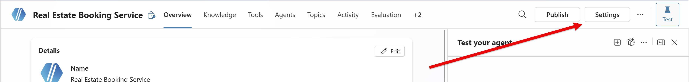

3. Select the **Security** tab, and then select the **Authentication** tile.

   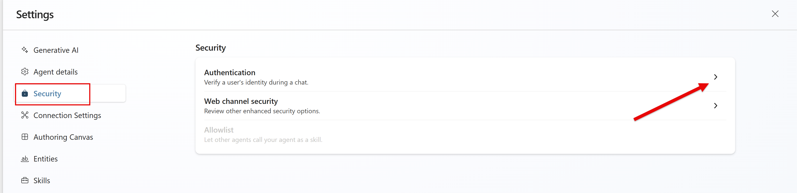

4. Choose **No authentication**, and then click **Save**. 

   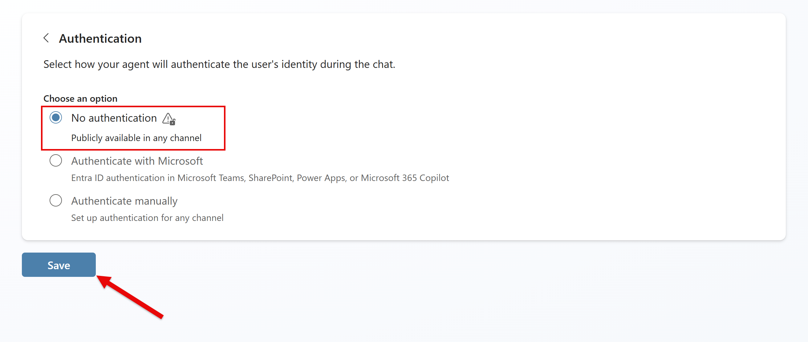

5. In the **Save this configuration** prompt, note the information presented, and then select **Save** again.

   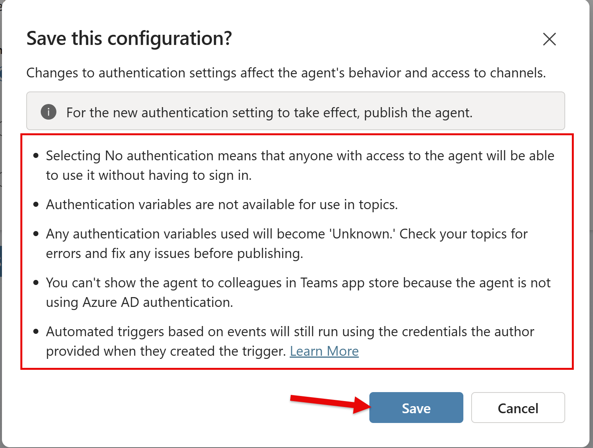

6. Once the save operation is complete, click **Close** to exit the **Settings** pane.

   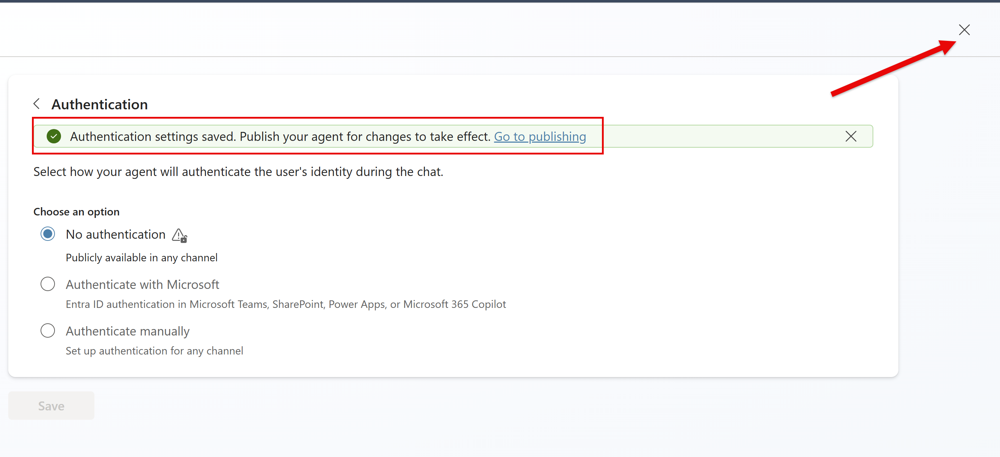

7. Leave Copilot Studio open if you plan to continue to the next task.

**✅ You have successfully configured security settings for your agent.**

### Task 4: Disable Topics  

Our newly created agent contains several built-in [system topics](https://learn.microsoft.com/en-us/microsoft-copilot-studio/authoring-system-topics?tabs=webApp), some of which are not relevant for our current scenario. In this task, you will disable the system topics that are not required.

1. You should still be in Copilot Studio from the previous task, with your **Real Estate Booking Service** agent open. If not, navigate back there now.
2. From the **Copilot Overview** page, select the **Topics** tab from the top menu. 

   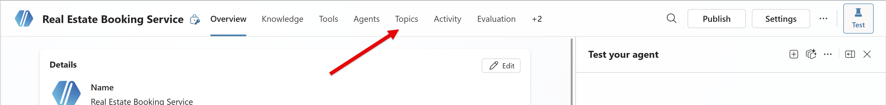

3. The **Custom Topics** page will display. Select the **System** tab and then toggle **Enabled** to **Off** for the **Sign in** topic.

   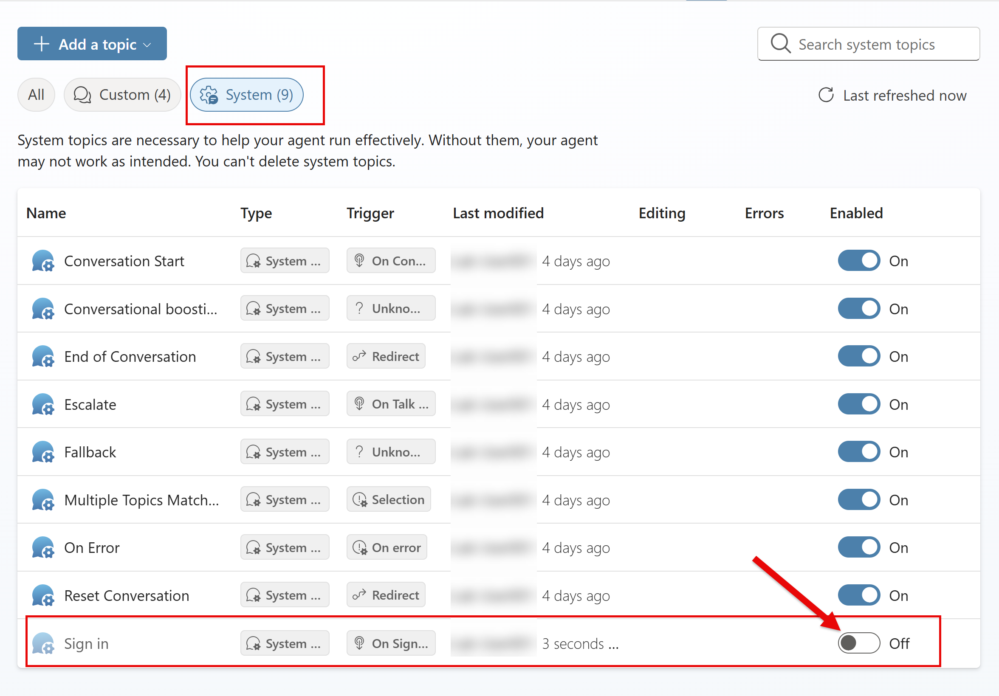 

4. Leave Copilot Studio open if you plan to continue to the next task.

**✅ You have successfully disabled the system topic not required for this scenario.**  

### Task 5: Publish and Test the Agent 

Publishing an agent makes it available for deployment across the channels you wish to use, such as **Microsoft Teams**, a **custom website** and more. It also ensures that your recent changes — such as disabling topics — are reflected accordingly.  

Only published changes take effect in the live version of your agent. This allows you to **develop freely** without impacting the agent’s behavior in production.  

1. You should still be in Copilot Studio from the previous task, with your **Real Estate Booking Service** agent open. If not, navigate back there now.
2. Select **Publish** to publish this agent.  

   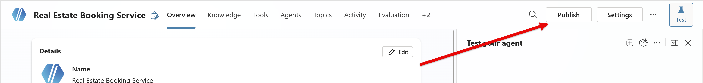

3. In the **Publish this agent** dialog, select **Publish** again to confirm.

   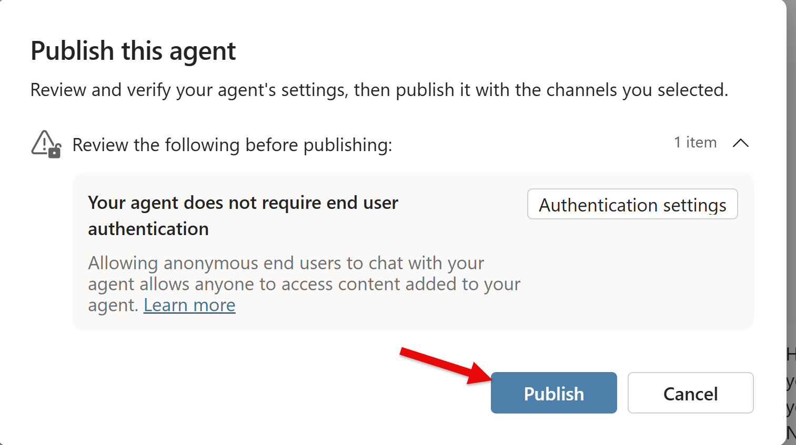

>[!NOTE]
> If you receive a **There are open issues with your agent** dialog box resembling the below, indicating that you don't have a license, contact your instructors for further assistance.

   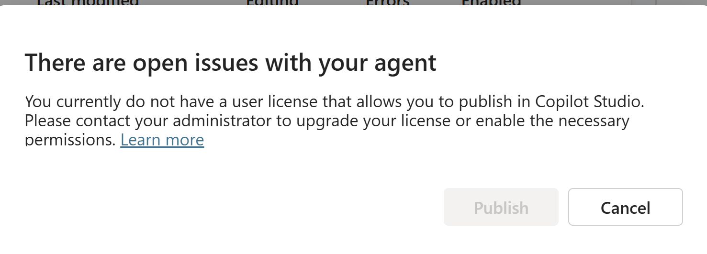

4. The publish operation may take several minutes to complete. Wait and verify that the agent is published successfully.

   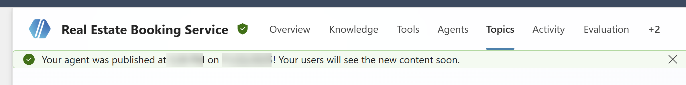

5. Leave Copilot Studio open if you plan to continue to the next task.

**✅ Your agent has been successfully published.**  

### Task 6: Use the Agent in the Demo Website Channel

The [demo website](https://learn.microsoft.com/en-us/microsoft-copilot-studio/publication-connect-bot-to-web-channels?tabs=preview) allows users - even those without a license - to test your agent in a realistic context. You can share the demo website URL to let others interact with your agent.

1. You should still be in Copilot Studio from the previous task, with your **Real Estate Booking Service** agent open. If not, navigate back there now.
2. In the top-right corner of the screen, select the **three dots** next to the **Settings** or **Publish** button, and choose **Go to demo website**.  

   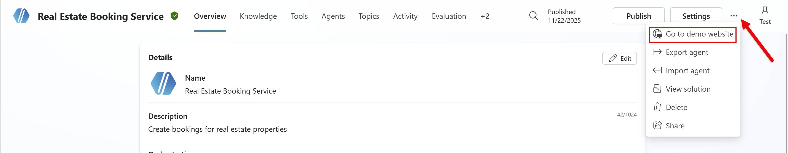

3. In the **Type your message** text box, enter the following prompt and hit **Enter**.

```
What information is needed to book a viewing for a real estate property?
```

4. Verify that you receive a response from the agent.

   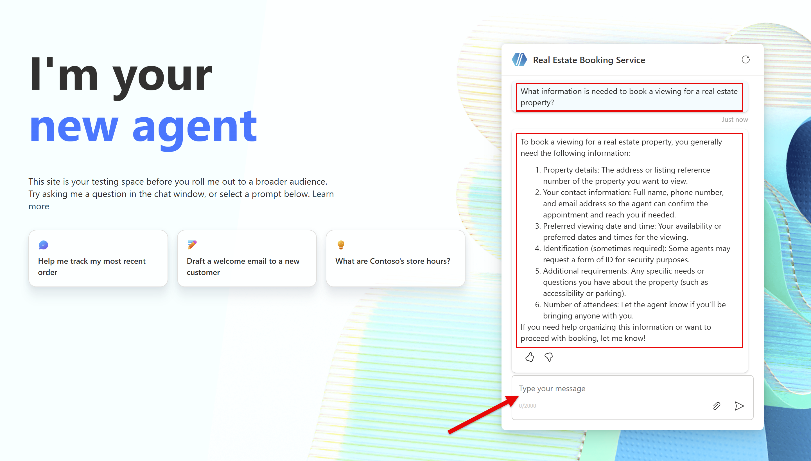 

> [!NOTE]  
> The response will be generic — similar to what you saw in the **Test your agent** pane in Copilot Studio. This is expected, as no specific topics or logic have been configured yet. You will implement these in the upcoming exercises.

5. Close the demo website tab to return to Copilot Studio.
6. Leave Copilot Studio open if you plan to continue to the next exercise.

**✅ You have successfully accessed and tested your agent using the demo website.**

## ✍️ Exercise 3: Create and Manage Topics using Copilot  

[Topics](https://learn.microsoft.com/en-us/microsoft-copilot-studio/authoring-create-edit-topics?tabs=webApp) allow us to control the behavior of our agent based on the input provided by the user. They are a foundational element that supports both straightforward and complex, turn-based conversations.

### Task 1: Create a Topic using Copilot  

Topics can be created and edited using **natural language**. 

> [!NOTE]  
> During this task, if your browser prompts you with a **See text and images copied to the clipboard** notification, select **Allow**.  

1. You should still be in Copilot Studio from the previous exercise, with your **Real Estate Booking Service** agent open. If not, navigate back there now.
2. From the **Topics** tab, select **Add a topic**, and then choose **Create from description with Copilot**.

   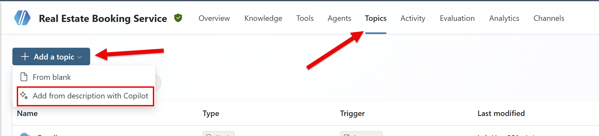

3. Enter the details below and click **Create**:  
   - **Name your topic:** `Customer Details`  
   - **Create a topic to:** `Ask the customer for their name and email address`

   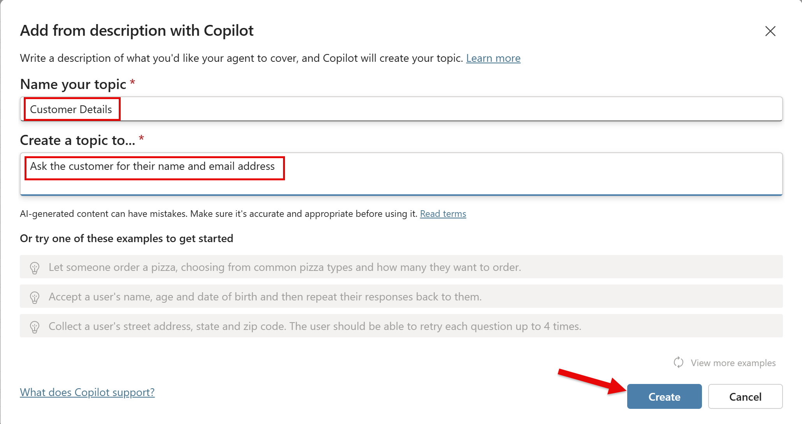

4. A new topic will be created with **trigger phrases** and **question nodes**.

   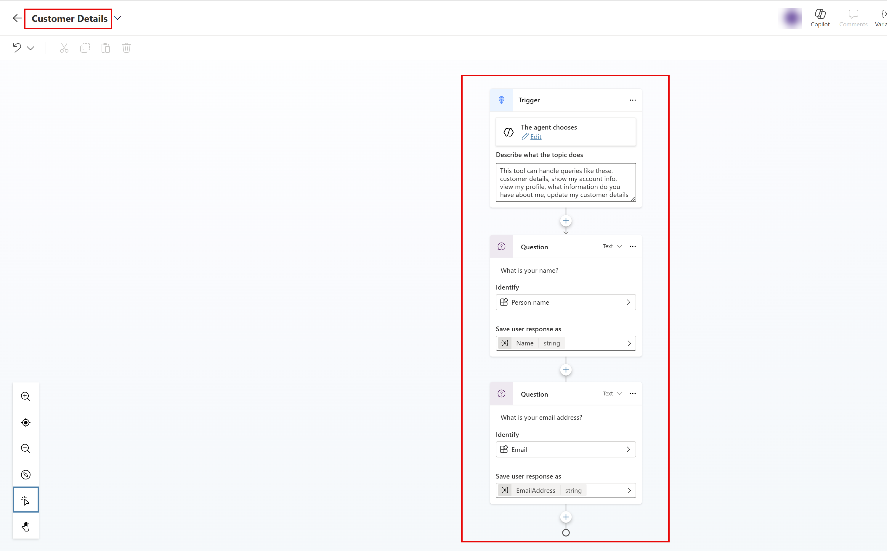

> [!IMPORTANT]
> As Copilot is non-deterministic, the precise output you receive may vary slightly from the screenshots shown. Check to ensure that there are at least two question nodes asking for the user's name and email address. If these have not been created correctly, speak to your instructors for further assistance.

5. Select **Save** to save your topic and verify that the operation completes successfully.

   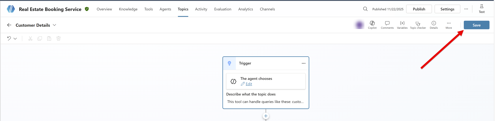

6. Leave the topic open if you plan to continue to the next task.

**✅ You have successfully created a new topic using Copilot.**  

### Task 2: Update Nodes with Natural Language  

Copilot can also be used to support any ad-hoc modifications required to a new or existing topic.  

1. You should still have the **Customer Details** topic open from the previous task. If not, navigate back there now.
2. If the **Edit with Copilot** pane isn’t visible on the right-hand side, select the **Copilot icon** in the upper part of the authoring canvas.

   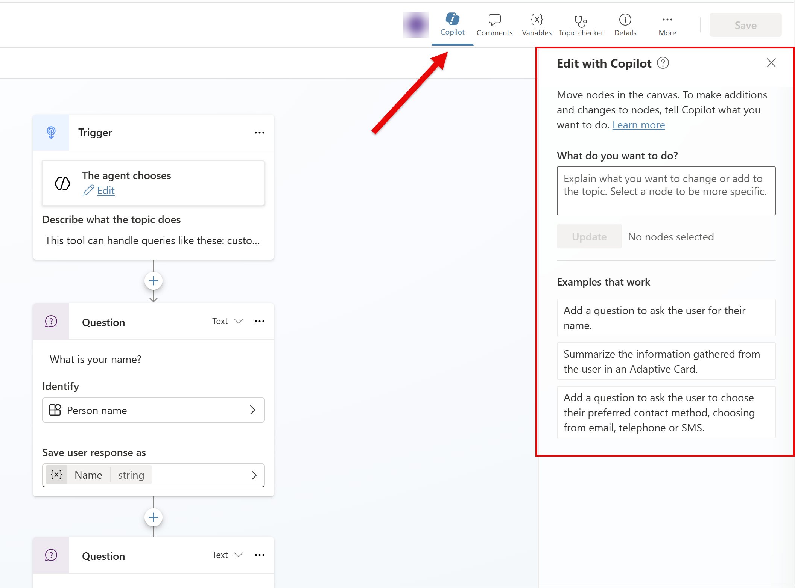

> [!NOTE]  
>  If Copilot is not visible from the menu and navigation options, click the three dots above **More** and select **Copilot** from the dropdown. That happens when the interface is too small to show everything. 

2. Select the second question node labeled **What is your email address?**  
3. In the **Edit with Copilot** panel, in the *What do you want to do?* field, enter the following text and then select **Update**.

```
Update the message in this question node to say thank you to the Name variable from the previous node and then proceed to ask the email address question.
```

4. Verify that the message in the question node has been updated accordingly.

   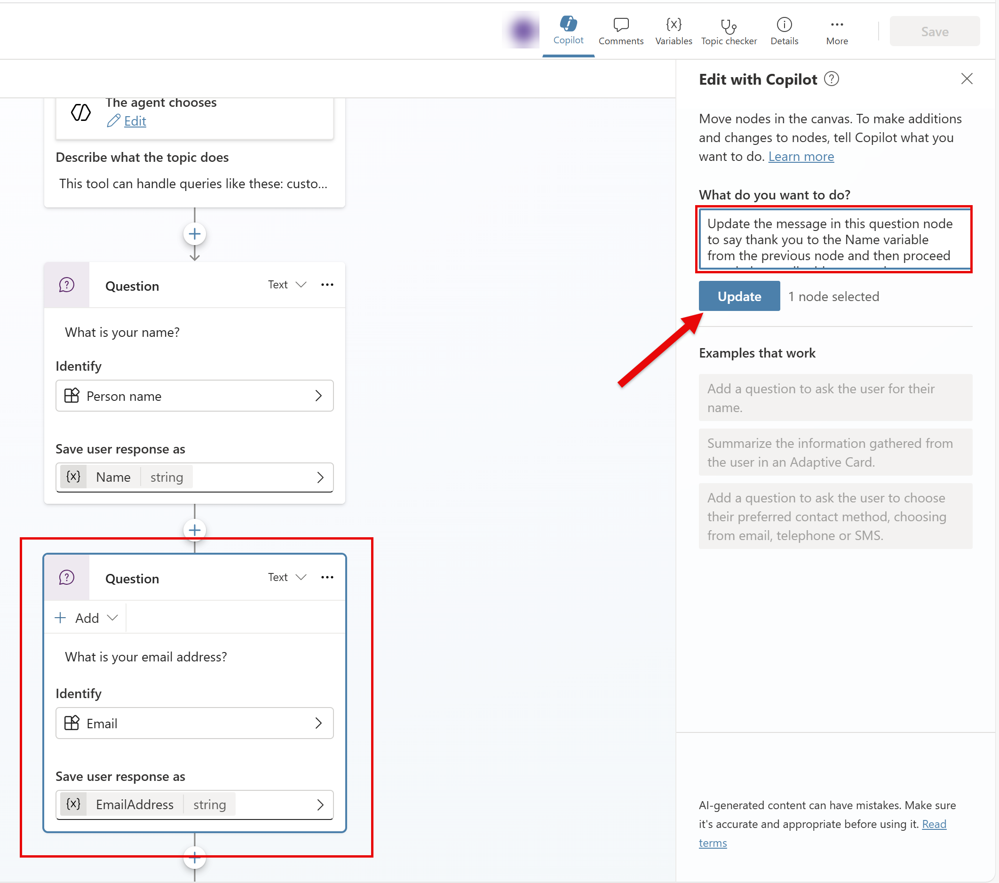

> [!IMPORTANT]
> As Copilot is non-deterministic, the precise output you receive may vary slightly from the screenshots shown. Check to ensure that the message thanks the user by their name using the variable from the previous node. If this has not been modified correctly, speak to your instructors for further assistance.

5. Select **Save** to save your topic and verify that the operation completes successfully.
6. Leave the topic open if you plan to continue to the next task.

**✅ You have successfully updated an existing node using natural language.**

### Task 3: Add Nodes with Natural Language  

In addition to modifying existing nodes, you can also use Copilot to add new ones through natural language commands.  

1. You should still have the **Customer Details** topic open from the previous task. If not, navigate back there now.
2. Make sure that no node is selected by clicking on an empty area of the canvas.  
3. In the **What do you want to do?** field, enter the following text and select **Update**:

```
Add a new multiple-choice question to prompt the user if the details are correct with two options: Yes or No.
```

   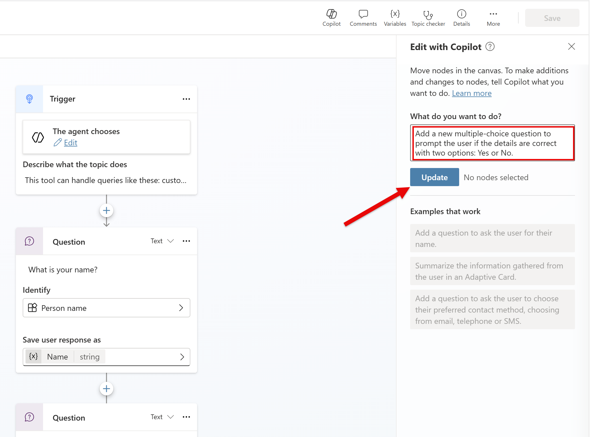 

4. A new question node resembling the below screenshot should be added to the end of the topic with two options for **Yes** and **No**.

   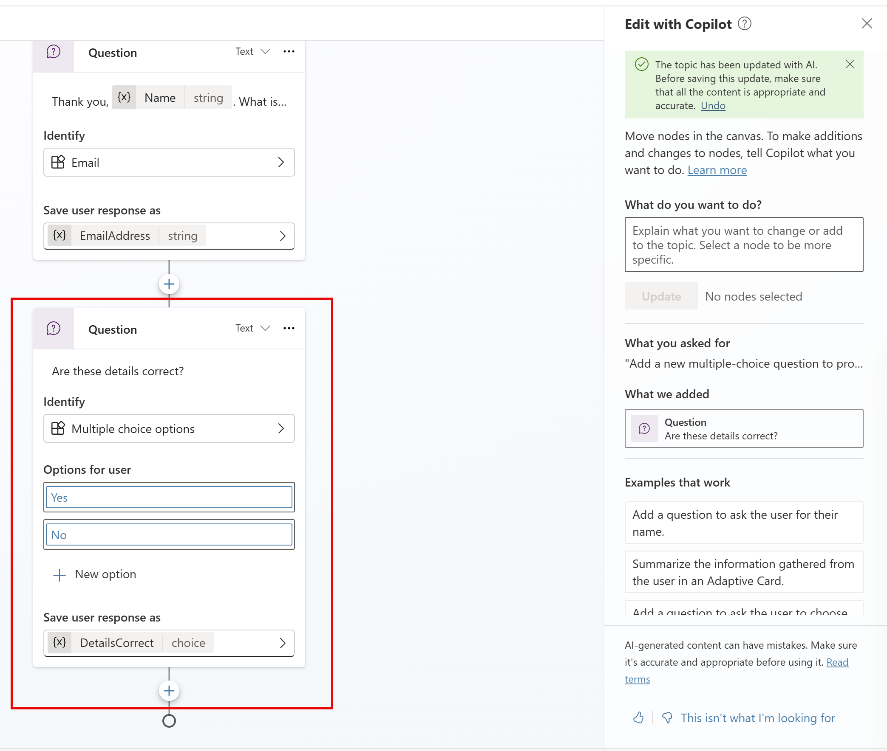

> [!IMPORTANT]
> As Copilot is non-deterministic, the precise output you receive may vary slightly from the screenshots shown. Check to ensure that a multiple-choice question node has been added with **Yes** and **No** options. If this has not been created correctly, speak to your instructors for further assistance.

5. Select **Save** to save your topic and verify that the operation completes successfully.
6. Leave the topic open if you plan to continue to the next task.

**✅ You have successfully added a new node using Copilot.**  

### Task 4: Configure the Scope of the Variables  

[Variables](https://learn.microsoft.com/en-us/microsoft-copilot-studio/authoring-variables-about?tabs=webApp) are used to store and persist important pieces of information during a conversation session. We can choose to scope variables to:  
- The **current topic** only,  
- The **entire session**, or  
- **Across automations** (for example, when passed into Power Automate cloud flows).  

In this task, you’ll update the variable scope so that their values are available elsewhere in other topics.  

1. You should still have the **Customer Details** topic open from the previous task. If not, navigate back there now.
2. Select **Variables** to open the Variables pane. 

   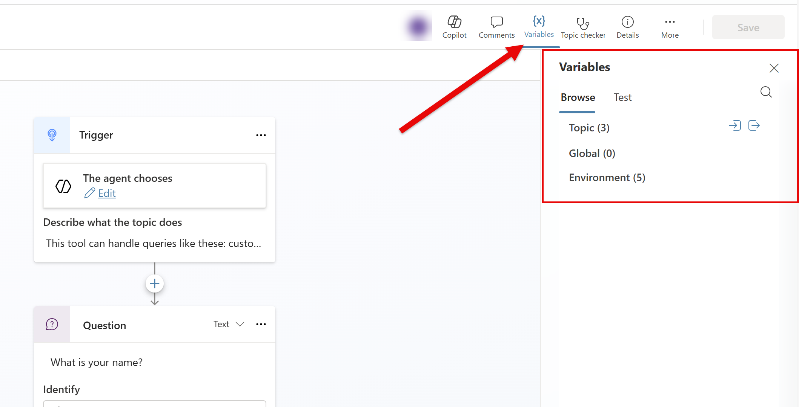

3. Click on **Topic** to expand the list of variables and then select the right-hand checkboxes for each variable to make them accessible in other topics.

   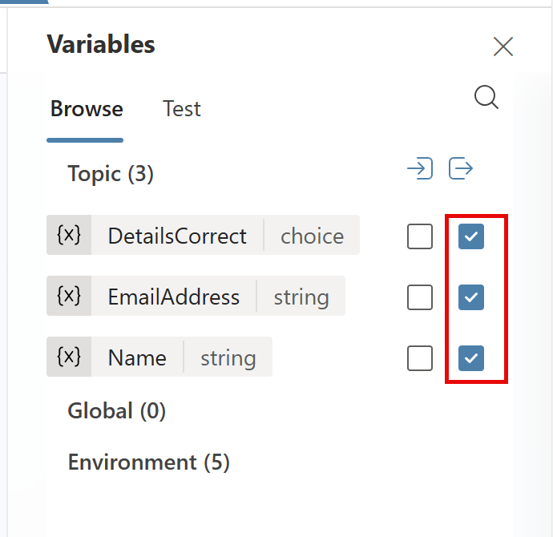

4. Click **Save** to save your topic and verify that the operation completes successfully.
5. Leave the topic open if you plan to continue to the next exercise.

**✅ You have successfully configured the variable scope for use across topics.**

## ✍️ Exercise 4: Create and Manage Topics Manually  

It’s also possible to create topics manually when needed. In this exercise, you will learn how to manually create and configure a topic, so you can compare the process to using Copilot, and then test your changes in the agent.  

### Task 1: Create a Topic from Blank  

1. You should still be in Copilot Studio from the previous exercise, with your **Real Estate Booking Service** agent open. If not, navigate back there now.
2. Select the **Topics** tab.
3. Select **Add a topic**, and then choose **From blank**.

   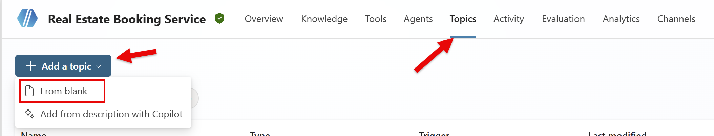

3. Select **Details** to open the **Topic details** dialog.  

4. Fill in the following details and click **Save**:  
   - **Name:** `Book a Real Estate Showing`
   - **Description:** `Select the property and requested date and create a booking request`
   - **Model Display Name:** `Book`

   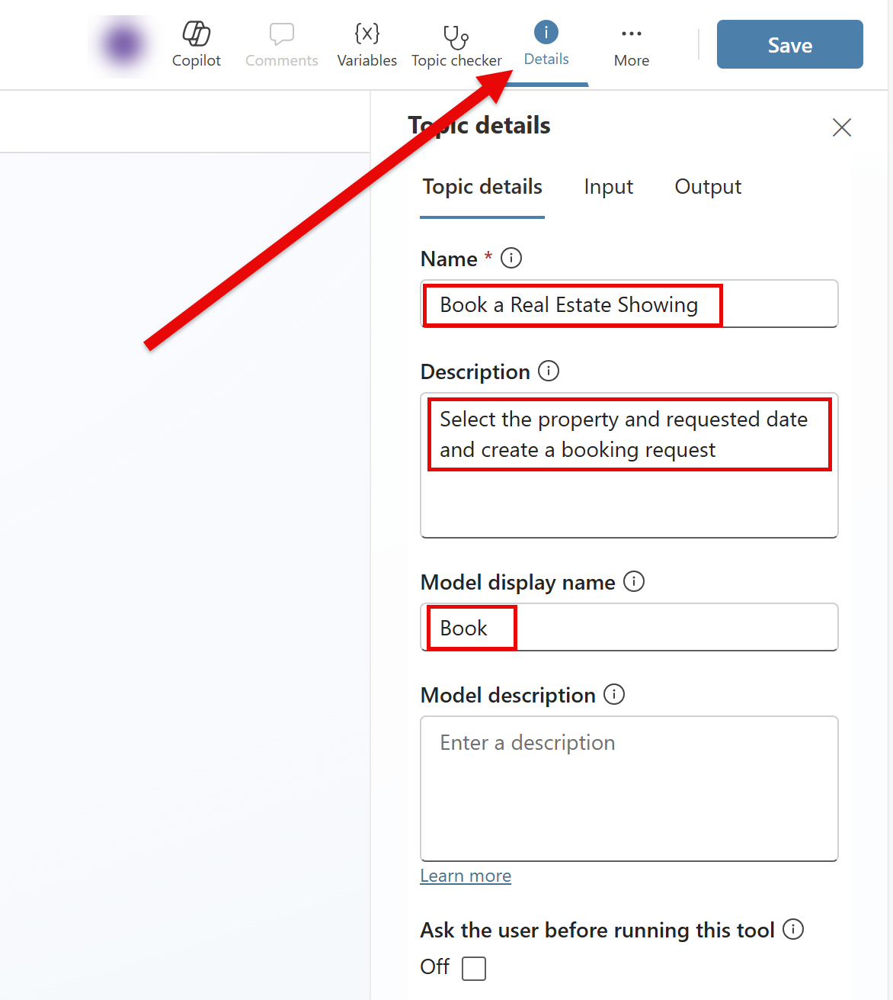

5. Select **Details** again to close the **Topic details** dialog.
6. Click **Save** to save your topic and verify that the operation completes successfully.
7. Leave the topic open if you plan to continue to the next task.

**✅ You have successfully created a blank topic.**  

### Task 2: Add a Topic Description  

Newly created agents leverage **generative AI orchestration** rather than **classic orchestration**, which previously relied on defining a set number of trigger phrases. While classic orchestration can be re-enabled from the **Settings** area, it’s recommended to continue using the modern orchestration approach.

1. You should still have the **Book a Real Estate Showing** topic open from the previous task. If not, navigate back there now.
2. Under **Describe what the topic does**, enter the following text:  

```
This topic allows customers to book real estate showings, arrange a property viewing, or set up any other kind of appointment for a property.
```

   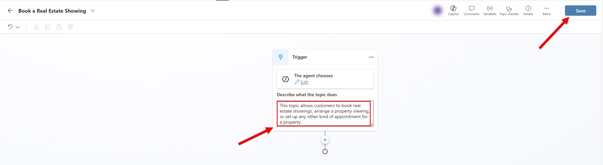

3. Click **Save** to save your topic and verify that the operation completes successfully.
4. Leave the topic open if you plan to continue to the next task.

**✅ You have successfully added a topic description.**  

### Task 3: Add a Message Node  

[Message nodes](https://learn.microsoft.com/en-us/microsoft-copilot-studio/authoring-send-message) define static or dynamic text responses to be sent to the user. They’re ideal when you need specific control over what your agent says.

1. You should still have the **Book a Real Estate Showing** topic open from the previous task. If not, navigate back there now.
2. Select the **+** icon under the **Trigger** node, and choose **Send a message**.

   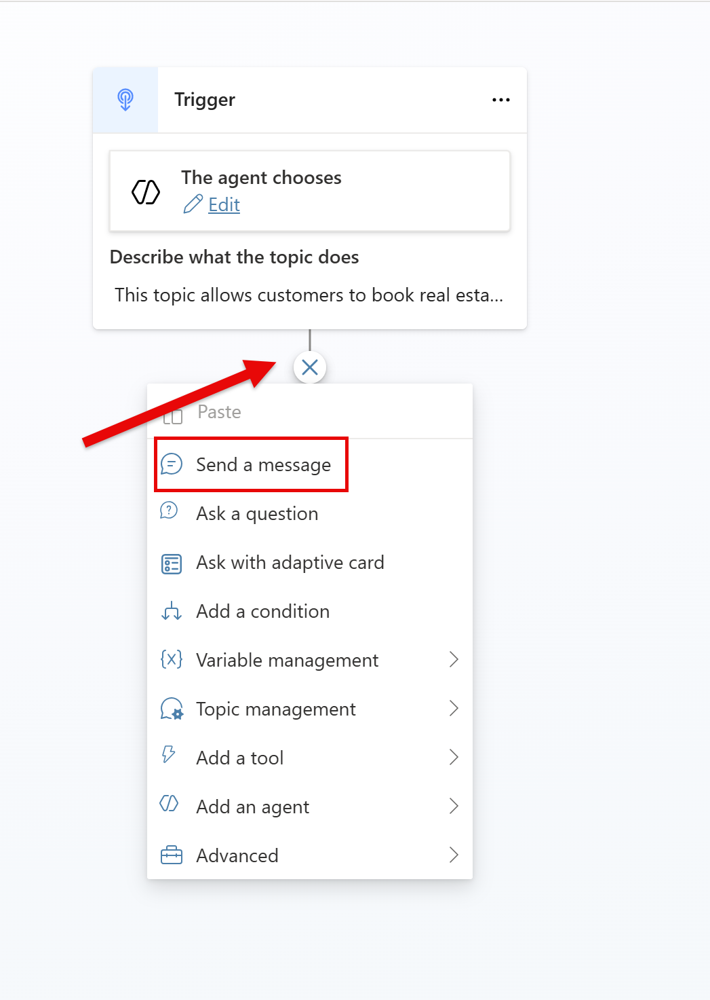

3. In the **Enter a message** field, type:  

```
Hi, I can help you with booking a real estate property showing.
``` 

   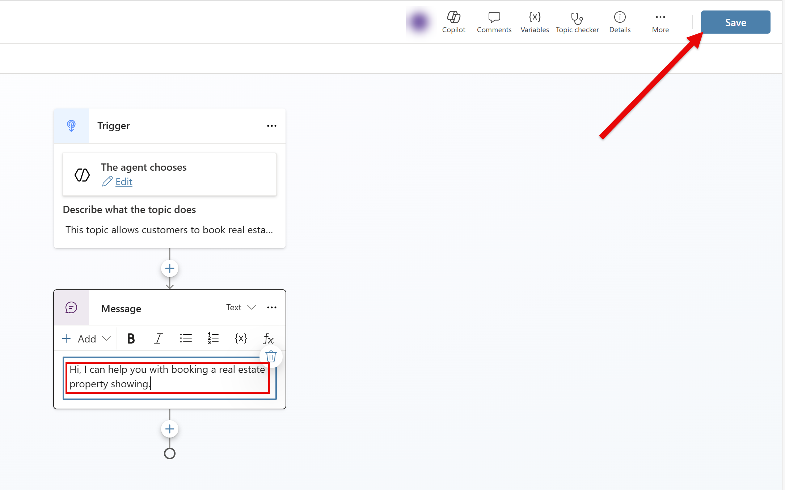

3. Click **Save** to save your topic and verify that the operation completes successfully.
4. Leave the topic open if you plan to continue to the next task.

**✅ You have successfully added a message node.**  

### Task 4: Add a Topic Management Node  

At any point during a conversation, you can [navigate the user to a different topic](https://learn.microsoft.com/en-us/microsoft-copilot-studio/authoring-topic-management?tabs=webApp#redirect-to-another-topic). This is useful when another topic is better suited to handle the user’s request. If the trigger conditions for the topic is met, it will change the flow of the conversation. 

1. You should still have the **Book a Real Estate Showing** topic open from the previous task. If not, navigate back there now.
2. Select the **+** icon under the **Send a message** node, and choose **Topic management** -> **Go to another topic**. Then, select the **Customer Details** topic from the list.

   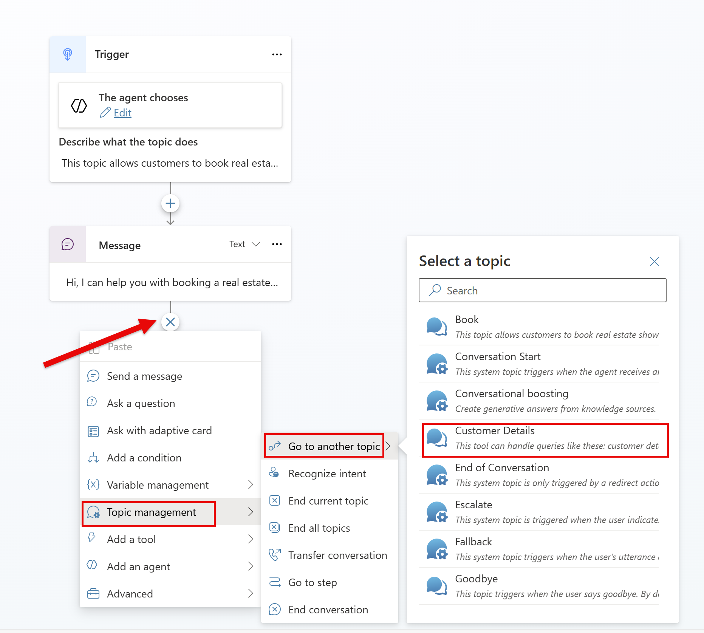

3. Click **Save** to save your topic and verify that the operation completes successfully.
4. Leave the topic open if you plan to continue to the next task.

**✅ You have successfully added a topic management node.**  

### Task 5: Add a Condition Node  

[Condition nodes](https://learn.microsoft.com/en-us/microsoft-copilot-studio/authoring-using-conditions) allow you to evaluate user responses or variable values and direct the conversation flow accordingly.  

1. You should still have the **Book a Real Estate Showing** topic open from the previous task. If not, navigate back there now.
2. Select the **+** icon under the **Topic management** node, and choose **Add a condition**.

   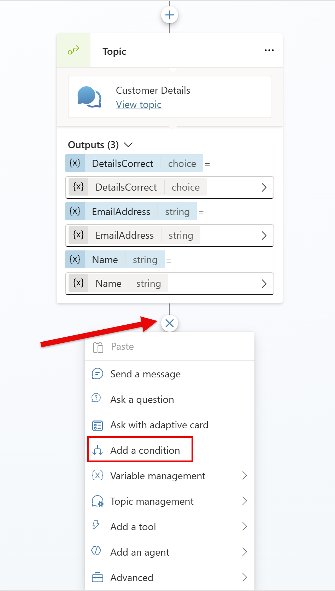

3. Click on **Select a variable** and then select **DetailsCorrect**.

   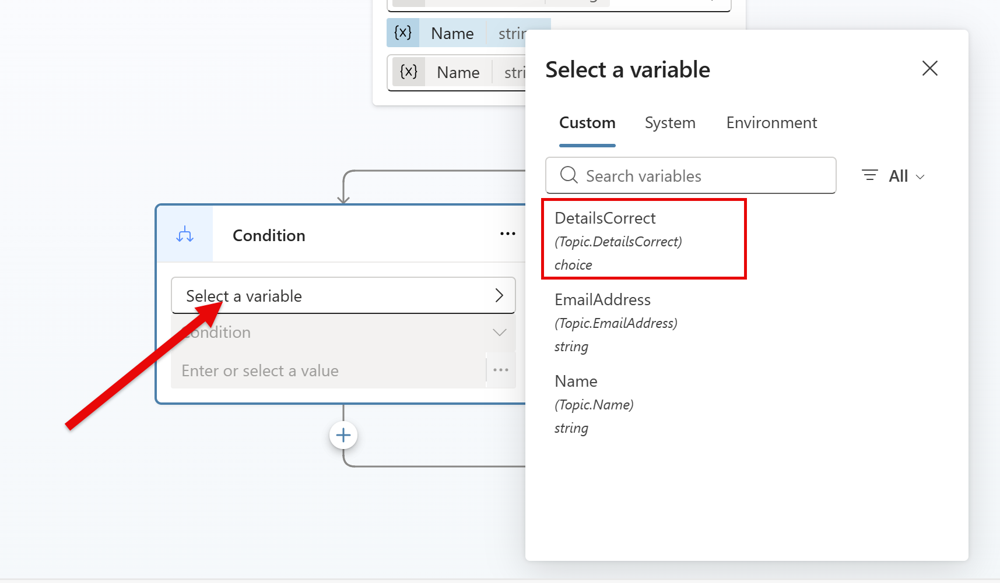

4. Verify that **Condition** is set to `is equal to`; otherwise, select it from the dropdown
5. Set the **Value** to `Yes`.

   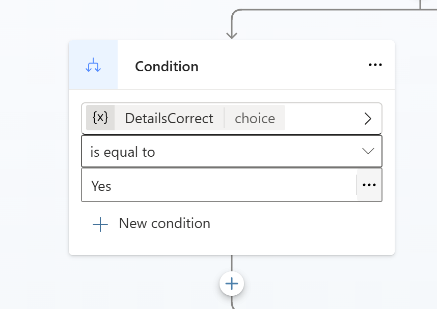

6. Click **Save** to save your topic and verify that the operation completes successfully.
7. Leave the topic open if you plan to continue to the next task.

**✅ You have successfully added a condition node.**  

### Task 6: Add Question Nodes  

[Question nodes](https://learn.microsoft.com/en-us/microsoft-copilot-studio/authoring-ask-a-question) collect information from the user. Their responses can be automatically mapped to system or custom entities, ensuring better data consistency.  

1. You should still have the **Book a Real Estate Showing** topic open from the previous task. If not, navigate back there now.
2. Select the **+** icon under the **left-hand condition** node and choose **Ask a question**. Populate the fields as follows: 
   - **Message:** `Which property do you want to see?`  
   - **Identify:** `User's entire response`  
   - **Save user response as:** `PropertyName` - rename the variable by clicking on **Var1** and then update it accordingly in the **Variable properties** pane.

   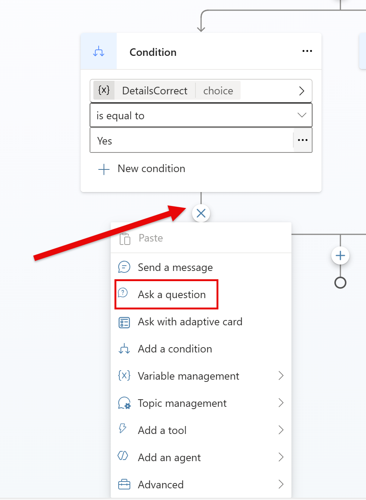

   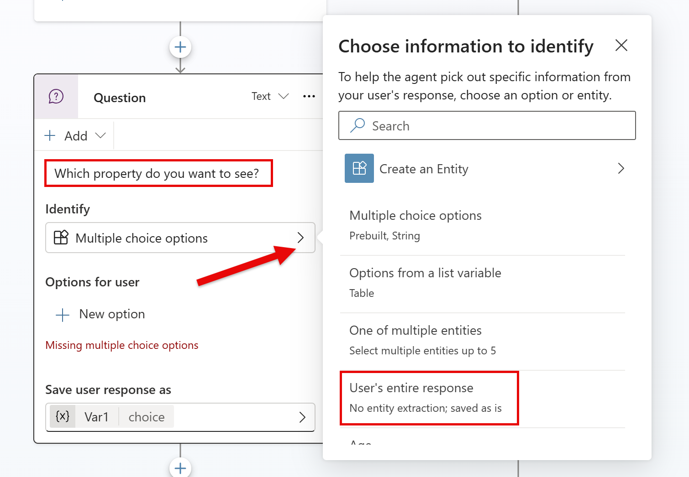

   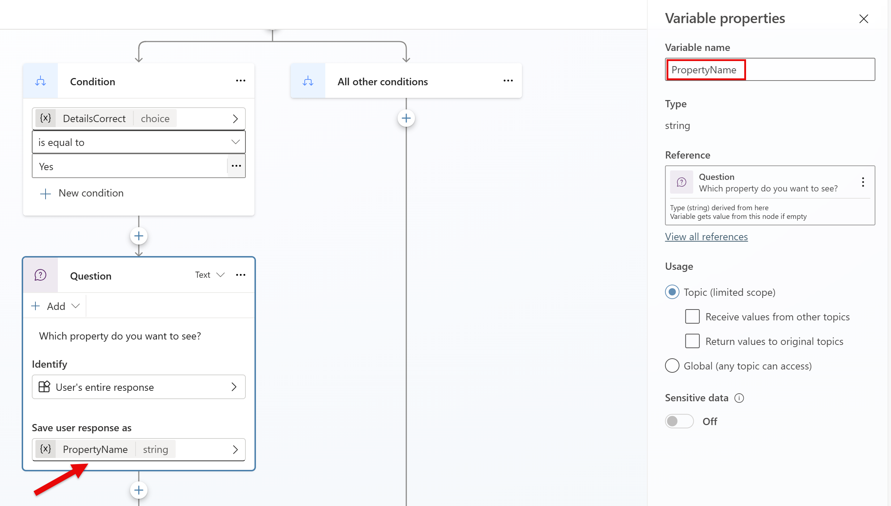

3. Add and configure an additional **Ask a question** node underneath the question node created in step 2 as follows:
   - **Message:** `What date and time do you want to see the property?`  
   - **Identify:** `Date and Time`  
   - **Save user response as:** `DateTime` - rename the variable by clicking on **Var1** and then update it accordingly in the **Variable properties** pane.

   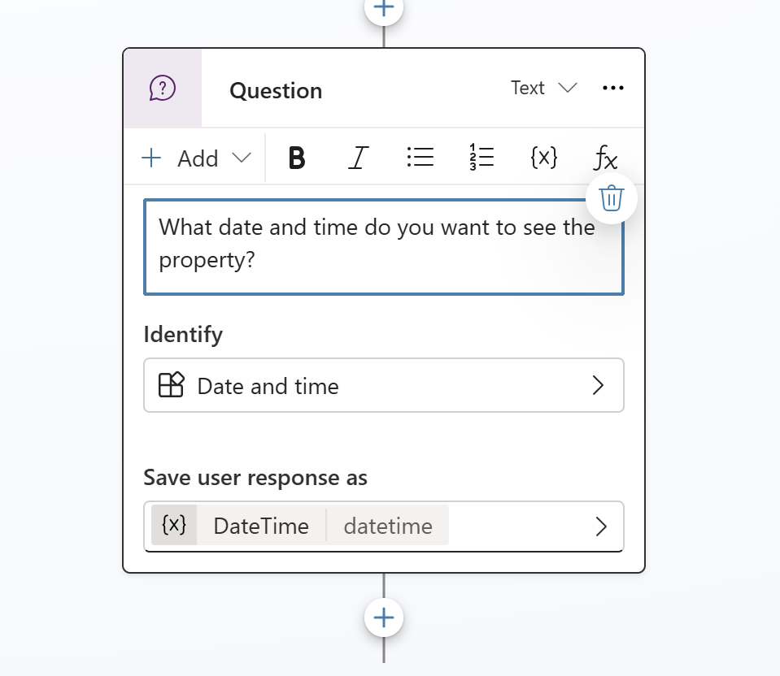

4. Click **Save** to save your topic and verify that the operation completes successfully.
5. Leave the topic open if you plan to continue to the next task.

> [!TIP]  
> You can rename each node to be more descriptive. Just hover over the default name and rename to something that explains it in more detail.

**✅ You have successfully added question nodes to collect user input.**  

### Task 7: Change the First Agent Message

The message that a user sees when they open the conversation is set by default and is configurable on a per agent basis. This is useful for creating a more personalised experience. 

1. You should still have the **Book a Real Estate Showing** topic open from the previous task. If not, navigate back there now.
2. Select the **down arrow** next to the topic name *Book a Real Estate Showing*
3. Select the **Conversation Start** topic

   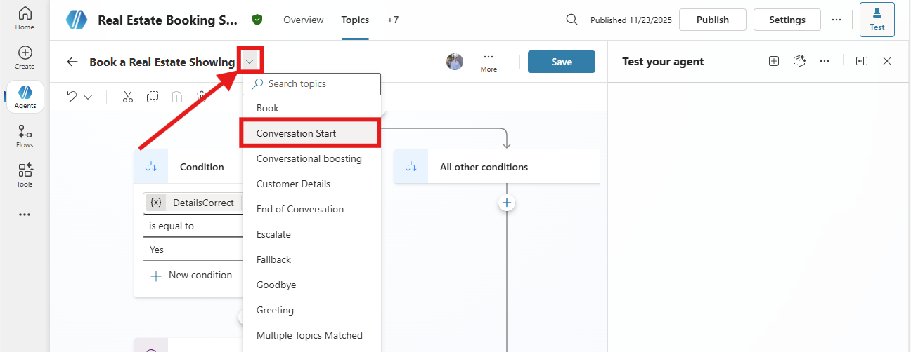

4. Update the default message by selecting the message box and removing everything after the dynamic value **Bot.Name**. Enter the following after the comma:

```
an Agent that will help you do real estate bookings and provide you with the booking information you need!
```

   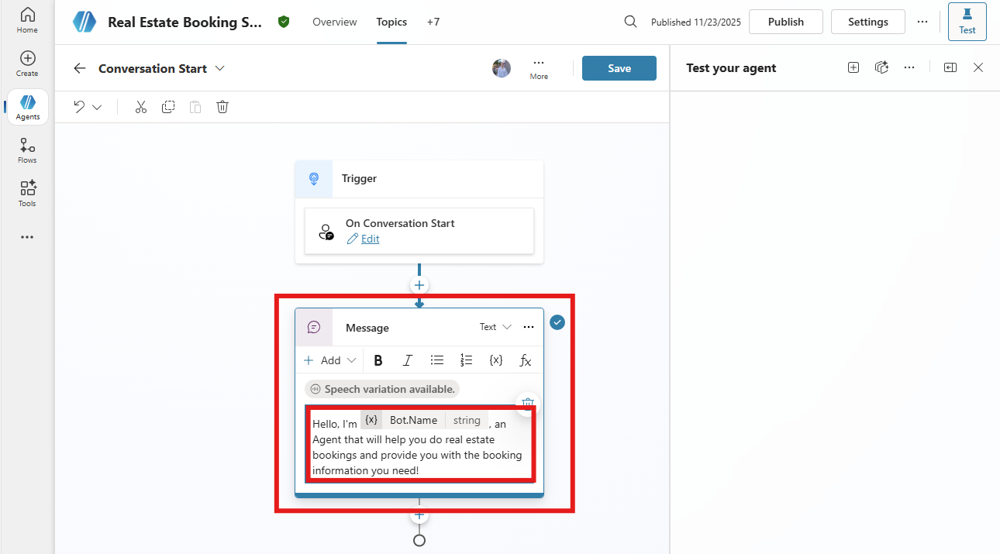

5. Click **Save** to save your topic and verify that the operation completes successfully.

> [!NOTE]  
> Feel free to be creative and write a message you want to show the user. You can add other dynamic values and add smiley faces for instance 😉

6. Leave the topic open if you plan to continue to the next task.

**✅ You have successfully edited the first message a user sees when starting the conversation.**

### Task 8: Test the Agent  

Now we’ll test your changes to verify that the topic behaves as expected.

> [!TIP]
> If you encounter any issues, review the previous steps to ensure all configurations were applied correctly.  

1. You should still have the **Book a Real Estate Showing** topic open from the previous task. If not, navigate back there now.
2. Select the **Test** button in the top-right of the screen to open the testing panel.

   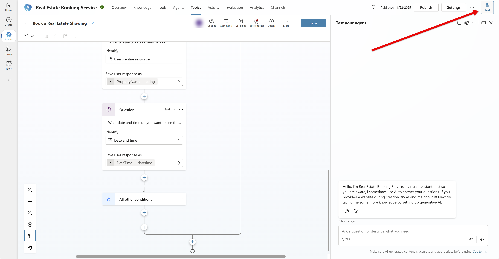

3. Select the **three dots** at the top of the testing panel, and enable **Track between topics**.

   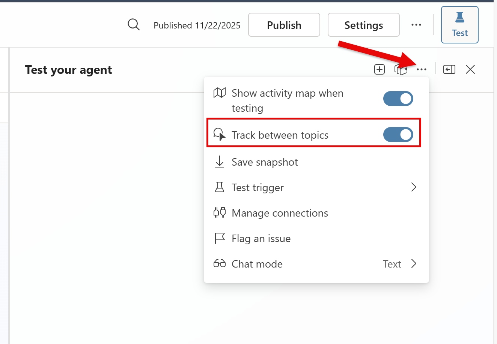

4. When the **Conversation Start** message appears, your agent begins the session.  
5. In response, enter the following trigger phrase:  

```
I want to book a real estate showing.
```

   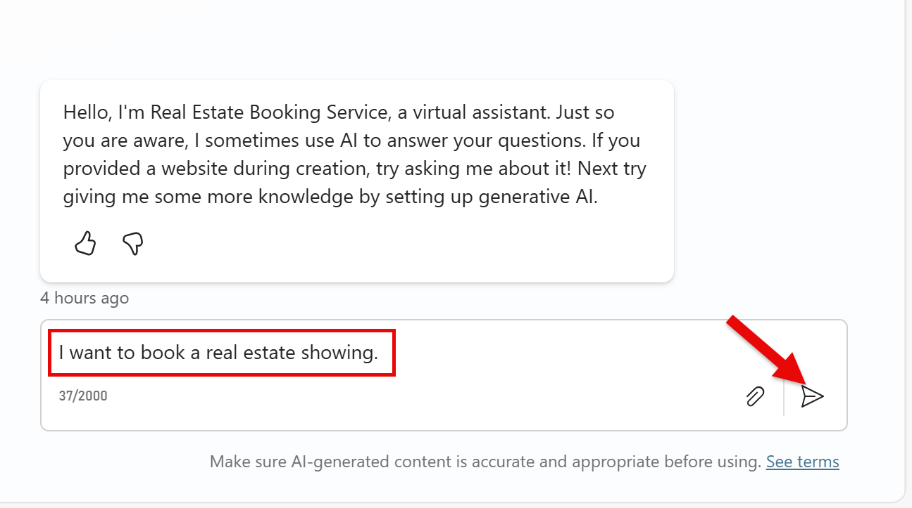

6. The agent should respond with the **"What is your name?"** question.

   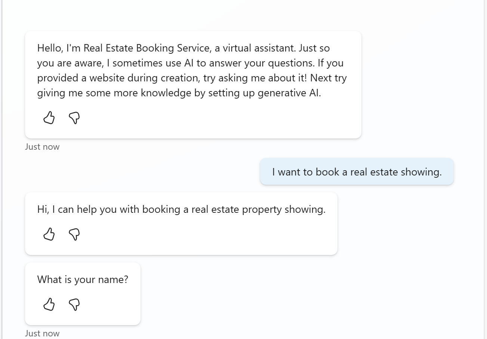
   
7. Enter your name and hit **Enter**.
8. When prompted, enter your **email address**. After entering your details, the agent will ask if the information is correct. Select **Yes**.

   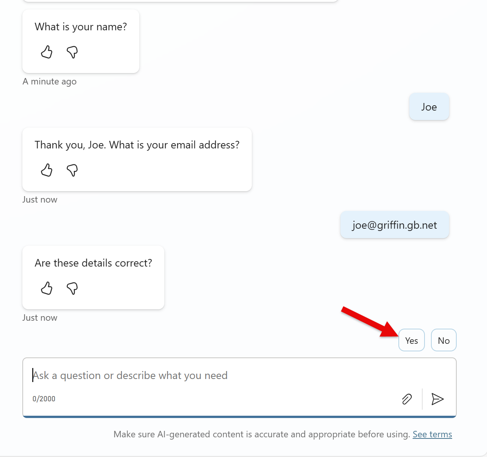
   
9. When prompted with **Which property do you want to see?**, enter `555 Oak Lane, Denver, CO 80203`
10. When prompted with **What date and time do you want to see the property?**, enter `Tomorrow 10:00 AM`

   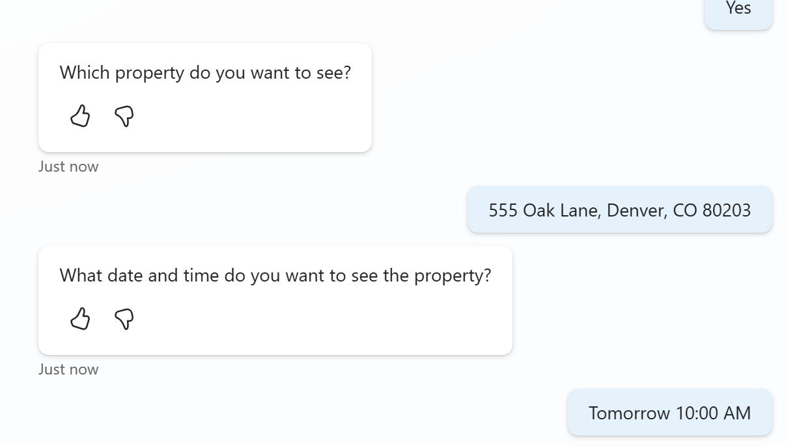

11. Leave Copilot Studio open if you plan to continue to the next exercise.

**✅ You have successfully tested your topic and confirmed that it behaves as expected.**

## ✍️ Exercise 5: Build an Autonomous Agent

This exercise showcases the [When a row is added, modified or deleted](https://learn.microsoft.com/en-us/power-automate/dataverse/create-update-delete-trigger?tabs=new-designer) trigger of an **Autonomous Agent**, and how the **Power Platform connector ecosystem** can be leveraged to implement tools to automate business processes.

In this scenario, you’ll create a new agent that detects updates to the **Booking Requests** table and automatically sends an email notification when a booking is created or modified.

### Task 1: Create an Agent  

1. You should still be in Copilot Studio from the previous exercise, with your **Development** environment selected. If not, navigate back there now.
2. From the left navigation pane, select **Agents**.
3. Click **+ New agent** to create a new agent.  
4. Select **Configure**, enter the following details and then select **Create**:  
   - **Name:** `Autonomous agent`  
   - **Description:** `You are an agent that detects updates to the Booking Requests table.`  

   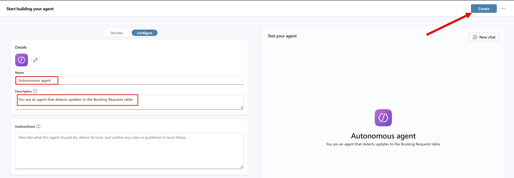

5. The agent setup may take a few minutes. Once finished, the **Autonomous agent** will open and display the message *Your agent is ready*.
6. Leave your newly created agent open if you plan to continue to the next task.

**✅ You have successfully created the Autonomous Agent.**  

### Task 2: Add a Trigger to the Agent  

Copilot Studio agents can leverage the same trigger types available within **Power Automate cloud flows**, allowing them to execute actions **autonomously** without any human intervention.

1. You should still have the **Autonomous agent** open from the previous task. If not, navigate back there now.
2. On the **Autonomous agent** page, scroll down to the **Triggers and Channels** section and select **+ Add**.

   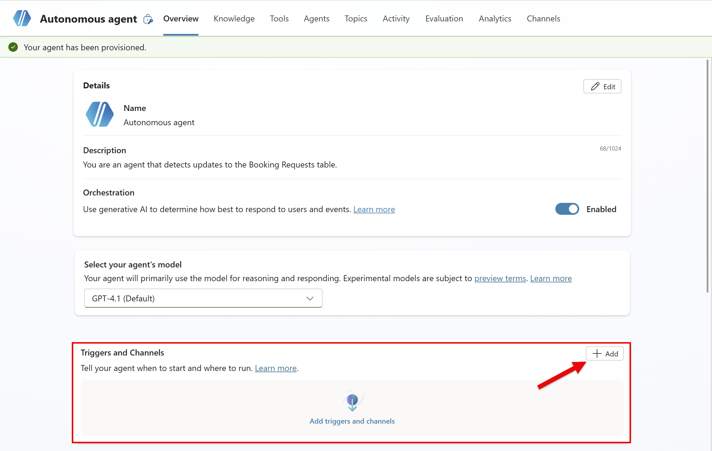

3. On the **Add trigger** dialog, select **When a row is added, modified or deleted** and then click **Next**.

   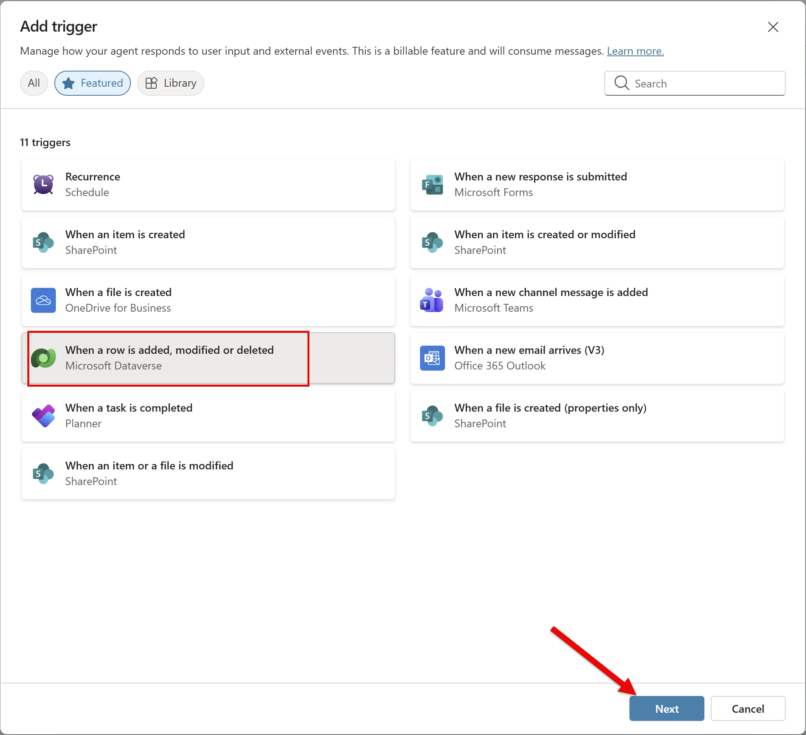

4. Click **Continue** on the next screen.  

   

5. Wait for the **Trigger name** and **Sign in options** to load — this may take a few minutes. You’ll see two apps listed: one for **Microsoft Copilot Studio** and one for **Microsoft Dataverse**. Ensure that the **connectivity status** shows green for both sign-in options, then select **Next**.

   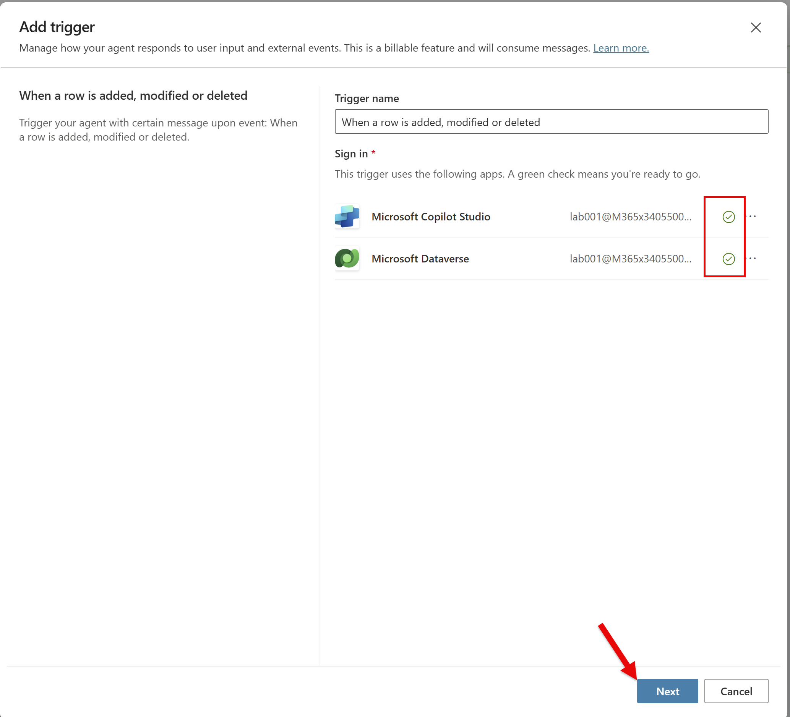

6. On the **Add trigger** screen, fill in the following details and click **Create trigger**:  
   - **Change type:** Select **Added or modified** from the dropdown
   - **Table name:** Select **Booking Requests** from the dropdown
   - **Scope:** Select **Organization** from the dropdown
   - **Trigger instructions:** Leave as default; this will return the entire response to the agent.

   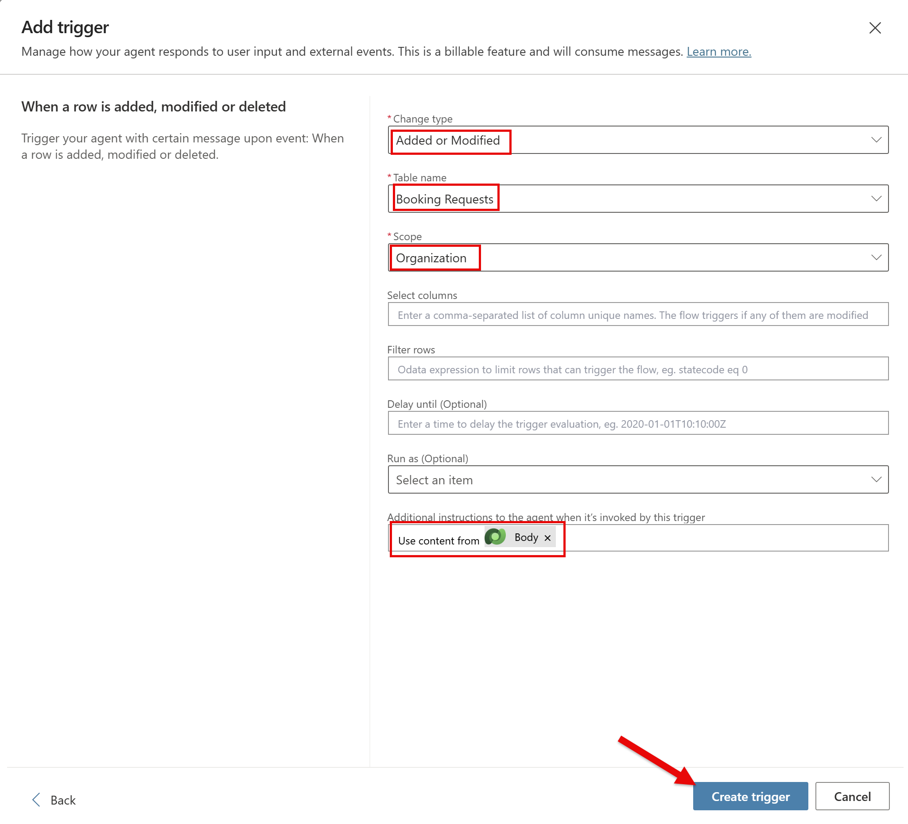

7. The trigger creation may take several minutes to complete. Once finished select **Close** on the **Time to test your trigger!** dialog.

   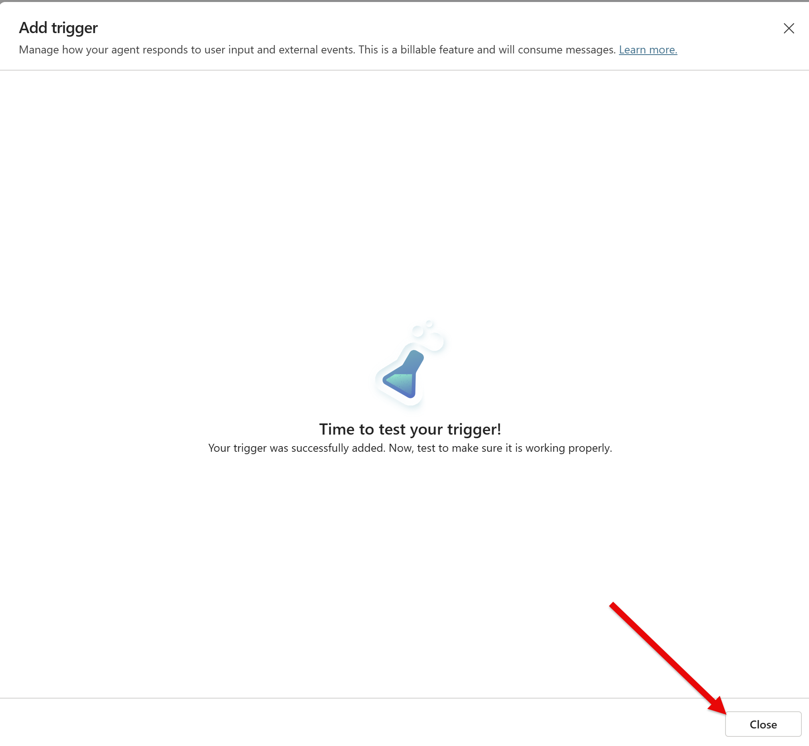

8. Click on the **Tools** tab and select **+ Add a tool**.

   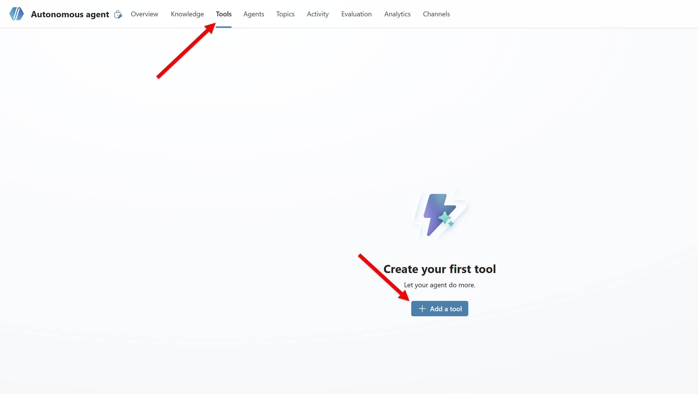

9. In the search box, type `Send an email` and select the **Send an email (V2) Office 365 Outlook** action.

   

10. On the **send an email V2** dialog, click on **Not connected** and then select **Create new connection**.

   

11. On the **Connect to Office 365 Outlook** dialog, select **Continue**. If a sign-in prompt appears, enter your credentials to establish the connection.

   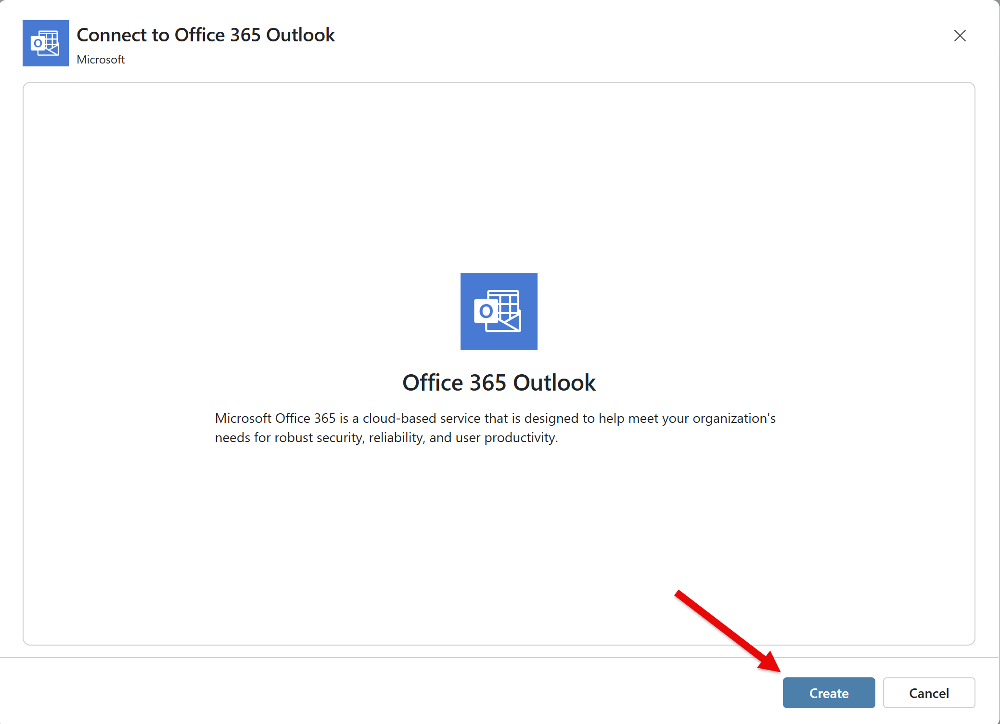

> [!IMPORTANT]
> You will need to sign in with an account that has an Exchange or applicable Microsoft 365 license assigned to it, such as one provided by your workplace. If you are using a lab environment provided by your instructors, these accounts may not automatically have this assigned. Please contact your instructors if you are unable to use you work account for this step or if you encounter any issues using the provided lab credentials.

12. Once the connection is established, click **Add and configure**.

   

13. The tool will be created after a few moments and you will be redirected to it automatically.
14. Underneath the **Inputs** section, click on the dropdown next to the **To** input and select **Custom Value**.

   

15. In the **Value** input that appears, enter the email address where the message should be sent and then select **Save**. This should be any mailbox which you have access to.

   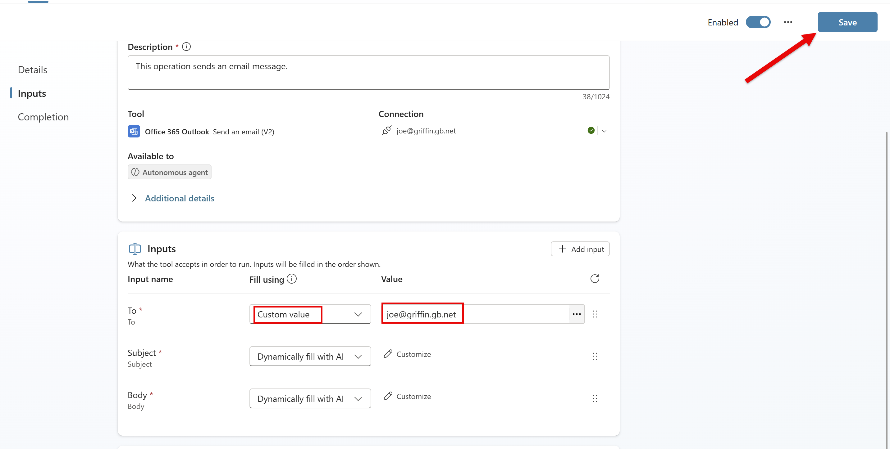

16. Leave Copilot Studio open if you plan to continue to the next task.

**✅ You have successfully configured the trigger and action for your Autonomous Agent.**

### Task 3: Add Instructions to the Agent  

[Custom instructions](https://learn.microsoft.com/en-us/microsoft-copilot-studio/authoring-instructions) define how the agent should behave and what it should do with the data it processes. When combined with tools, they unlock powerful automation capabilities.

1. You should still have the **Autonomous agent** open from the previous task. If not, navigate back there now.
2. Select **Overview** to return to the Overview page, then click **Edit** in the **Instructions** section.

   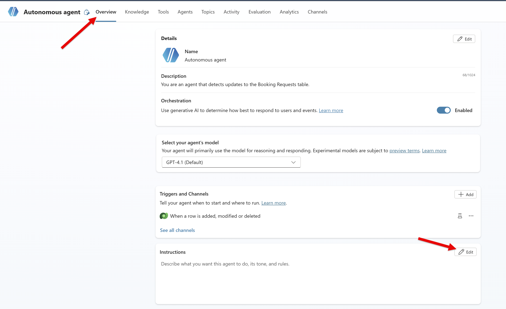

3. Update the **Instructions** field with the following text, replacing `<Email Address>` with your actual test address. Then, click **Save**.

```
a. Read the details of the row that gets added or modified  
b. Mail the modified information only to <Email Address> with a proper subject and body added to the email
```

   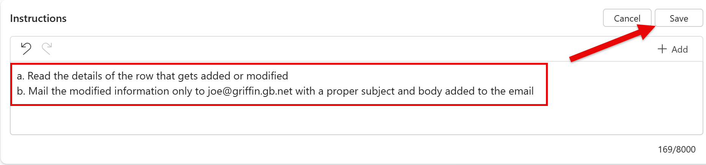

4. Click **Publish** to make the agent available to all connected channels.  
5. In the **Publish this agent** dialog box, select **Publish** again to confirm.  
6. Publishing may take several minutes to complete. Once completed, you will see the **Agent published successfully** message.

   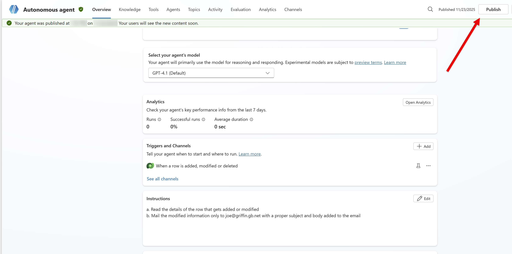

**✅ You have successfully configured and published your Autonomous Agent.**  

### Task 4: Update the Bookings Table  

Before testing the automation, we need to add or modify a record in the **Bookings** table to generate a trigger event.  

1. Open a new browser tab, navigate to [the Power Apps Maker Portal](https://make.powerapps.com/) and sign in if prompted.
2. From the left navigation pane, select **Tables**.
3. Open the **Custom** tab and choose the **Booking Request** table.  
4. Add a new record or modify an existing one with the following details:
   - **Booking Name**: `Test Booking`
   - **Booking Date**: Set to a date in the future
   - **Notes**: `This is a test booking created to trigger the Autonomous Agent.`
   - **Property**: Search for and select **1100 High Villas**
   - **Viewer Email**: Enter your email address
   - **Viewer Name**: Enter your name

   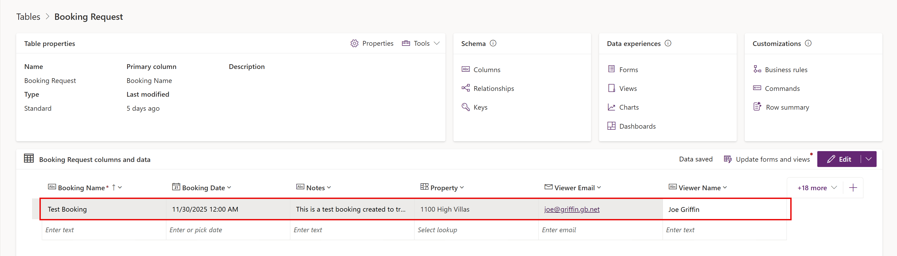

> [!TIP]
> You may need to click on the **+ 23 more** icon to make the required columns visible.
5. Close the tab to return to Copilot Studio.

**✅ You have successfully updated the Bookings table to trigger your agent.**

### Task 5: Test the Agent  

1. You should still have the **Autonomous agent** open from the previous task. If not, navigate back there now.
2. In the agent page, select **Test**, and verify that the **Activity Map** is set to **On**.

   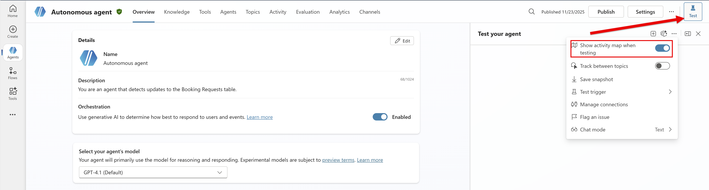

3. From the same page, select **Test trigger** and then **When a row is added, modified or deleted**.

   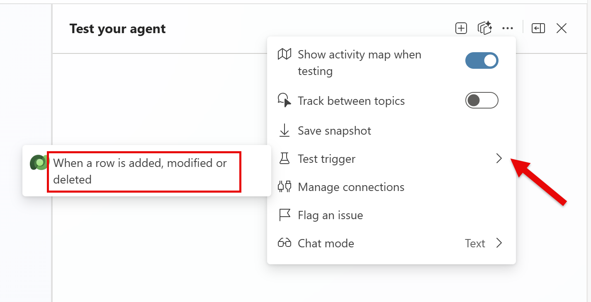

4. On the **Test your trigger** dialog, select the latest entry and click **Start testing**.

   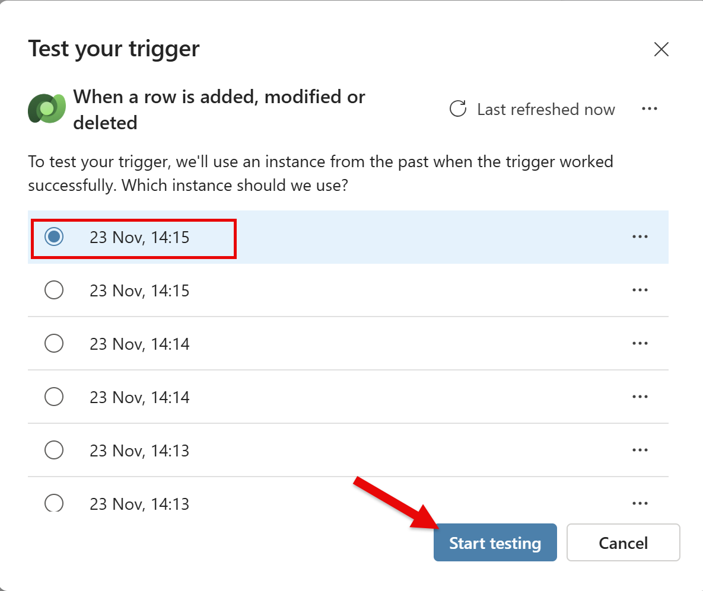

5. The trigger will be invoked. If prompted, **Allow** the connector for **Office 365 Outlook** in the chat window.

   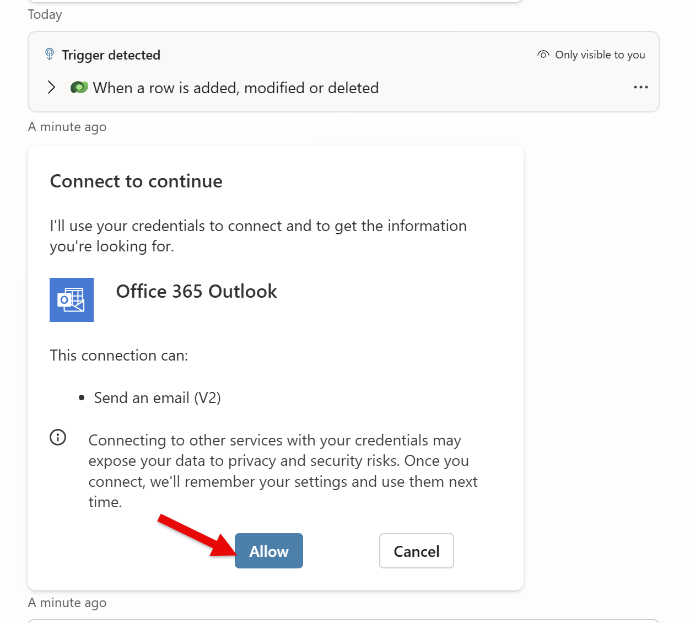

6. An email will be sent automatically to the address you specified earlier. Check the corresponding mailbox to verify that you received an email notification resembling the below:

   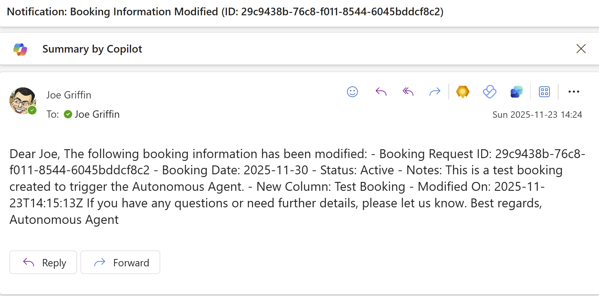

**✅ You have successfully tested your Autonomous Agent.**  

### Summary  

In this lab, you have learned how to: 

- Build an agent in **Copilot Studio** and create topics.  
- Test the agent from **Copilot Studio** and publish it to the demo website.  
- Build and test an **Autonomous Agent** that sends emails automatically when booking data changes.

**Congratulations, you've finished Lab 1** 🥳