# Lab 2 – Build an Autonomous Agent

In this lab, you will build an autonomous agent in Microsoft Copilot Studio that monitors newly created files in OneDrive for Business and logs their details into a central Excel-based file tracker used by the IT department.

## Lab Overview

> [!IMPORTANT]
> Microsoft Copilot Studio is a constantly evolving product, with two major releases each year and many incremental updates throughout each calendar year. Whilst every effort has been made to ensure the accuracy of these steps and all screenshots, from time to time, certain instructions or screenshots may no longer resemble the current interface or experience. In case of any issues completing any step, please consult your instructors.

Many users at Contoso rely on OneDrive for Business to store and manage documents. As the volume of files increases, it has become difficult for the IT department to maintain proper oversight. Important files may be created and overlooked, placed in incorrect locations, or missed entirely during audits.

To improve visibility and governance, Contoso needs a solution that automatically tracks newly created files. By creating a File Details Tracker in Excel and configuring an autonomous agent to update the tracker, Contoso can ensure all new files are logged consistently and made available for review.

### 🎯 Goal

- Create an autonomous agent that triggers when new files are created in OneDrive for Business.  
- Extract file metadata including name, location, timestamp, and creator.  
- Log the data into a central Excel workbook acting as the File Details Tracker.  
- Provide IT with complete visibility into all new OneDrive file activity.

### ✅ Prerequisites

- If using a lab environment provided by your instructors:
   - Completion of all steps in [Lab 0 - Configure Lab Environment](Lab-0-Configure-Environment.md).
- Otherwise, if using your own environment:
   - Access to a Power Apps Developer environment with Copilot Studio enabled.  
   - A valid Copilot Studio license or trial license.  
   - A OneDrive for Business folder with permission to upload test files.  
   - An Excel workbook with a table prepared to store file details.

> [!IMPORTANT]  
> Before starting, ensure your **Development** environment is active, selected, and accessible. All exercises in this lab will be completed in this environment.

### Scenario

You work as part of the central IT team at Contoso Enterprises. Your department is responsible for maintaining operational oversight of all business data and ensuring that critical information is stored, tracked, and governed appropriately.

Your task is to build an autonomous agent that will:

- Detect new files created in OneDrive.  
- Capture key metadata for each file.  
- Log the information into the File Details Tracker stored in Excel.  
- Enable continuous and automated monitoring of file creation activity.

### ⌛ Length

This lab will take approximately 30 minutes to complete.

---

## ✍️ Exercise 1 – Set up the Environment

### Task 1 – Set up OneDrive for Business

We need to configure a folder in OneDrive to store the files used throughout this lab and upload the Excel tracker file, which is available in this repository.

1. Download the [File details.xlsx](./Assets/Lab-2/File%20details.xlsx) file from this repo to your local machine.
2. Open and inspect the file, confirming it contains a table named **Table1** with the following columns:

   | File ID | File Name | File path |
   |---------|-----------|-----------|

   

3. Close the Excel file.
4. Open a new browser tab and navigate to the [Microsoft 365 portal](https://portal.office.com). Sign in using your lab credentials.
5. Click on **Apps** and dismiss any dialogs that appear. Then, select **OneDrive**.

   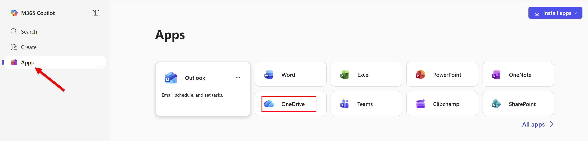

6. Click on **+ Create or upload**, and then select **Folder**.

   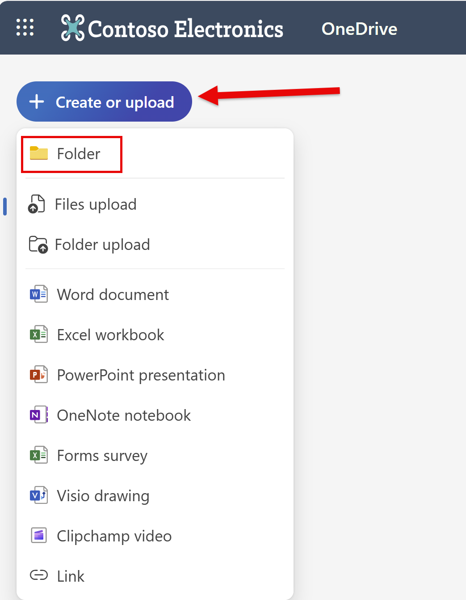

7. In the **Create a folder** dialog, enter the name **Lab 02** and select **Create**.

   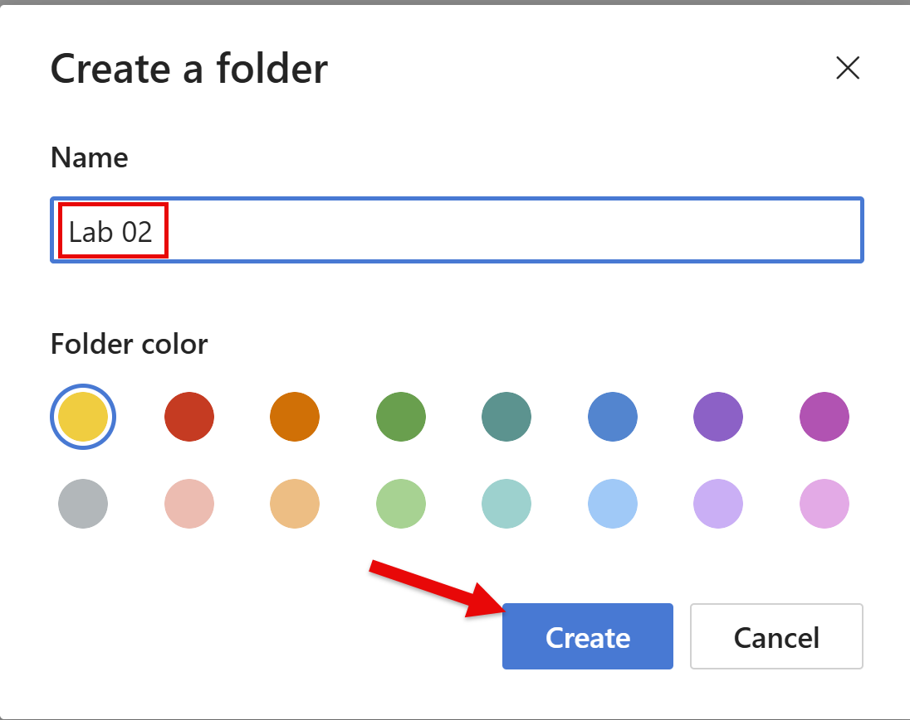 

8. Once the folder is created, select the **Lab 02** hyperlink on the success notification.

   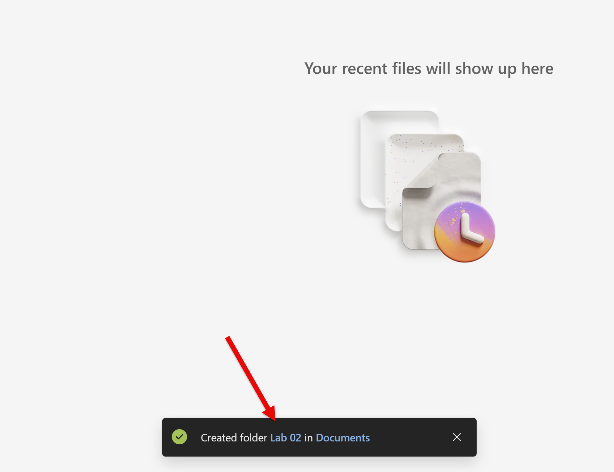

9. Upload the **File details.xlsx** file into the **Lab 02** by either dragging and dropping the file into the browser window or using the **+ Create or upload** -> **Files upload** option.

   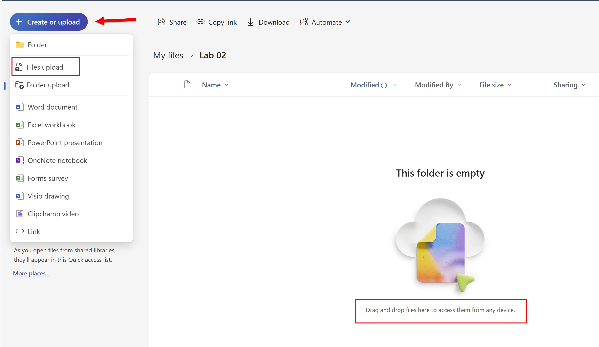

8. Once uploaded, a success notification will appear and the file will be listed in the folder.

   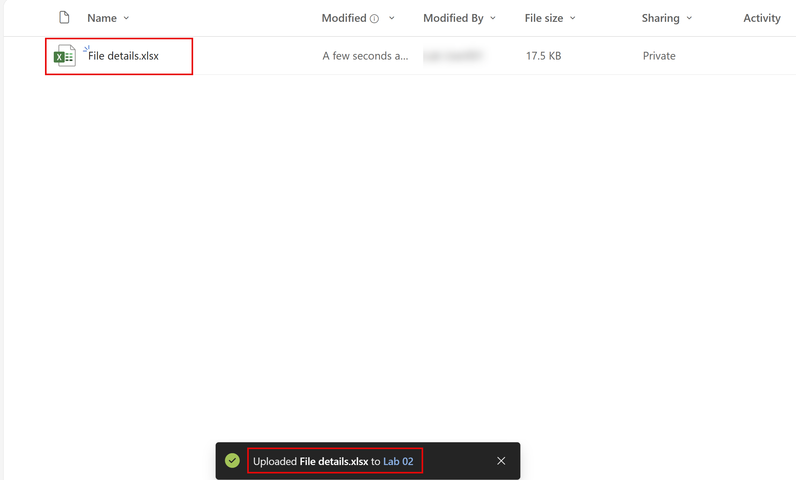

9. Leave the OneDrive for Business tab open, as we will return to it later in the lab.

**✅ You have successfully uploaded the file that our autonomous agent will write to.**

## ✍️ Exercise 2 – Build and Test an Autonomous Agent

### Task 1 – Create an Agent in Copilot Studio

1. Open a new browser tab and navigate to [Copilot Studio](https://copilotstudio.microsoft.com). Sign in using your lab credentials if prompted and ensure your **Development** environment is selected.
2. Select **Agents** -> **+ New agent**.
3. Select **Configure**, enter the following details and then select **Create**:  

   - **Name:** `File tracker agent`
   - **Description:** `This agent will update the File details tracker placed in OneDrive each time a new file is created.`

   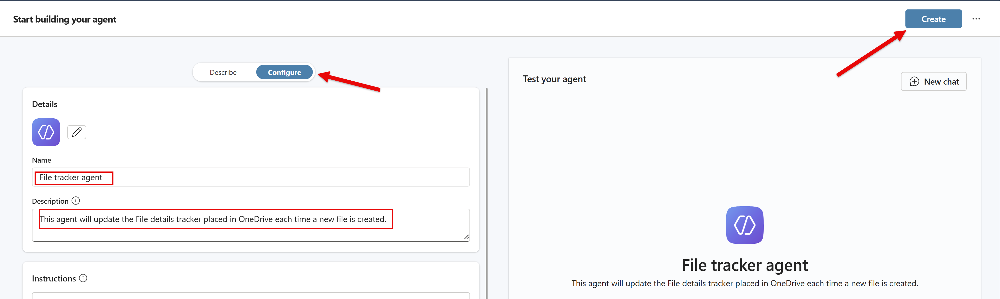
 
4. The agent setup may take a few minutes. Once finished, the **File tracker agent** will open and display the message **Your agent is ready**.
5. Leave your newly created agent open if you plan to continue to the next task.

**✅ You have successfully created a new autonomous agent in Copilot Studio.**

### Task 2 – Add a Trigger to the Agent

[Triggers](https://learn.microsoft.com/en-us/microsoft-copilot-studio/authoring-triggers-about) allow your agents to operate independently from user input. Based on events, such as a predefined schedule or a new e-mail being sent, an agent can orchestrate and execute logic. In this task, we'll add a trigger for whenever a new file is created in OneDrive for Business.

1. You should still have the **File tracker agent** open from the previous task. If not, navigate to **Agents**, locate the **File tracker agent**, and select it to open.
2. On the **File tracker agent** page, scroll down to the **Trigger** section and select **+ Add trigger**.

   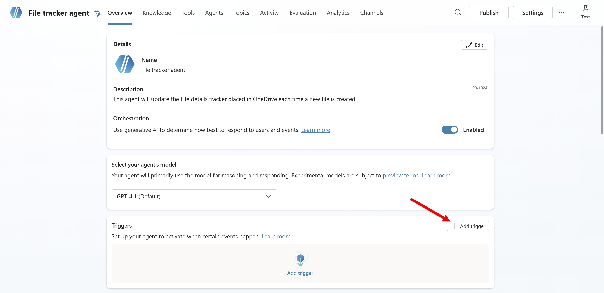

3. On the **Add trigger** dialog, choose the trigger **When a file is created** from the **OneDrive for Business** connector, and then click **Next**.

   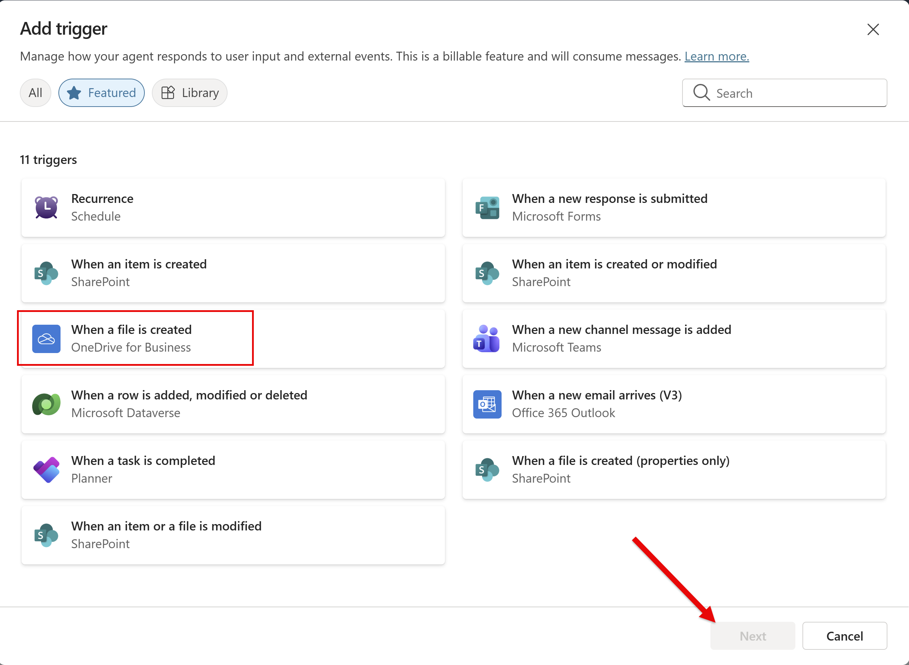

4. Wait for the connections to initialize on the next page (green check marks should appear) and then click **Next**.

   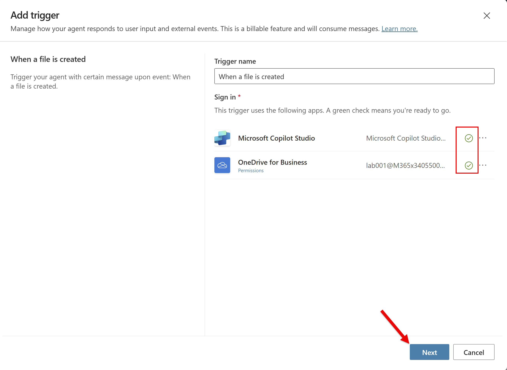

5. On the next dialog page, configure the settings as follows. When finished, click **Create trigger**:
   - **Folder:** Type in `/` or select the root folder of your OneDrive for Business.  
   - **Include subfolders:** Select *Yes** from the dropdown  
   - **Leave all other fields as default**

   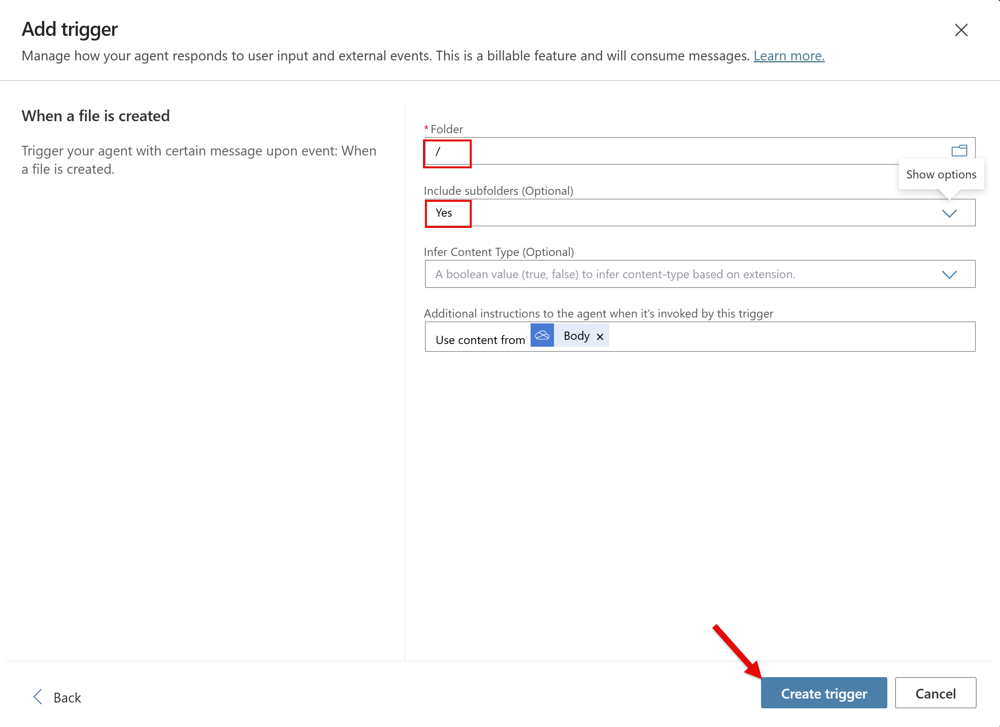

6. The trigger will take a few moments to create. Once you see the **Time to test your trigger** message, click on **Close** to finish the setup.

   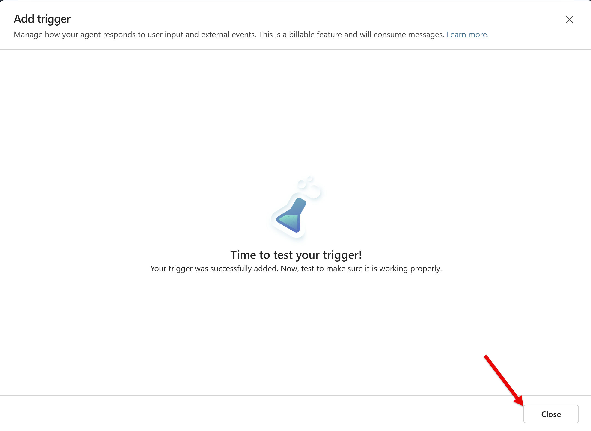

> [!IMPORTANT]
> Do not test the trigger yet, as we will modify its logic in the next task.

7. Leave the agent open if you plan to continue to the next task. 

**✅ You have successfully added a trigger to the autonomous agent.**

### Task 3 – Add Logic to the Trigger

We will now modify the underlying Power Automate cloud flow to define what the trigger should do when a new file is created.

1. Ensure you still have the **File tracker agent** open from the previous task. If not, navigate to **Agents**, locate the **File tracker agent**, and select it to open.
2. On the **File tracker agent** page, scroll down to the **Trigger** section, select the **three dots (…)** on the **When a file is created** trigger, and then choose **Edit in Power Automate**.

   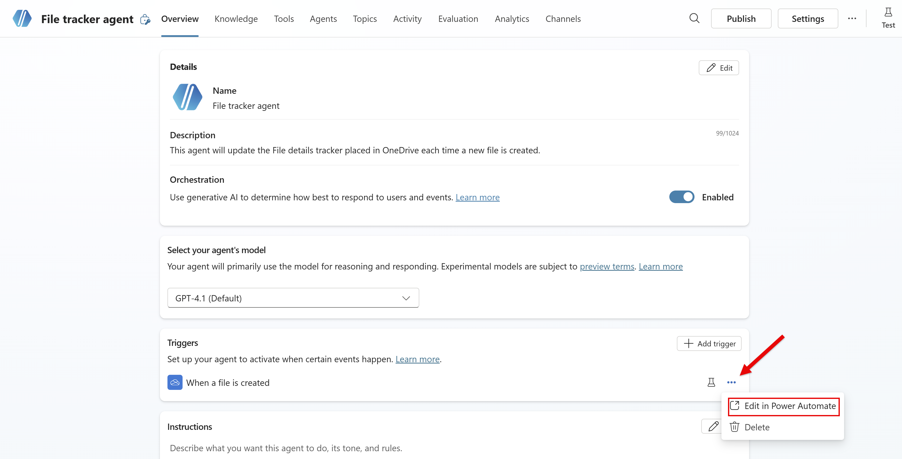

3. On the cloud flow designer page, select the **+** icon between the trigger and **Sends a prompt to the specified copilot for processing**. Then, choose **Add an action**.

   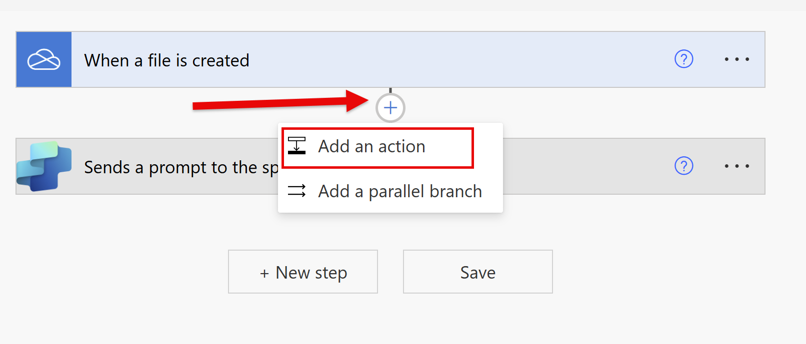

4. Search for **Add a row** and then select **Add a row into a table** from the **Excel Online (business)** connector.

   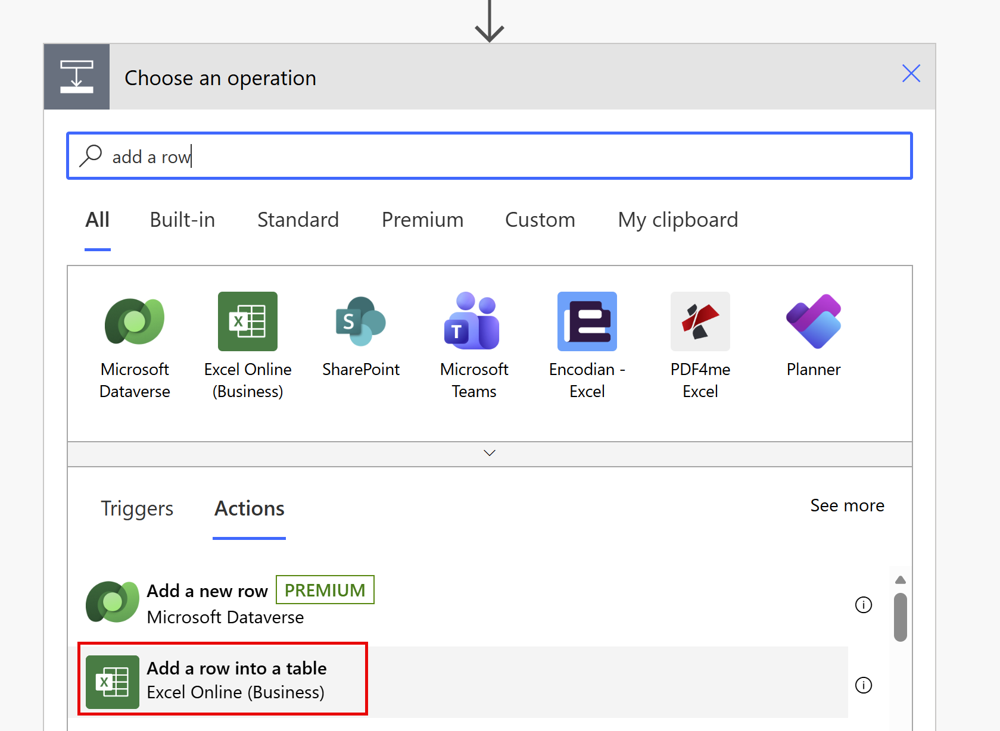

5. Enter the following values, then select **Save**:

   | Property            | Value                               |
   |---------------------|-------------------------------------|
   | Location            | OneDrive for Business               |
   | Document Library    | OneDrive                            |
   | File                | /Lab 02/File details.xlsx           |
   | Table               | Table1                              |
   | Date Time Format    | Serial Number                       |
   | File ID             | File identifier (dynamic content)   |
   | File Name           | File name (dynamic content)         |
   | File Path           | File path (dynamic content)         |

   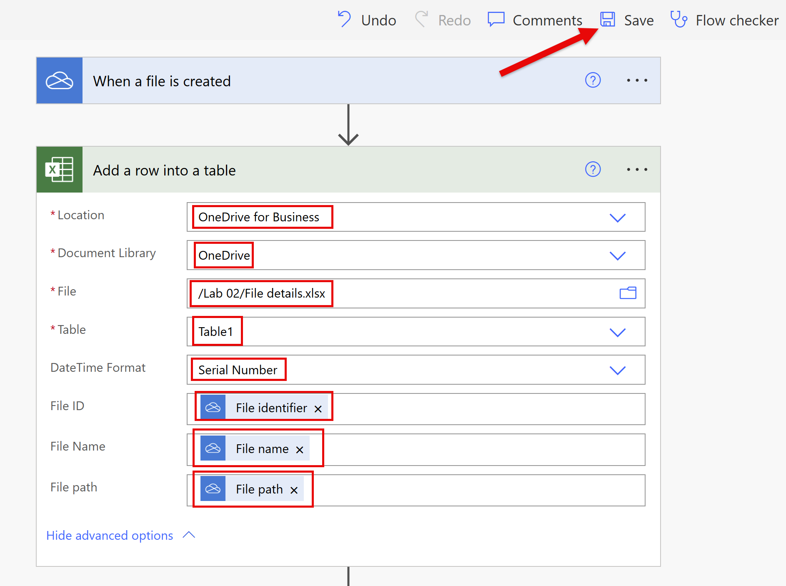

6. **Close** the cloud flow designer browser tab to return to Copilot Studio.
7. Leave Copilot Studio open if you plan to continue to the next task.

**✅ You have successfully modified the trigger logic to log new file details into the Excel tracker.**

### Task 4 – Publish the Trigger

1. Ensure you still have the **File tracker agent** open from the previous task. If not, navigate to **Agents**, locate the **File tracker agent**, and select it to open.
2. On the **File tracker agent** page, open **Settings**. 

   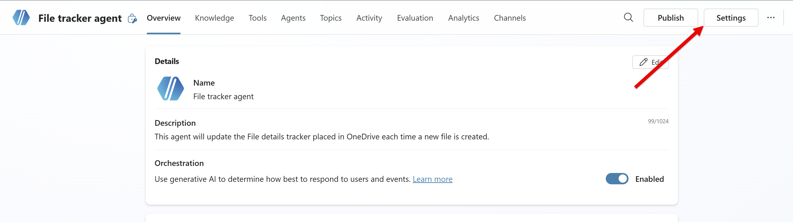

3. Navigate to **Security**, then **Authentication** and then select **No authentication**. Click **Save** and then **Save** again on the **Save this configuration?** dialog.

   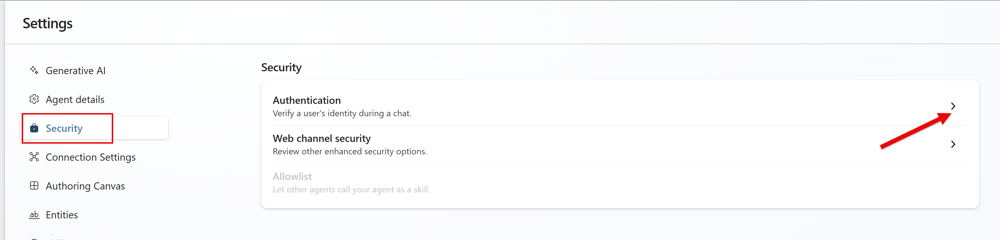

   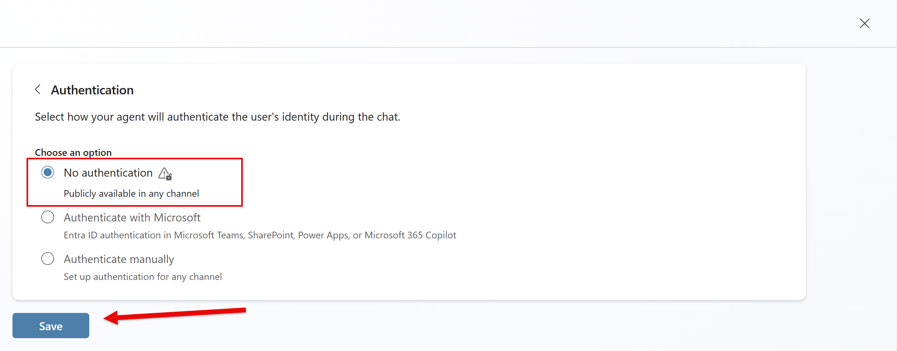

4. **Close** the Settings pane by clicking the **X** in the top-right corner.

   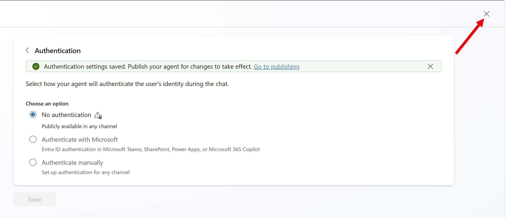

5. Publish the agent by selecting **Publish** in the top-right corner and then **Publish** again in the confirmation dialog.

   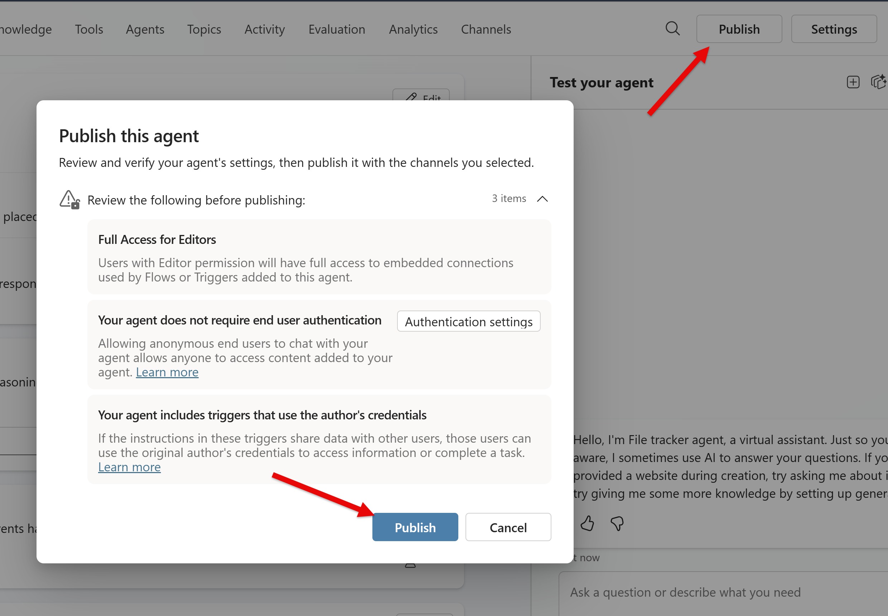

6. Wait for the publishing process to complete. Once finished, a success notification will appear.

   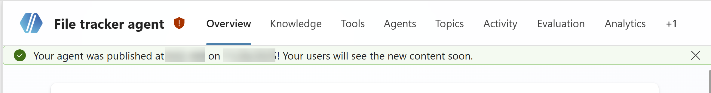

**✅ You have successfully published the autonomous agent with the configured trigger.**

### Task 5 – Test the Trigger

1. You should still have **OneDrive for Business** open from Exercise 1. If not, navigate to the [Microsoft 365 portal](https://m365.cloud.microsoft/), sign in using your lab credentials, click on **Apps**, and then select **OneDrive**.
2. With the **Lab 02** folder open, click **Create or upload** -> **Word document**.  

   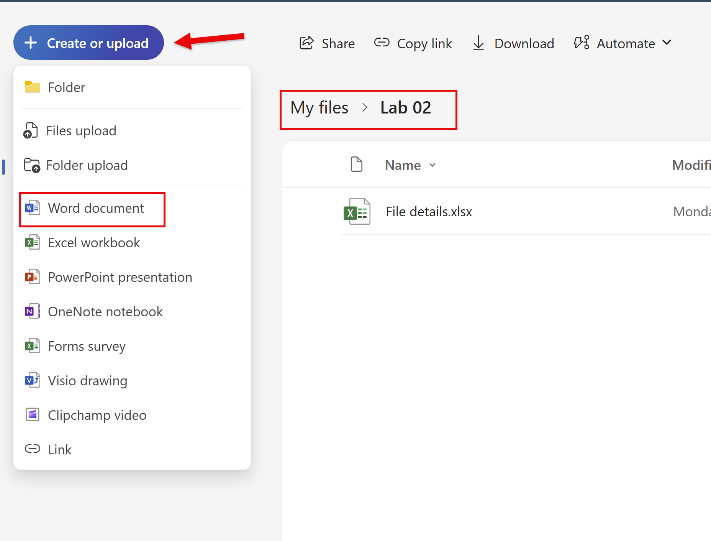

3. A new, blank Word document will open in a new browser tab. Click **Close** on the **Your privacy option** dialog that appears.

   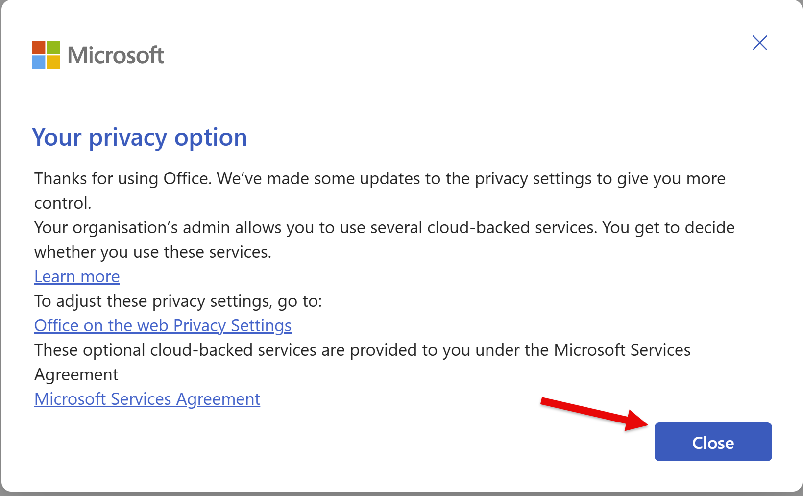

4. Click on **Document** in the top-left corner of the screen and rename the document to **Test Document 1**. The document will automatically save.

   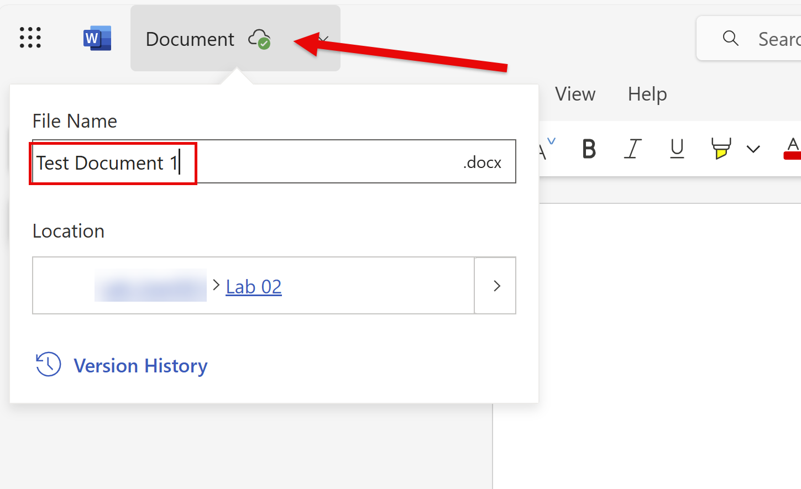

5. Close the Word document browser tab to return to OneDrive for Business. Refresh the page and verify that the newly created Word document appears in the **Lab 02** folder.

   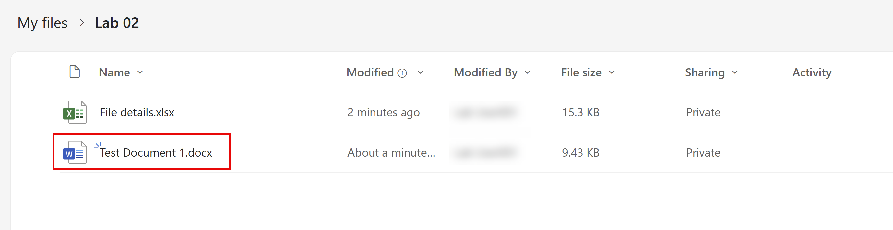

6. Repeat steps 2-5 to create an additional file. You may (optionally) create a different file type, such as an Excel workbook or PowerPoint presentation, and create a variable number of files to test the trigger further.

7. When you are finished creating files, open the **File details.xlsx** spreadsheet and verify that the tracker is being updated with information about the newly created file(s).

   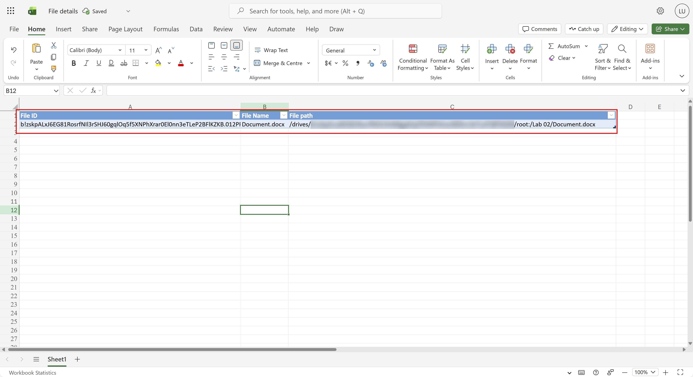

**✅ You have successfully tested the autonomous agent and verified that it logs new file details into the Excel tracker.**

### Summary

In this lab, you have learned how to: 

- Create an autonomous agent in Copilot Studio  
- Add and configure a trigger  
- Modify trigger logic using Power Automate  
- Publish and test the autonomous agent  

> [!IMPORTANT]
> To ensure the autonomous agent does not continue running in the background, remember to **delete the trigger** in Copilot Studio when you are finished.

**Congratulations, you've finished Lab 2** 🥳