# Lab 3 – Enhancing the Real Estate Agent with Gen AI Capabilities

In this lab, you will extend the **Real Estate Booking Service** agent you created earlier by introducing [entities & slot filling](https://learn.microsoft.com/en-us/microsoft-copilot-studio/advanced-entities-slot-filling), [knowledge](https://learn.microsoft.com/en-us/microsoft-copilot-studio/knowledge-copilot-studio) and [tools](https://learn.microsoft.com/en-us/microsoft-copilot-studio/advanced-plugin-actions). These enhancements will make the agent more intelligent, more context-aware, and capable of handling more advanced real-world scenarios.

## Lab Overview

> [!IMPORTANT]
> Microsoft Copilot Studio is a constantly evolving product, with two major releases each year and many incremental updates throughout each calendar year. Whilst every effort has been made to ensure the accuracy of these steps and all screenshots, from time to time, certain instructions or screenshots may no longer resemble the current interface or experience. In case of any issues completing any step, please consult your instructors.

In [Lab 1](./Lab-1-Build-Agent-Copilot-Studio.md), you created the foundation for a Real Estate agent that could assist customers with booking property showings. While effective, the agent’s capabilities were limited to predefined questions, responses, and logic.

Modern agentic experiences rely on generative AI, pattern recognition, and dynamic entity extraction to understand more complex user input. By enhancing the agent with these capabilities and integrating automation via workflows, you will significantly expand its abilities.

### 🎯 Goal

- Use entities to identify and extract structured information from user messages.  
- Use variables to store user responses throughout the conversation.  
- Add a custom knowledge source to the agent.
- Build a Power Automate flow that retrieves property details from Dataverse.  
- Build another flow that creates a booking request for a property showing.

### ✅ Prerequisites

- If using a lab environment provided by your instructors:
   - Completion of all steps in [Lab 0 - Configure Lab Environment](Lab-0-Configure-Environment.md) and [Lab 1 - Build Your First Agent with Copilot Studio](Lab-1-Build-Agent-Copilot-Studio.md).
- Otherwise, if using your own environment:
   - Access to a Power Apps Developer environment with Copilot Studio enabled.  
   - A valid Copilot Studio license or trial license.
   - The ability to create cloud flows in Power Automate.
   - Completion of all steps in [Lab 1 - Build Your First Agent with Copilot Studio](Lab-1-Build-Agent-Copilot-Studio.md)

### Scenario

You are part of the Real Estate customer service and automation team at Contoso Homes. Your goal is to modernise the digital experience for potential buyers and renters.

The current agent can collect basic information, but it cannot yet:

- Understand variations of property types  
- Capture details like number of bedrooms  
- Search Dataverse for matching properties  
- Create a formal booking request  

In this lab, you will upgrade the agent so it behaves more like an intelligent, modern, AI-powered assistant.

### ⌛ Length

This lab takes approximately 80 minutes to complete.

---

## ✍️ Exercise 1 – Use Entities to Improve the Agent

Entities allow Copilot Studio to extract meaningful information such as property types, numbers, or identifiers. You will create two custom entities and add them to the **Book a Real Estate Showing** topic.

### Task 1 – View Prebuilt Entities

1. Open a new browser tab and navigate to [Copilot Studio](https://copilotstudio.microsoft.com). Sign in using your lab credentials if prompted and ensure your **Development** environment is selected.
2. Open the **Real Estate Booking Service** agent created in Lab 01.
3. Select **Settings** and then **Entities**.

   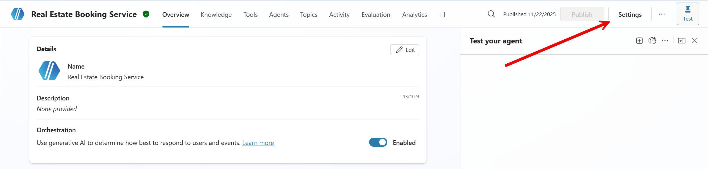

   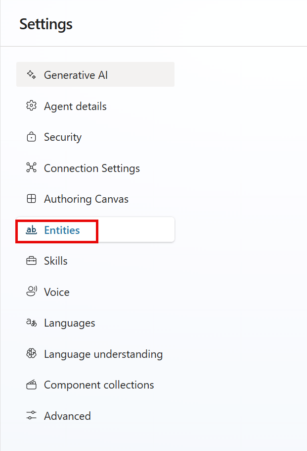

4. Review the list of available prebuilt entities. Observe that there are entities for commonly used business objects such as Date, Email, and Location. You may (optionally) select any of these to view more details.

   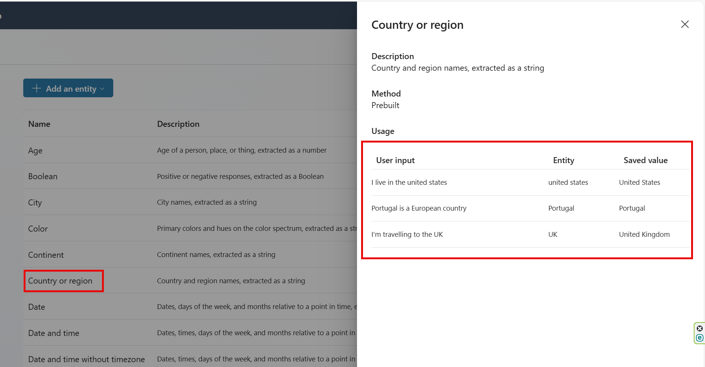

> [!NOTE]
> Entities provide a powerful mechanism to map user intent into structured data that can be used in topics and tools. You can create custom entities to suit your specific use cases. We will do this in the next task.

5. Leave the **Entities** pane open if you plan to continue to the next task.

**✅ You have successfully reviewed the prebuilt entities provided by Copilot Studio.**

### Task 2 – Create Custom Entities

1. You should still be in the **Entities** pane for the **Real Estate Booking Service** agent. If not, navigate back to **Settings** -> **Entities**.
2. Select **+ Add an entity** -> **+ New entity**.

   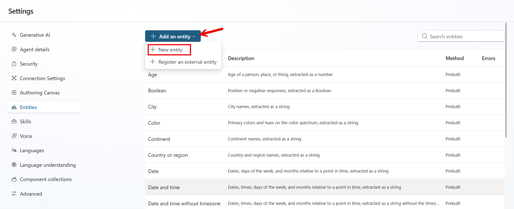

3. In the **Create an entity** dialog, select **Closed list**.

   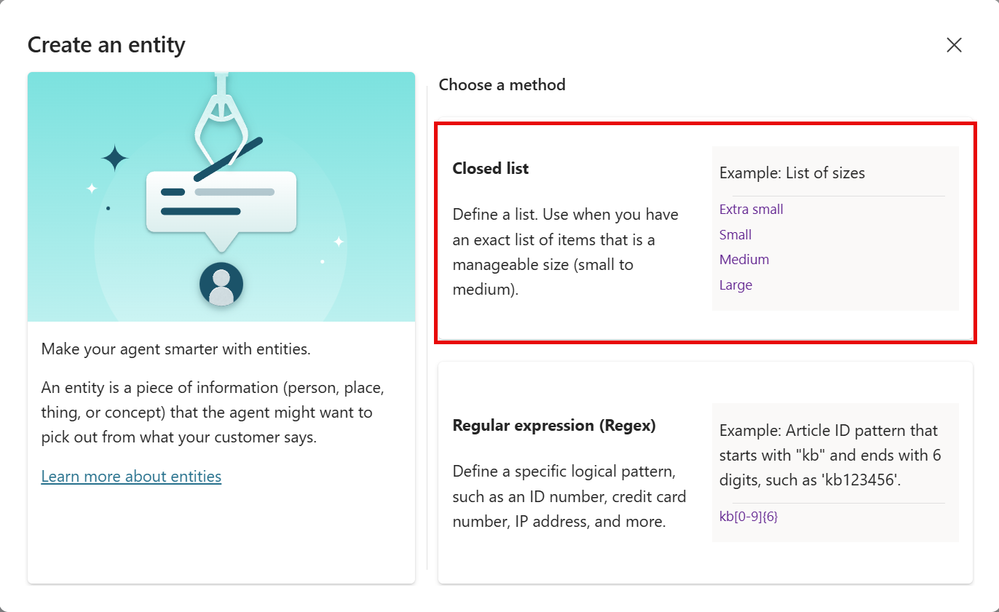

4. On the **Untitled** pane, configure the new entity as follows:
   - **Name**: `Property Type`
   - **Add these list items**: `Apartment`, `Condominium`, `Duplex` and `House`

   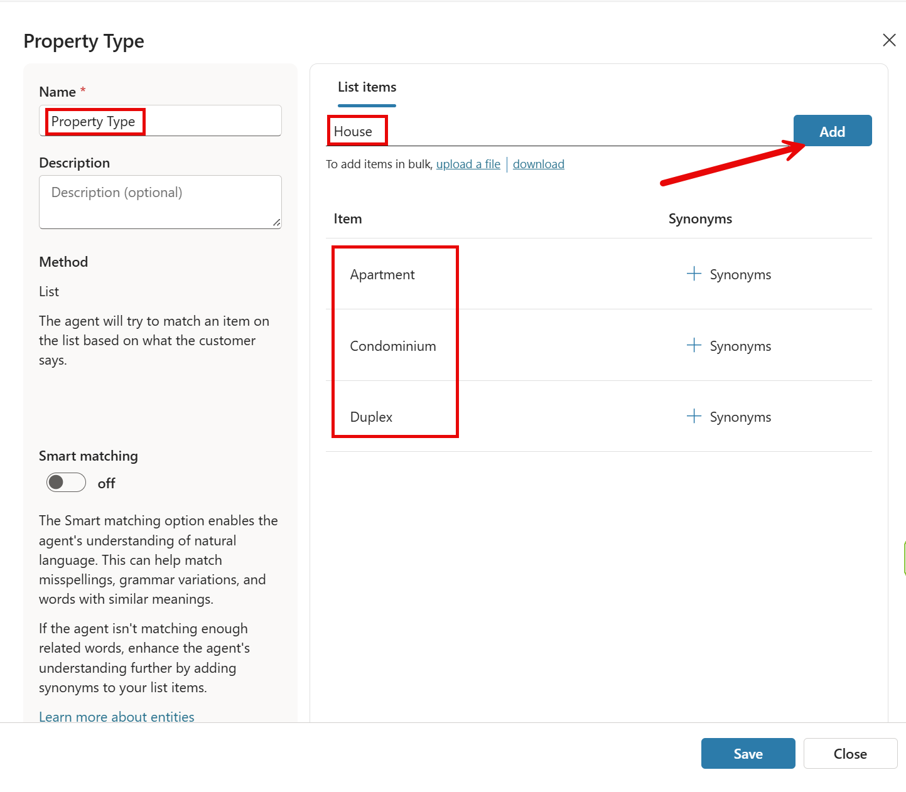

5. Add synonyms by clicking the **+ Synonyms** next to each list item, entering the term, pressing the **+** button, and then selecting **Done**:  
   - `Apartment` -> `Flat`  
   - `House` -> `Single-family home`  
   - `Condominium` -> `Townhouse`

   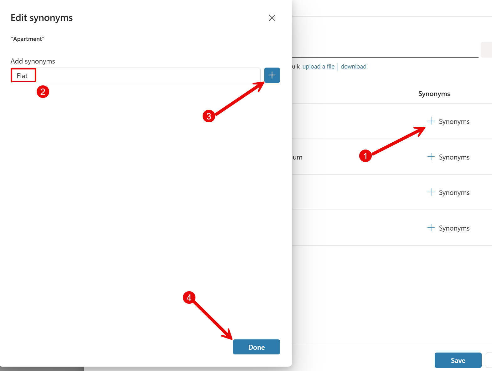

> [!NOTE]
> Synonyms help the agent recognise different terms that users might use to refer to the same concept. For example, **Football** could have a synonym of **Soccer**.

6. Verify that the new entity is configured correctly per the below screenshot and then press **Save**. Once created successfully, press **Close** to return to the Entities list.

   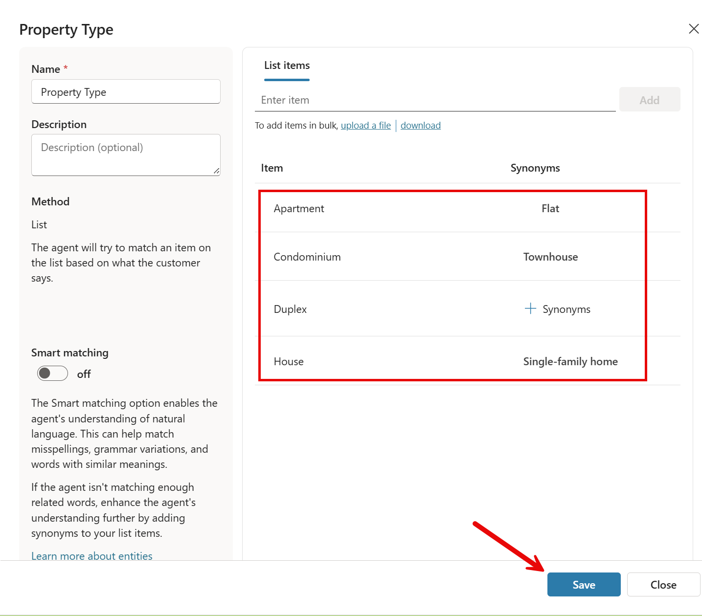

   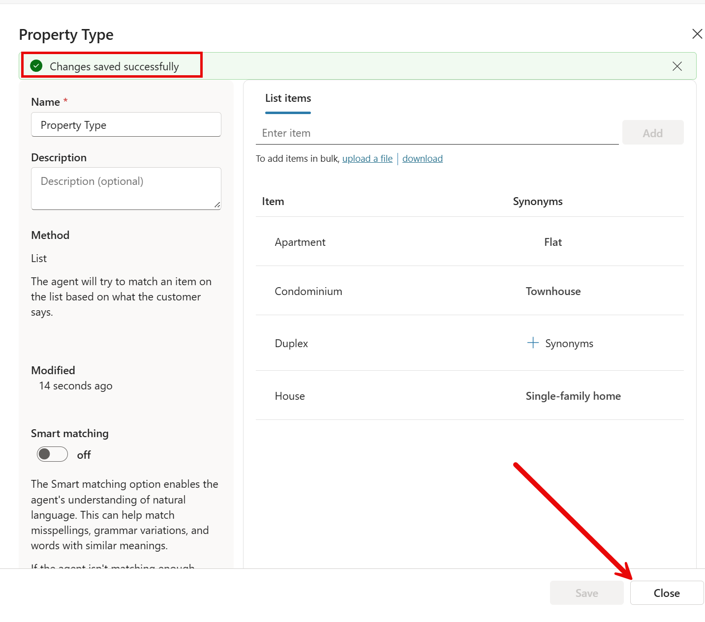

7. Repeat steps 2-6 to create the **Number of Bedrooms** entity, with the following configuration:
   - **Type**: Select **Regular expression (Regex)**
   - **Name**: `Number of Bedrooms`
   - **Pattern**: `[1-5]`

   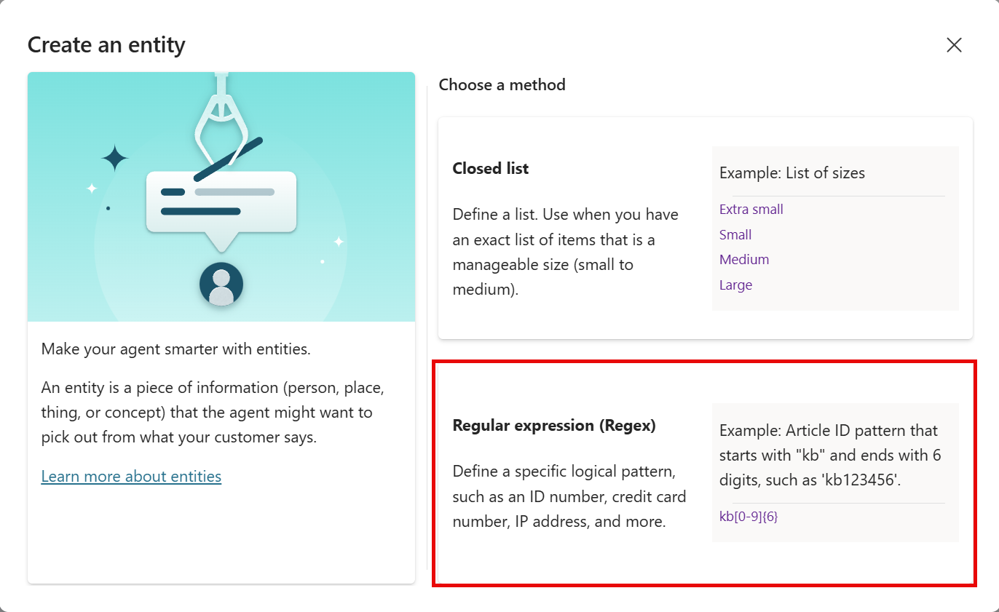

   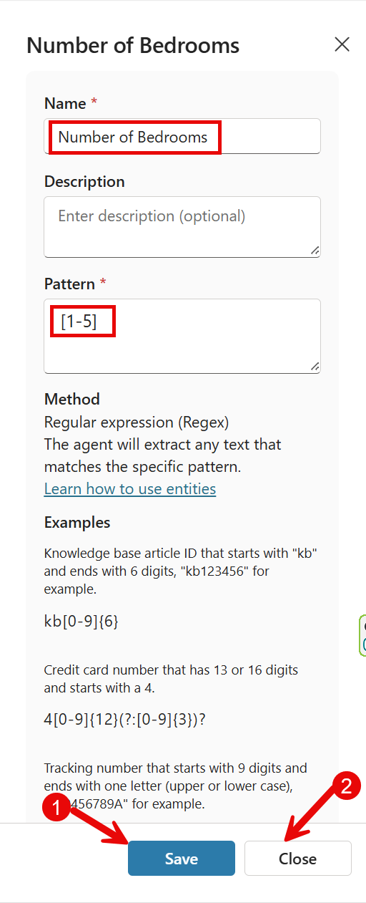

> [!NOTE]
> The regex pattern `[1-5]` allows the agent to capture any single digit between 1 and 5 as the number of bedrooms. Regular expressions provide a powerful way to define patterns for extracting structured data from user input. For further details on regex syntax, refer to the [Regular Expression Quick Reference](https://learn.microsoft.com/en-us/dotnet/standard/base-types/regular-expression-language-quick-reference) article.

8. Verify that both entities are listed in the **Entities** pane.

   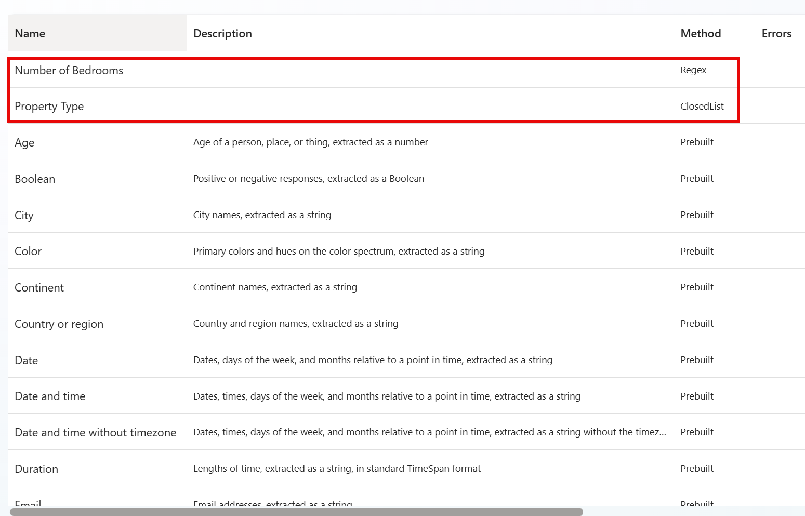

9. Close the **Settings** area to return to the **Overview** tab.

   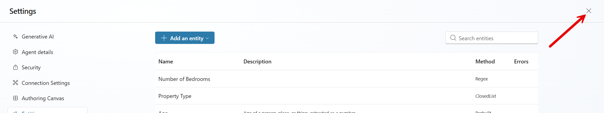

10. Leave the agent open if you plan to continue to the next task.

**✅ You have successfully created the Property Type entity.**

### Task 3 – Use Entities in the Book a Real Estate Showing Topic

1. You should be on the **Overview** tab of the **Real Estate Booking Service** agent. If not, navigate back to the agent from within Copilot Studio.
2. Open the **Topics** tab and then select the **Book** topic:

   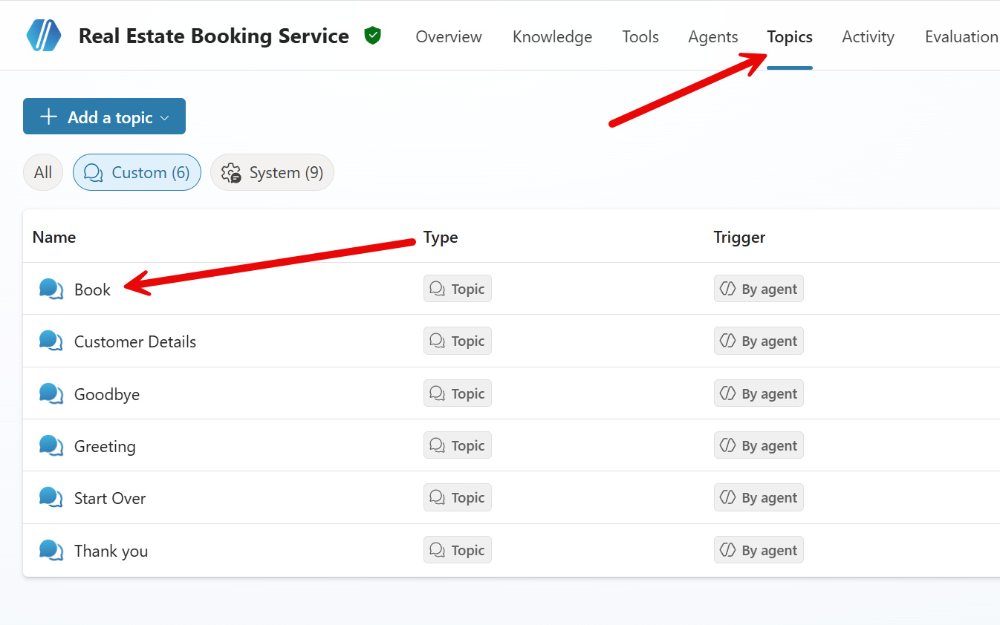

> [!NOTE]
> In our testing, although the topic was named **Book a Real Estate Showing** in Lab 01, it may appear as simply **Book** on the **Topics** page. If the longer name is displayed, select that instead.

3. Scroll down to the **What date and time do you want to see the property?** question node and then add a new question node with the following configuration:
   - **Message**: `Which type of property are you interested in?`
   - **Identify**: Select the **Property Type** entity created earlier.
   - **Variable name**: Rename to `PropertyType`
   - Ensure all list values are displayed to the user by clicking **Select options** and ticking all boxes.

   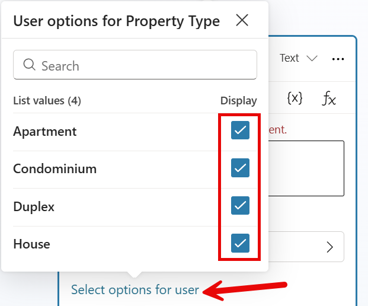

   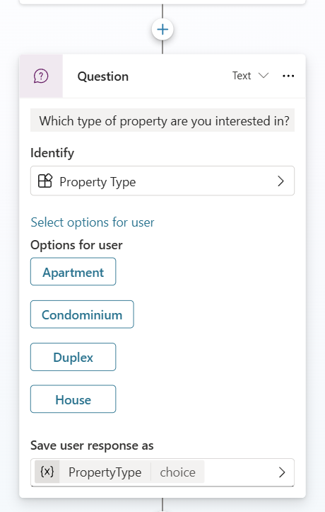

4. After the newly added question node in step 3, add another question node with the following configuration:
   - **Message**: `How many bedrooms do you need?`
   - **Identify**: Select the **Number of Bedrooms** entity created earlier.
   - **Variable name**: Rename to `NumberofBedrooms`

   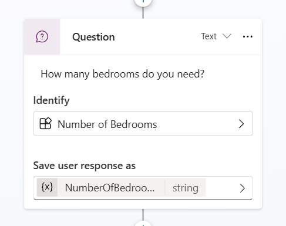

5. Click **Save** on the topic so you don't lose your changes.

   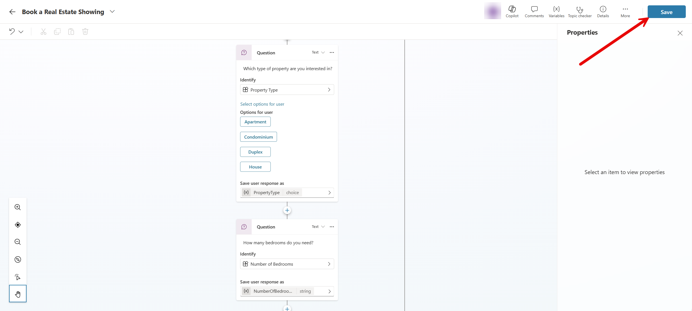

6. Leave the topic open if you plan to continue to the next exercise.

**✅ You have successfully added entities to the topic.**

## ✍️ Exercise 2 – Create Tools

You will implement two connector actions leveraging the **Microsoft Dataverse** connector. The first will retrieve property details based on the number of bedrooms specified by the user. The second will create a booking request row in Dataverse.

### Task 1 – Use a Tool to Retrieve a Property

1. You should still be in the **Book a Real Estate Showing** topic from the previous exercise. If not, navigate back to here.
2. Scroll to the question node **How many bedrooms do you need?** topic added in Exercise 1, click the **+** icon below it, and then select **Add a tool** -> **Connector**. Use the search bar to search for and select the **List rows from selected environment** action.

   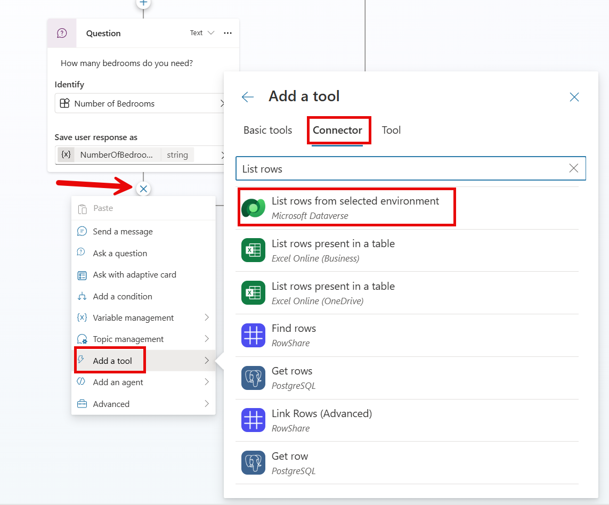

3. On the **Create or pick a connection** dialog, verify that the connection has been established successfully and then click **Submit**.

   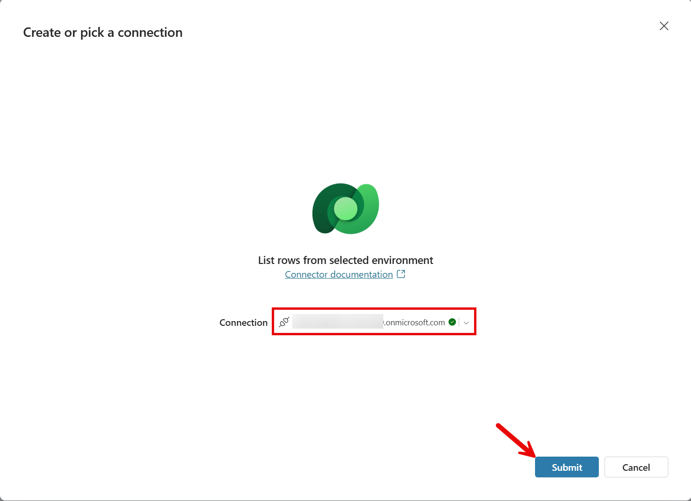

4. The tool will be added to the topic. Select it and then click on **Inputs**.

   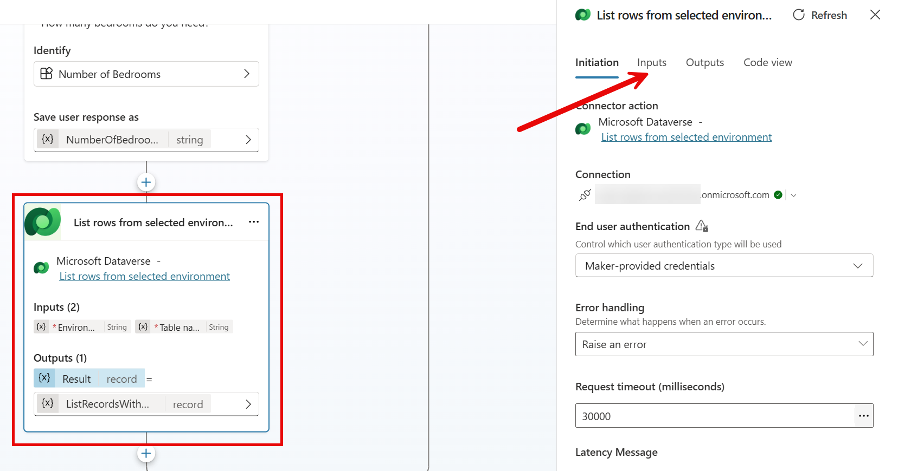

5. Configure the tool inputs as follows:
   - **Environment**: Select your **Development** environment.
   - **Table name**: Select **Real Estate Properties**.
   - **Filter rows**: Enter the following expression by clicking the elipses (...), selecting **Formula** and pasting the following: `"contoso_bedrooms eq " & Topic.NumberOfBedrooms`

   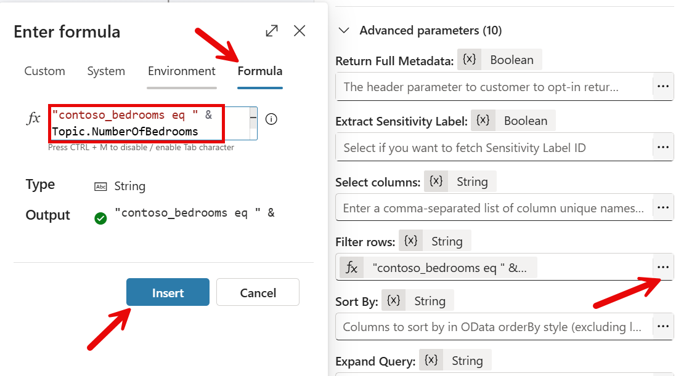

   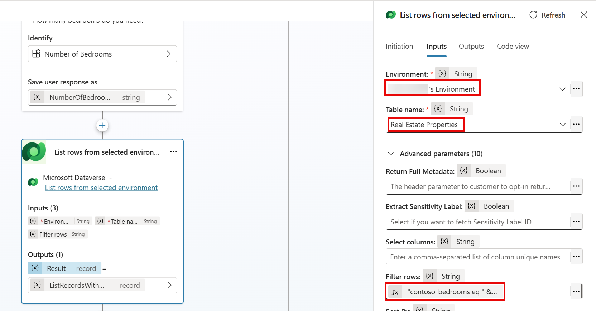

6. Scroll up the topic and delete the question node **Which property do you want to see?** since the tool will now handle this functionality instead.

   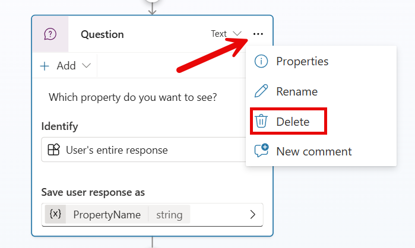

7. Scroll back down to the **List rows from selected environment** tool and add a new message node after it with the following configuration:
   - **Message**: Select the **Formula** icon and enter: `"Property Name: " & First(Topic.ListRecordsWithOrganization.value).contoso_newcolumn`

   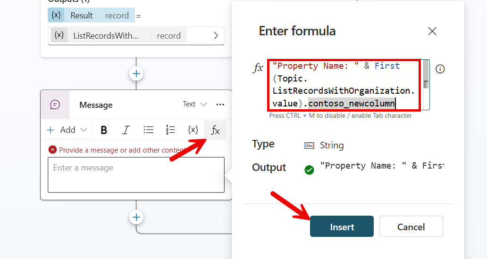

8. Click **Save** on the topic to avoid losing your changes.
9. Leave the topic open if you plan to continue to the next task.

**✅ You have successfully added a tool to retrieve property details.**

### Task 2 – Use a Tool to Make a Booking Request

1. You should still be in the **Book a Real Estate Showing** topic from the previous task. If not, navigate back to here.
2. Scroll to the end of the topic, click the **+** icon below the last message node, and then select **Add a tool** -> **Connector**. Use the search bar to search for and select the **Add a new row to selected environment** action.

   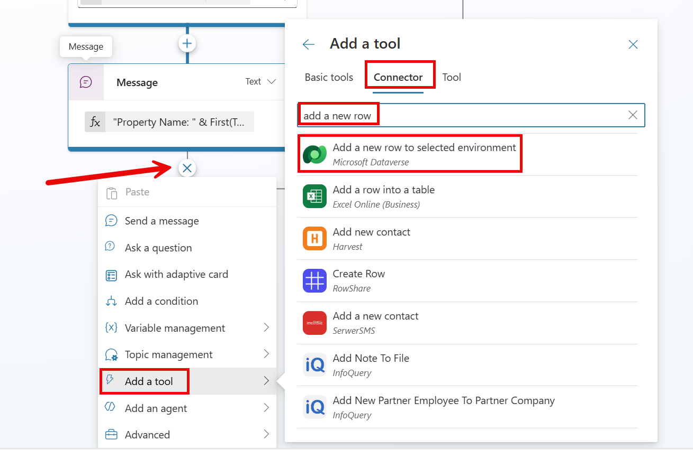

3. On the **Create or pick a connection** dialog, verify that the connection has been established successfully and then click **Submit**.
4. The tool will be added to the topic. Select it and then click on **Inputs**.

   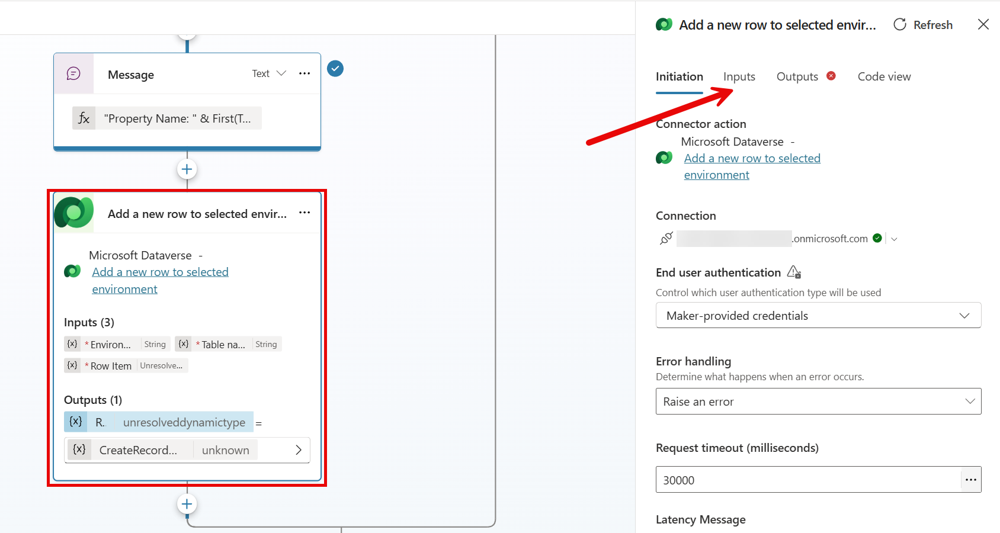

5. Configure the tool inputs as follows:
   - **Environment**: Select your **Development** environment.
   - **Table name**: Select **Booking Requests**.
   - **Field values**:
     - **Booking Name**: Type in `Copilot booking`
     - **Property (Real Estate Properties)**: Enter the following expression by clicking the elipses (...), selecting **Formula** and pasting the following: `"contoso_bookingrequests(" & First(Topic.ListRecordsWithOrganization.value).contoso_realestatepropertyid & ")"`
     - **Viewer Email**: Enter the following expression by clicking the elipses (...), selecting **Formula** and pasting the following: `Topic.EmailAddress`
     - **Viewer Name**: Enter the following expression by clicking the elipses (...), selecting **Formula** and pasting the following: `Topic.Name`

   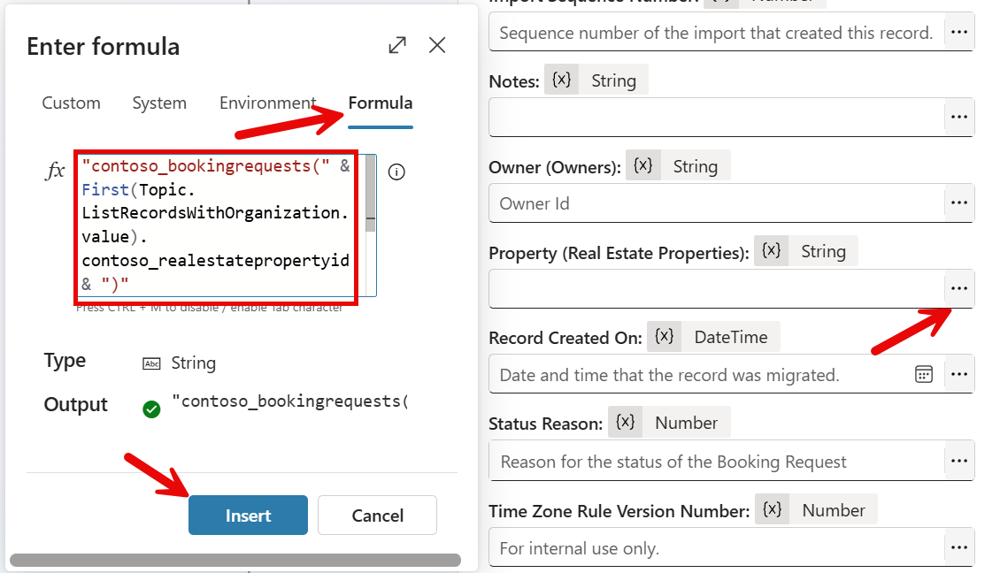

   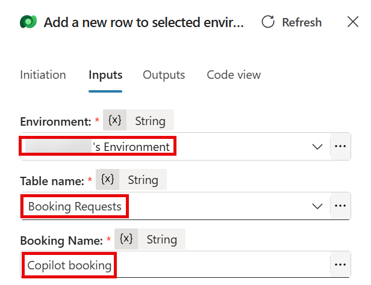

   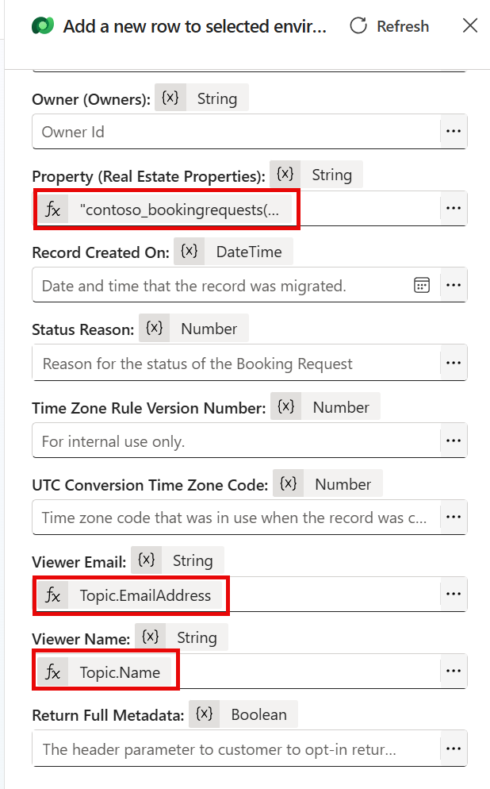

6. Add a final message node after the tool with the following configuration:
   - **Message**: `Your booking request has been submitted successfully! We will contact you soon with further details.`

   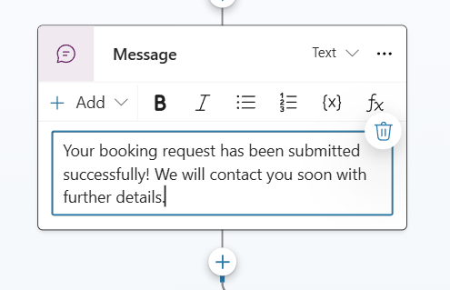

7. Click **Save** on the topic to avoid losing your changes.
8. Leave the topic open if you plan to continue to the next exercise.

**✅ You have successfully added a tool to create a booking request.**

## ✍️  Exercise 3 – Test the Agent

Let's test the enhanced agent to ensure that the entities and tools are functioning as expected.

### Task 1 – Test the Flow

1. You should still be in the **Book a Real Estate Showing** topic from the previous exercise. If not, navigate back to here.
2. Select **Test** to open the test pane and enable the **Track between topics** setting by selecting the elipses (...).

   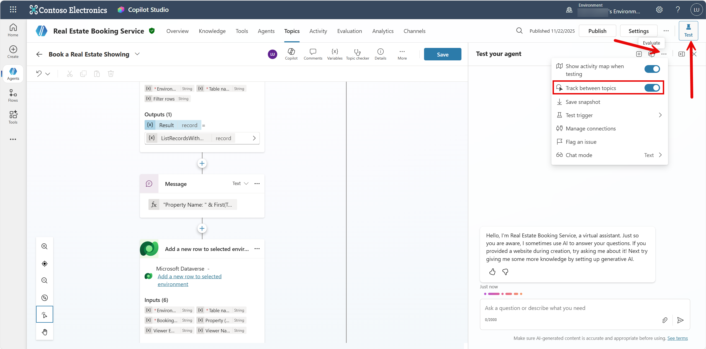

3. Initiate a new conversation by typing `I want to book a real estate showing` and pressing **Enter**.
4. Provide the agent with answers to each question, verifying at each stage that the changes in this lab have taken effect:
   - For the date and time, enter a future date and time.
   - For the property type, use one of the synonyms defined earlier (e.g., `Flat` for `Apartment`).
   - For the number of bedrooms, enter `2`; this will ensure the test row created in Lab 1 is retrieved.
   - Verify that the final confirmation message is displayed. This indicates that the topic executed successfully.

   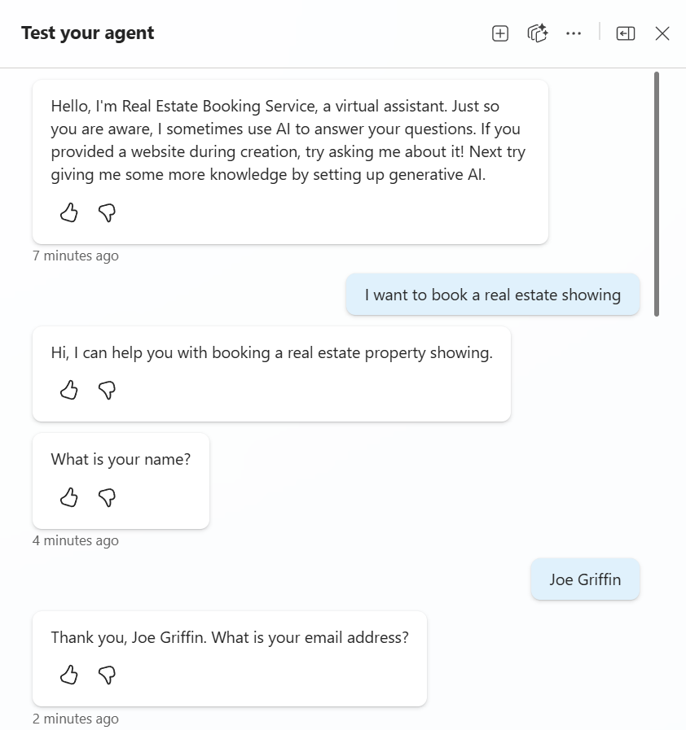

   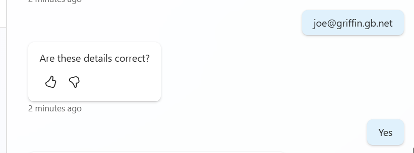

   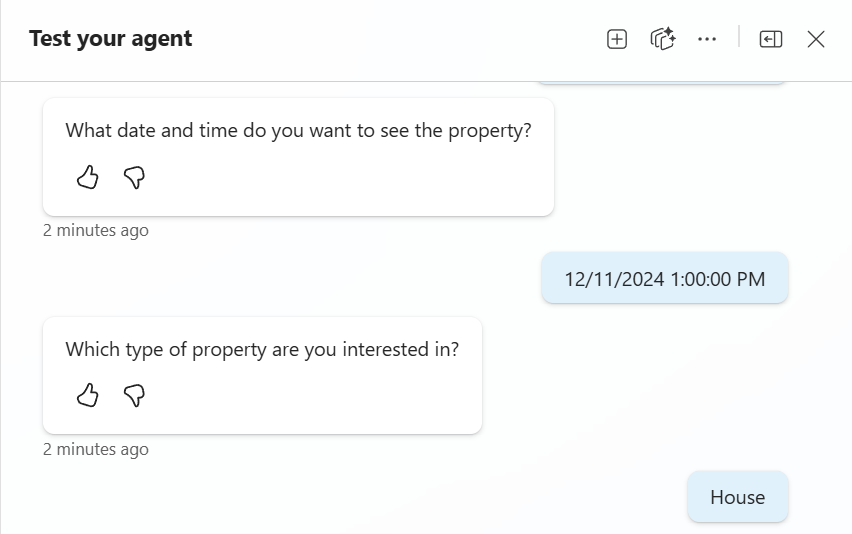

   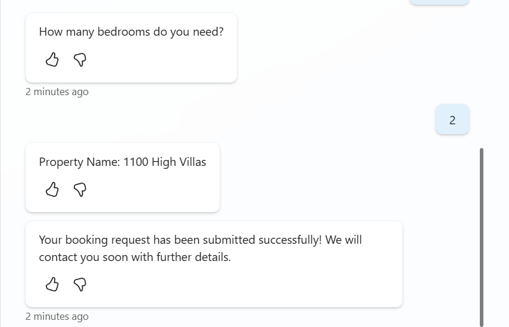

5. Close the test pane and leave the agent open if you plan to continue to the next task.

**✅ You have successfully tested your changes to the agent topic.**

### Task 2 – Validate the Booking in Dataverse

1. Open a new browser tab and navigate to [Power Apps](https://make.powerapps.com). Sign in using your lab credentials if prompted and ensure your **Development** environment is selected.
2. In the left-hand menu, select **Tables** -> **Custom** and then select the **Booking Request** table.

   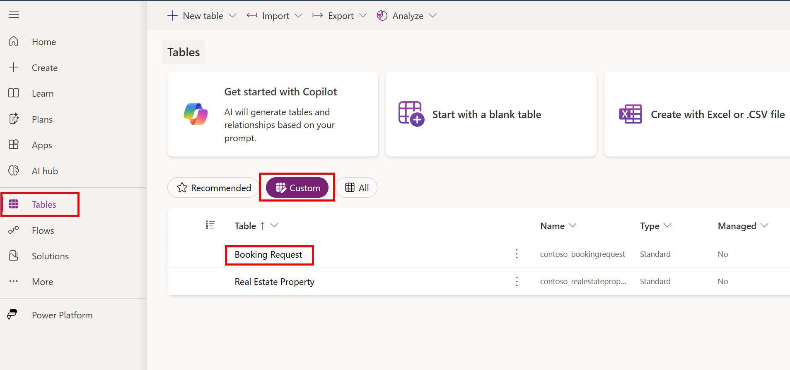

3. Verify that a new record with the name `Copilot booking` has been created. You can (optionally) add additional columns to the view to see more details.

   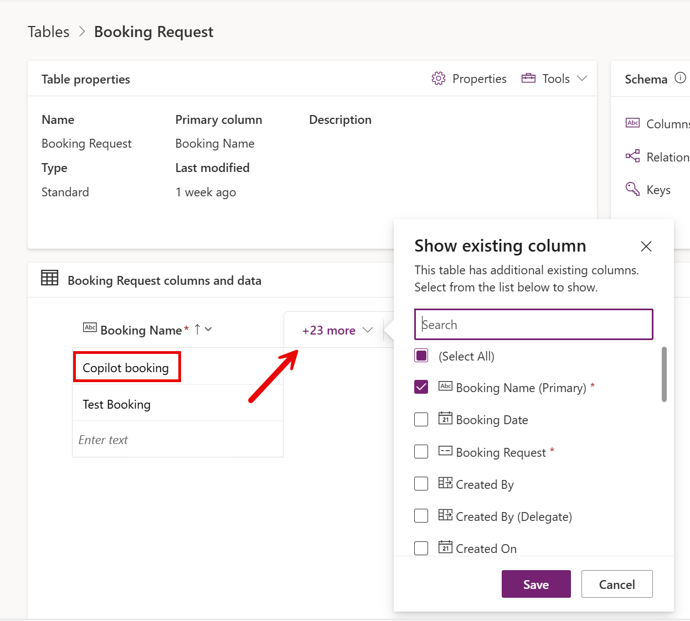

4. Close the Power Apps browser tab to return and return to Copilot Studio.
5. Leave the agent open if you plan to continue to the next exercise.

**✅ You have successfully validated that the booking request was created in Dataverse.**

## ✍️ Exercise 4 – Setup Knowledge Sources

In this exercise, you'll learn how to add knowledge sources to your agent. This will make your agent more intelligent and capable of answering a wider range of questions relating to the organisation.

### Task 1 – Ensure General Knowledge is Enabled

1. You should still be in the **Real Estate Booking Service** agent from the previous exercise. If not, navigate back to here and ensure the **Overview** tab is selected.
2. Click on **Settings** (top-right) and then ensure the **Generative AI** tab is selected.

   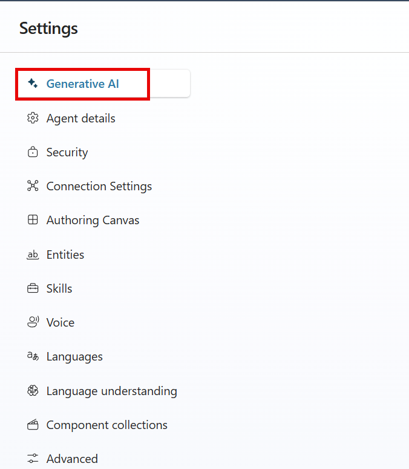

3. Scroll down to the **Knowledge** section and verify the **Use general knowledge** setting is enabled.

   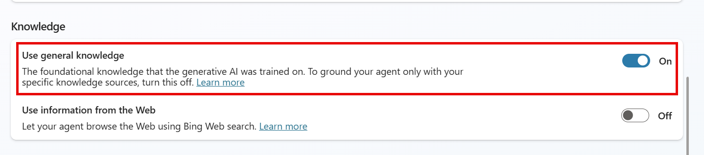

4. Close the **Settings** pane to return to the **Overview** tab.
5. Leave the agent open if you plan to continue to the next task.

**✅ You have successfully verified that general knowledge is enabled.**

### Task 2 – Add Knowledge from a Website

1. You should still be in the **Real Estate Booking Service** agent from the previous exercise. If not, navigate back to here and ensure the **Overview** tab is selected.
2. Scroll down to the **Knowledge** section and select **+ Add knowledge**.

   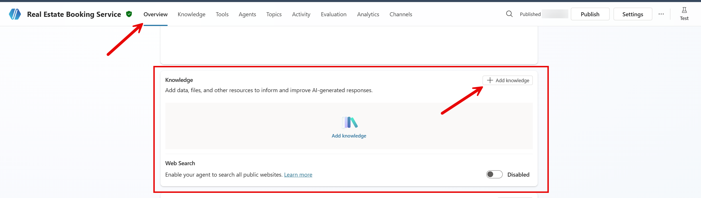

3. On the **Add knowledge** dialog, select **Public websites**.

   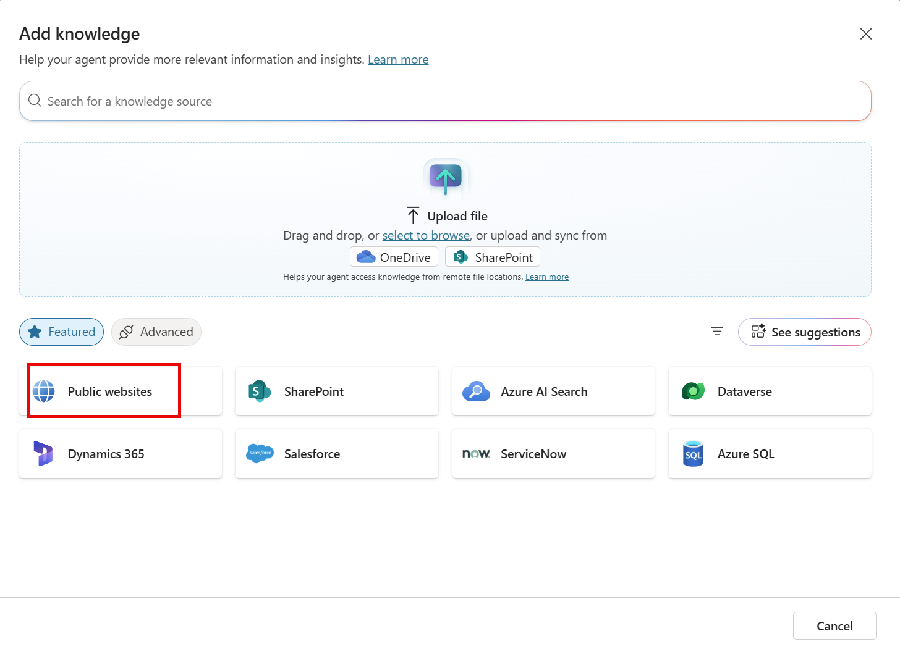

4. In the **Public website link** field, enter the following URL: `https://create.microsoft.com/templates/real-estate` and then press **Add**.

   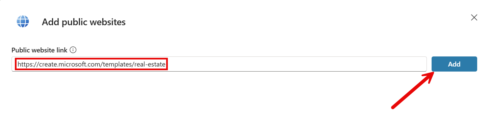

5. Verify that the website has been added successfully. Rename it to `Real Estate Website` and then press **Add to agent**.

   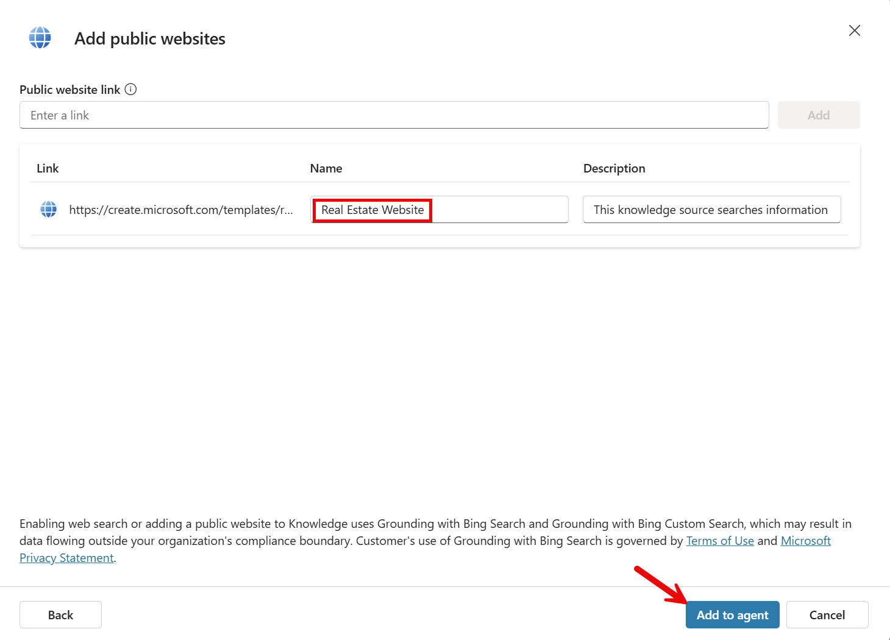

6. The newly added knowledge source should now be visible in the **Knowledge** section.

   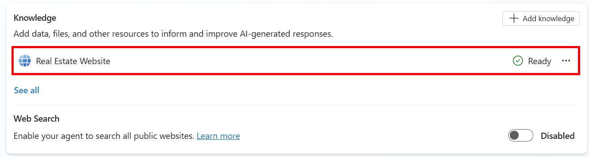

7. Leave the agent open if you plan to continue to the next task.

**✅ You have successfully added a website as a knowledge source.**

### Task 3 – Add Knowledge from Dataverse

1. You should still be in the **Real Estate Booking Service** agent from the previous exercise. If not, navigate back to here, ensure the **Overview** tab is selected and that you have scrolled down to the **Knowledge** section.
2. Select **+ Add knowledge**.
3. On the **Add knowledge** dialog, select **Dataverse**.

   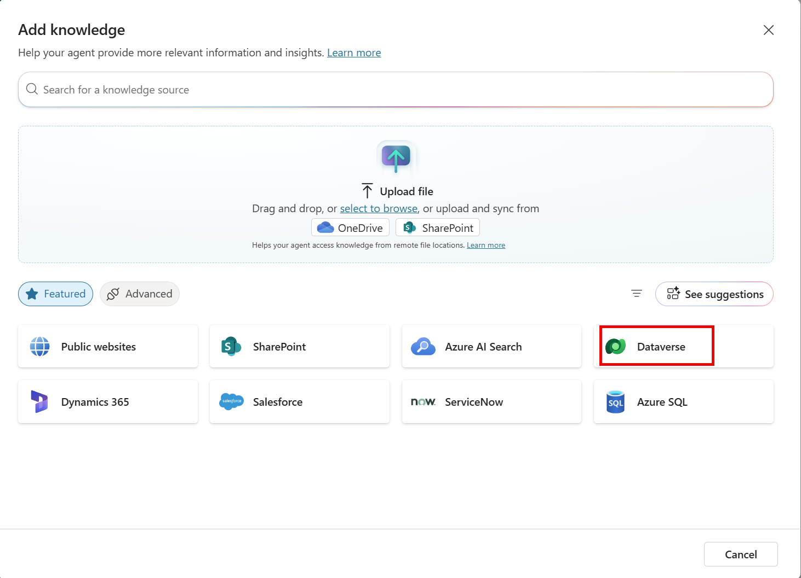

4. Tick the checkbox next to the **Real Estate Property** table and then click **Add to agent**.

   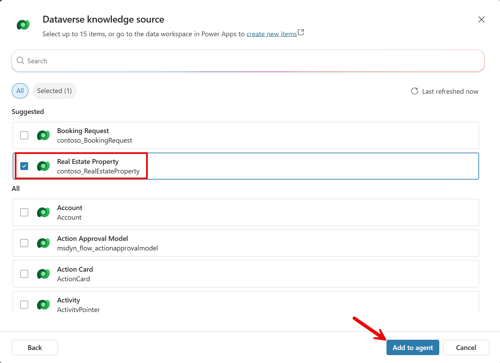

5. The newly added knowledge source should now be visible in the **Knowledge** section.

   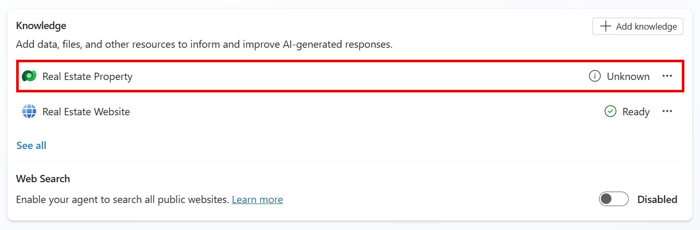

6. Leave the agent open if you plan to continue to the next task.

**✅ You have successfully added Dataverse as a knowledge source.**

### Task 4 – Add Knowledge from Files

>[!IMPORTANT]
> To complete this task, you must first download the [SummitRealtyCaseStudy.docx](/Assets/Lab-3/SummitRealtyCaseStudy.docx) case study file to your local machine. After clicking the hyperlink, select the **Download raw file** button to download it. Save the file to a location where you can easily find it, such as your Desktop or Downloads folder.

   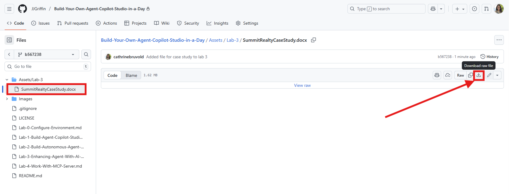

1. You should still be in the **Real Estate Booking Service** agent from the previous exercise. If not, navigate back to here, ensure the **Overview** tab is selected and that you have scrolled down to the **Knowledge** section.
2. Select **+ Add knowledge**.
3. On the **Add knowledge** dialog, click the **select to browse** hyperlink to locate and select your file or drag the **SummitRealtyCaseStudy.docx** file into the dialog.

   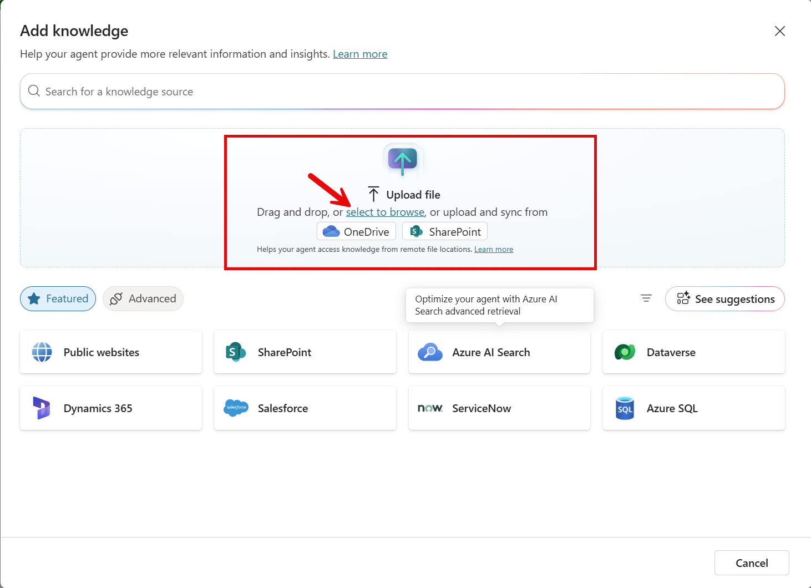

4. After uploading the file, on the **Upload files** dialog, click **Add to agent**.

   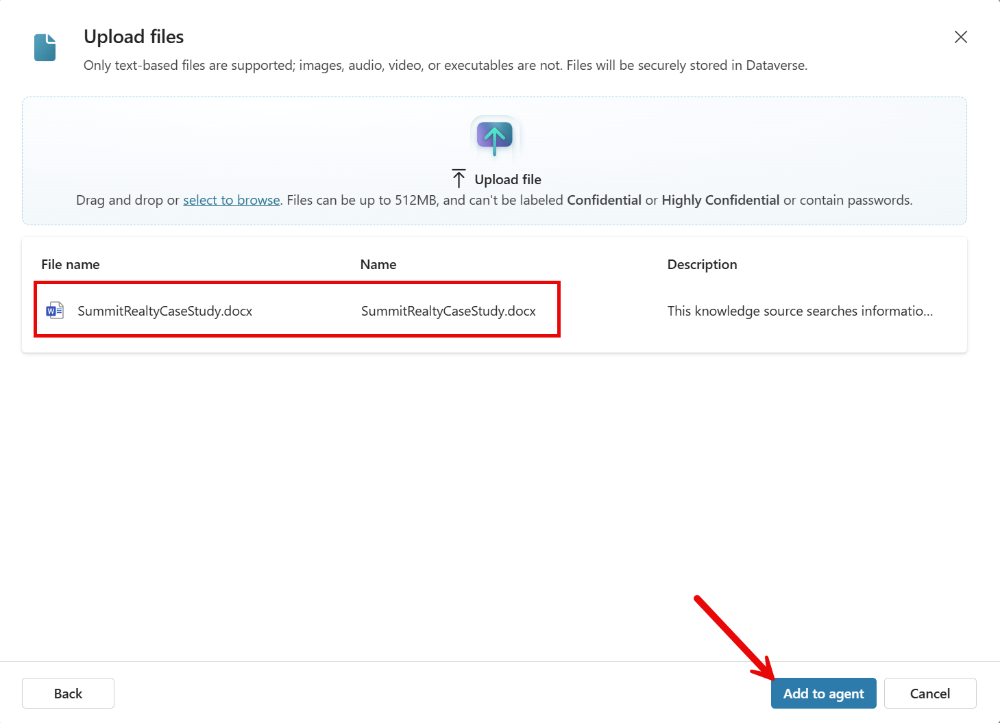

5. The newly added knowledge source should now be visible in the **Knowledge** section. For file uploads, it may take several minutes for the file to be indexed and become available as a knowledge source. Refresh the page as needed and monitor the status until it shows as **Ready**.

   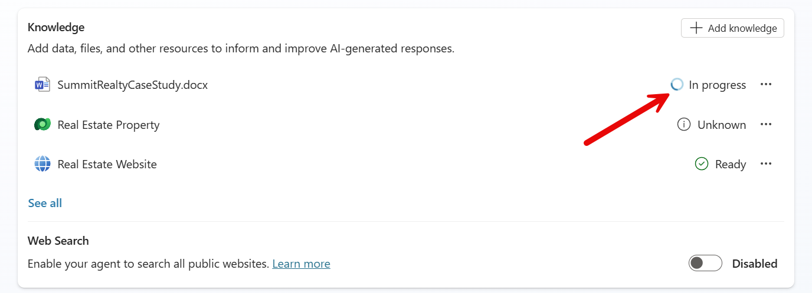

   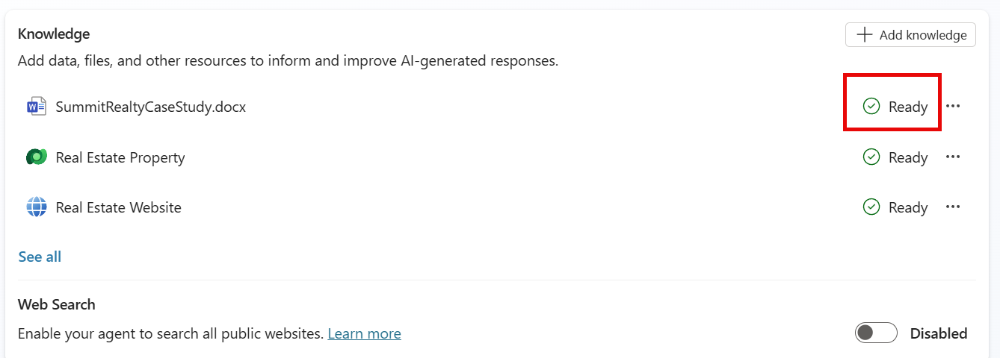

6. Leave the agent open if you plan to continue to the next task.

**✅ You have successfully added a file as a knowledge source.**

### Task 5 – Configure Security

To test our agent with our newly configured knowledge sources, we need to enable authentication again on the agent.

1. You should still be in the **Real Estate Booking Service** agent from the previous exercise. If not, navigate back to here and ensure the **Overview** tab is selected.
2. Select **Settings** (top-right), select the **Security** tab and then select **Authentication**.

   

3. Enable the **Authenticate with Microsoft** setting and then click on **Save**. Click on **Save** again if prompted.

   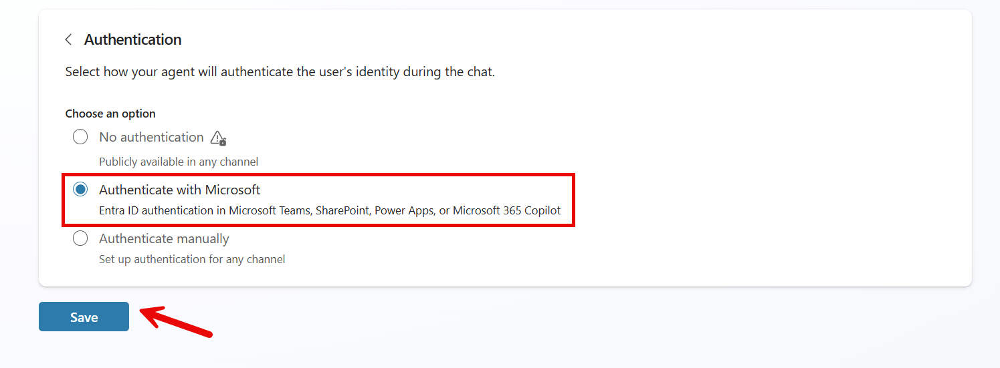

4. Close the **Settings** pane to return to the **Overview** tab.
5. Select **Publish** and then confirm by selecting **Publish** again. This may take several minutes to complete. Verify that the publish operation completes successfully.

   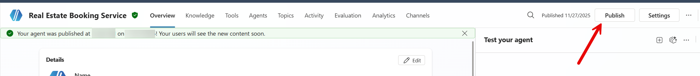

6. Leave the agent open if you plan to continue to the next task.

**✅ You have successfully enabled authentication and published your changes to the agent.**

### Task 6 – Test the Agent's Knowledge

1. You should still be in the **Real Estate Booking Service** agent from the previous exercise. If not, navigate back to here and ensure the **Overview** tab is selected.
2. Open the test pane by selecting **Test** (top-right). Ensure the **Show activity map when testing** setting is enabled by selecting the elipses (...) in the testing panel.

   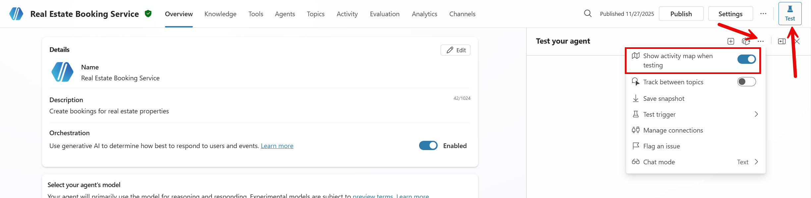

4. Start a new test session, type the following question and press **Enter**:

```
Can you tell me about the services offered by Summit Realty group?
```

   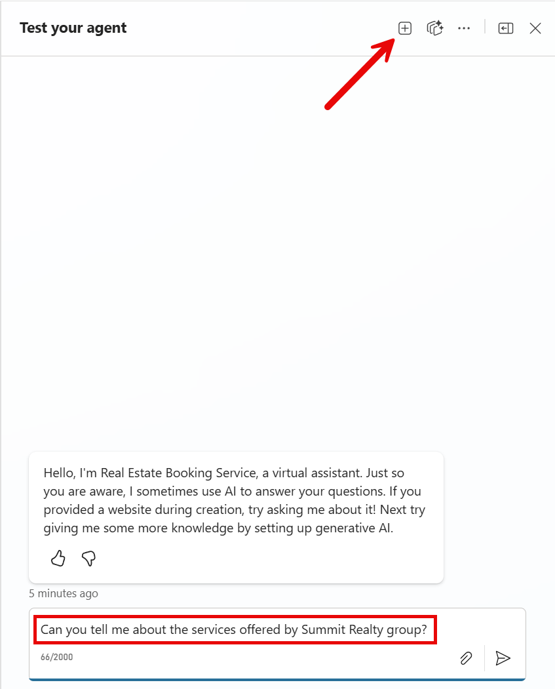

5. Verify that the response is generated based on the content from the uploaded **SummitRealtyCaseStudy.docx** file. If the response has valid citations and then activity map shows that the answer was generated using the file knowledge source, the test is successful.

   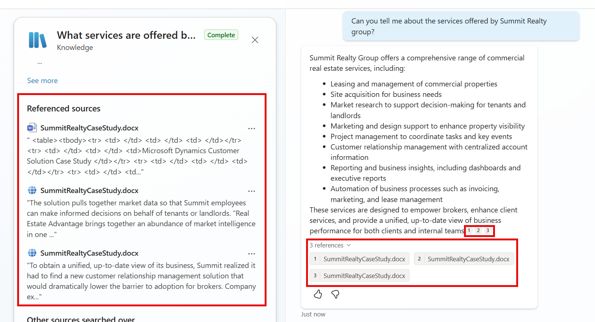

6. Close the test pane.

**✅ You have successfully tested the agent's knowledge capabilities.**

### Summary

In this lab, you have learned how to: 

- Use entities and slot filling  
- Implement tools to connect to Dataverse  
- Add multiple knowledge sources  

**Congratulations, you've finished Lab 3** 🥳