# Lab 4 – Consume and Work with an MCP Server in Copilot Studio

In this lab, you will learn how to enable and work with the [Dataverse Model Context Protocol (MCP) server](https://learn.microsoft.com/en-us/power-apps/maker/data-platform/data-platform-mcp) in Copilot Studio. You will add the MCP server as a tool in your Real Estate Booking Agent and test the integration by querying booking data.

## Lab Overview

> [!IMPORTANT]
> Microsoft Copilot Studio is a constantly evolving product, with two major releases each year and many incremental updates throughout each calendar year. Whilst every effort has been made to ensure the accuracy of these steps and all screenshots, from time to time, certain instructions or screenshots may no longer resemble the current interface or experience. In case of any issues completing any step, please consult your instructors.

MCP is becoming the primary method for AI to Dataverse communication. MCP servers implement [the open MCP protocol](https://modelcontextprotocol.io/docs/getting-started/intro), which standardises how applications provide context to LLMs from AI Agents.

MCP servers enable:

- A growing list of pre-built integrations an LLM can directly use  
- Flexibility to switch between LLM providers  
- Best-practice patterns for securing data inside your environment  
- Schema validation reducing the need to map output data to fields and tables.
- CRUD (Create, Read, Update and Delete) functionality on data sources.
- Removing the need for Power Automate cloud flows, which often was used to complete CRUD operations. 

By completing this exercise, you will understand how Copilot Studio agents can call Dataverse using MCP, how to enable the server in the [Power Platform Admin Center (PPAC)](https://admin.powerplatform.microsoft.com/), and how to add Dataverse as a tool that your **Real Estate Booking Agent** can use to query availability, create bookings, and manage customer data.

### 🎯 Goal

- Enable the **Dataverse MCP server**  
- Add the MCP Server as a Tool in an agent and connect the agent directly to the MCP server  
- Test the integration by requesting booking data information

### ✅ Prerequisites

- Completion of [Lab 0](./Lab-0-Configure-Environment.md), [Lab 1](./Lab-1-Build-Agent-Copilot-Studio.md), [Lab 2](./Lab-2-Build-Autonomous-Agent.md), and [Lab 3](./Lab-3-Enhancing-Agent-With-AI-Capabilities.md)

### Scenario

You are continuing your work as a developer for a real estate company that has built a Real Estate Booking Agent in Copilot Studio. The agent currently uses connectors to find information about bookings and to create new bookings, but you want to enhance its capabilities by integrating it with the Dataverse MCP server. This will allow the agent to directly execute all operations via a single tool, improving performance and reliability.

### ⌛ Length

This lab takes approximately 30 minutes to complete.

---

## Exercise 1 – Work with Dataverse for MCP Servers 

### Task 1 – Enable MCP clients to interact with Dataverse

To work with the Dataverse MCP server, it has to be enabled in PPAC within your **Development** environment.

1. Open a new browser tab, navigate to the [Power Platform Admin Center](https://admin.powerplatform.microsoft.com) and then select **Manage**.

   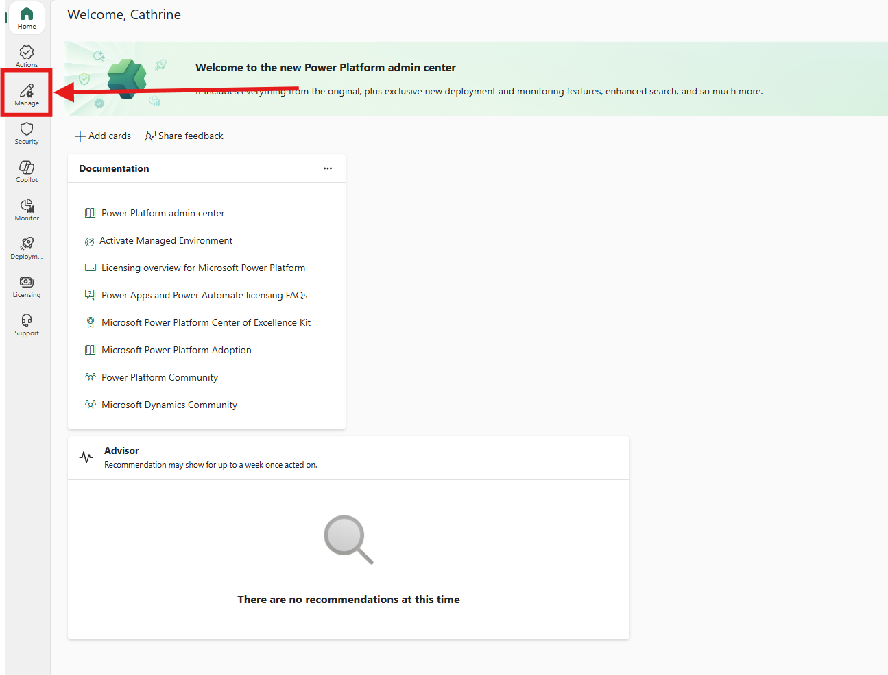

2. Select your **Development** environment.

   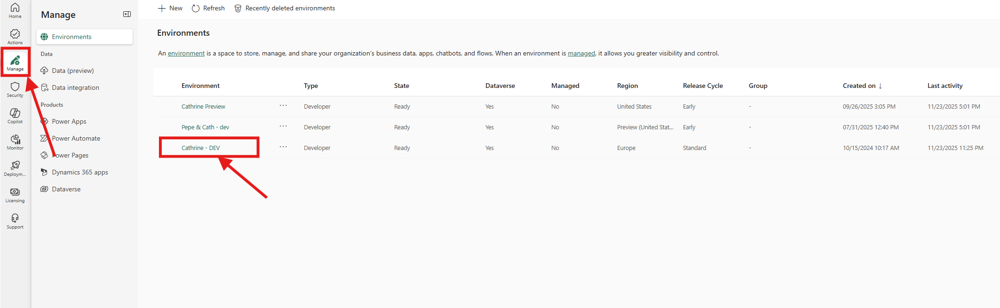

3. Select **Settings**.

   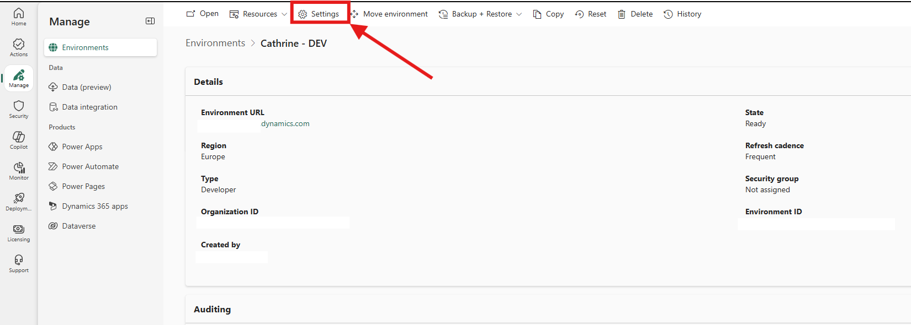

4. Select **Product** and then **Features**.

   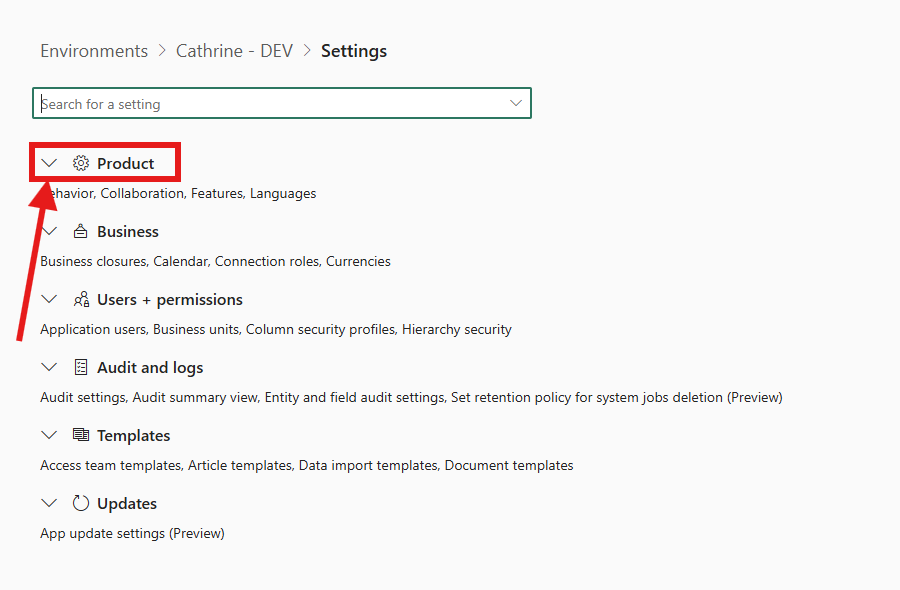

   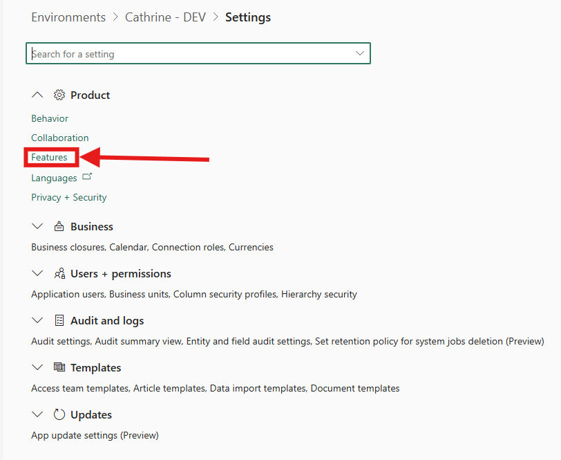

5. Scroll down until you see the **Dataverse Model Context Protocol** section and make that the **Step 1: Decide whether or not you’ll allow MCP client accesss** setting is checked.

   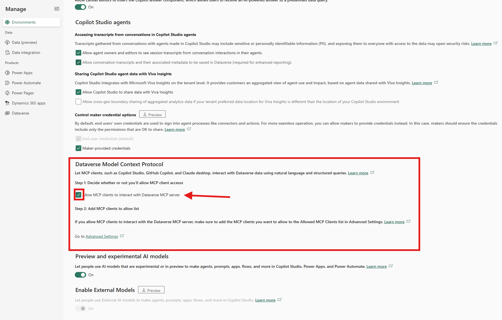

> [!NOTE]
> Copilot Studio is already a valid client, but you can decide what clients should be approved to be used for the Dataverse MCP Endpoint by going into **Advanced Settings** under step 2.

6. Click **Save** to apply any changes.

   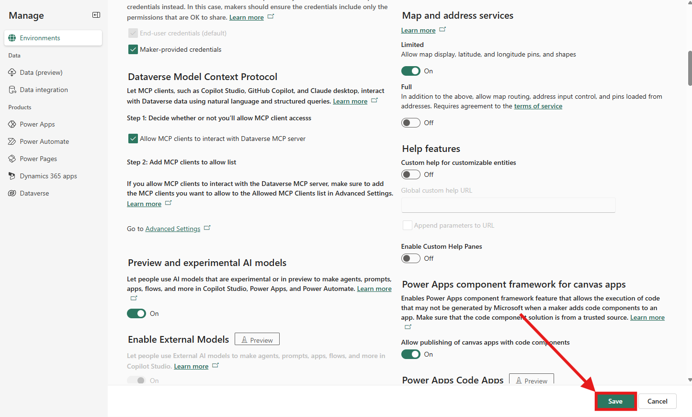

7. Close the current browser tab.

**✅ You have now successfully verified and enabled the Dataverse MCP Server in PPAC**

### Task 2 – Add Dataverse MCP Server as a Tool

1. Open a new browser tab and navigate to [Copilot Studio](https://copilotstudio.microsoft.com/). Sign in if prompted.
2. Select the **Real Estate Booking Service** agent, and then click on **Tools** in the navigation bar.

   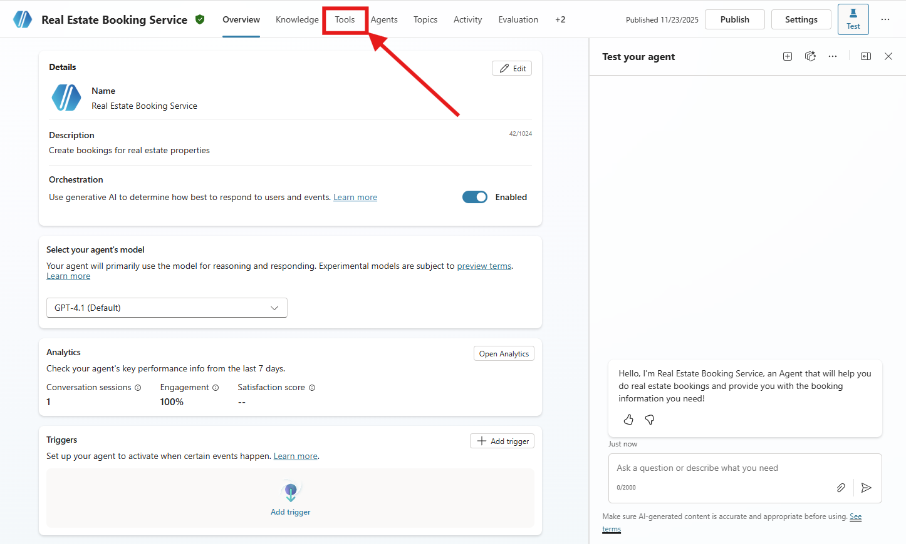

3. Select **+ Add new tool**.

   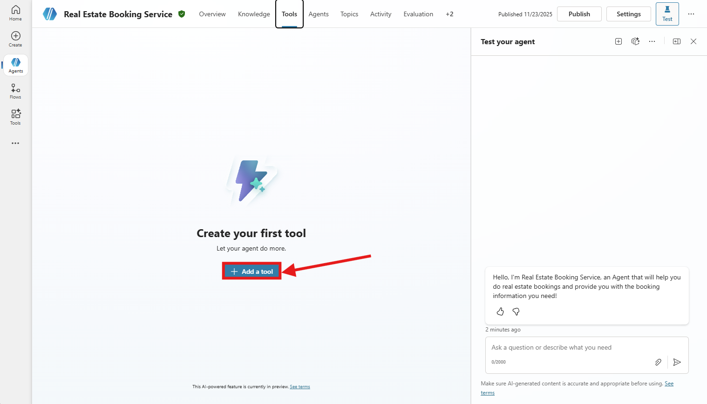

4. Select the filter option for **Model Context Protocol**.

   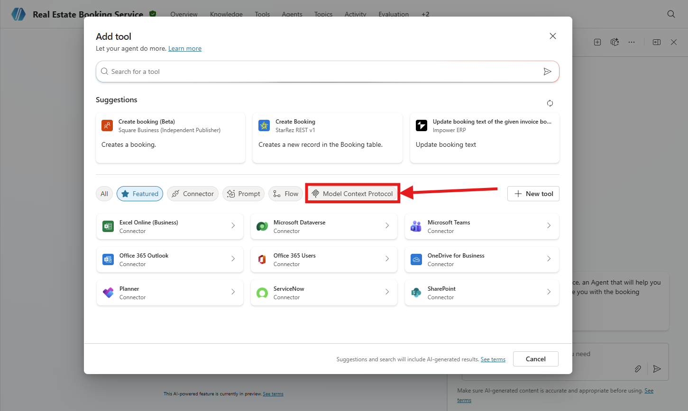

5. Choose the option for **Dataverse MCP Server** in the list of MCP servers

   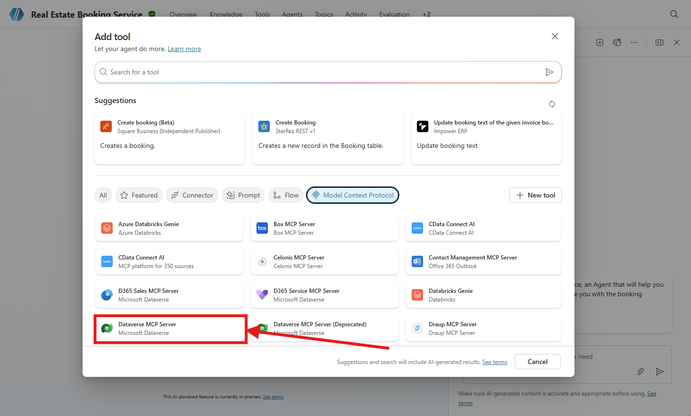

> [!IMPORTANT]
> Do **NOT** select the **Dataverse MCP Server (Deprecated)** tool.

6. Select **Not connected** -> **Create new connection** if there isn't a connection showing up already and/or verify that the connection being used is the correct one before clicking **Add and configure**

   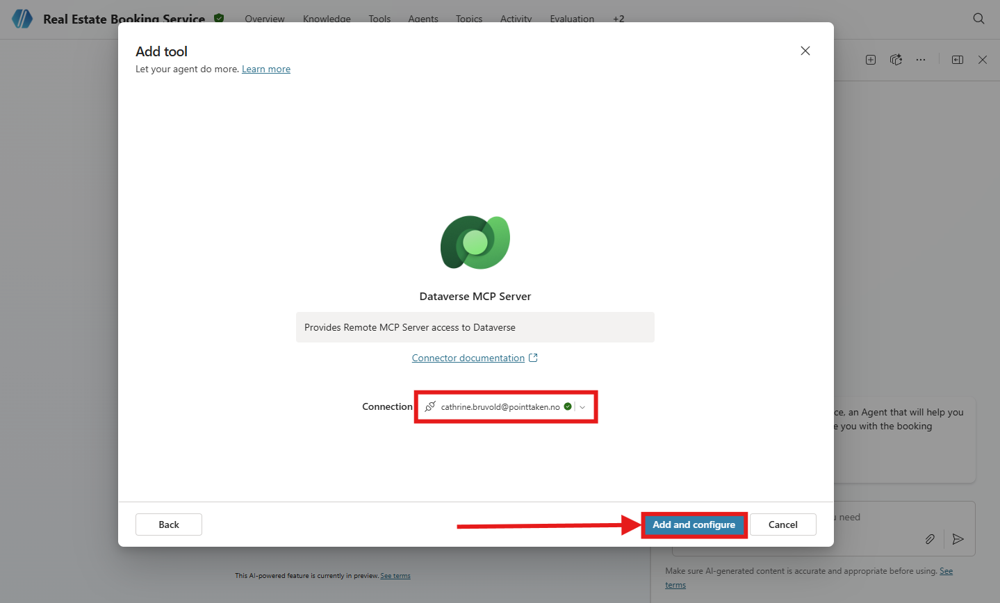

7. Wait for the Dataverse MCP Server tool to be added and scroll down to **Tools**. **Deselect** the toggle for enabling all tools related to the Dataverse MCP Server.

   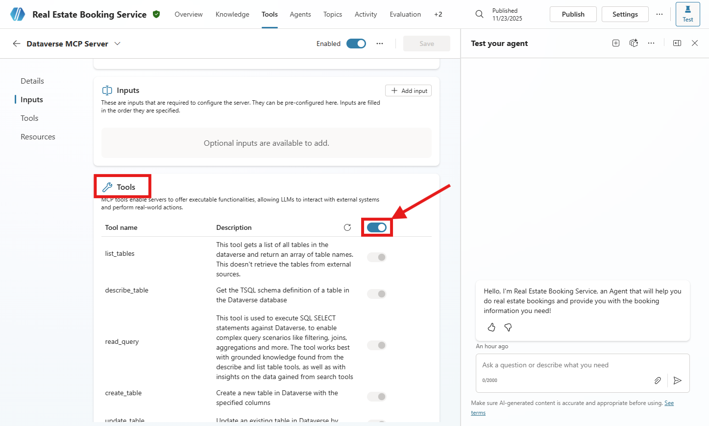

8. **Uncheck** the toggles for:
   - list_tables
   - describe_table
   - create_table
   - delete_table
   - delete_record

   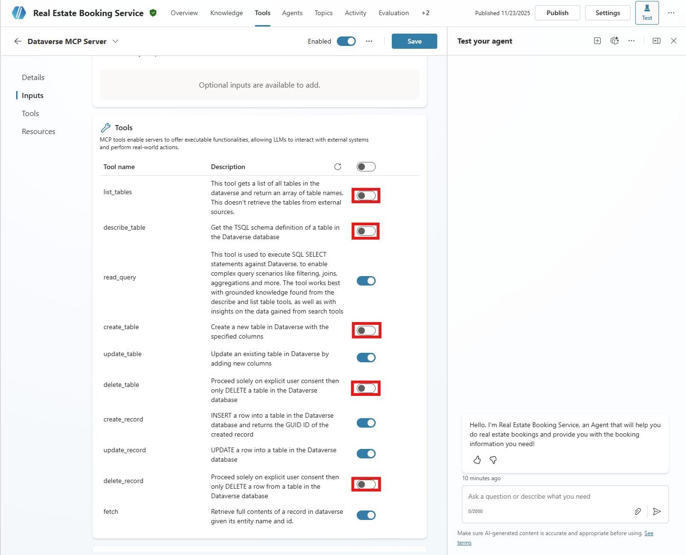

The below table shows what should be checked and unchecked:

| Tool             | Enable?    | Why                                       |
| ---------------- | ---------- | ----------------------------------------- |
| `read_query`     | ✔          | Query bookings, availability, customers   |
| `fetch`          | ✔          | Fetch details of a specific booking       |
| `create_record`  | ✔          | Create new booking requests               |
| `update_record`  | ✔          | Change booking status, time               |
| `search`         | ⚠ Optional | Useful for quick lookups by name or phone |
| `list_tables`    | ❌          | Not needed for a user-facing agent        |
| `create_table`   | ❌          | Not needed for a user-facing agent        |
| `describe_table` | ❌          | Prevents schema exposure                  |
| `delete_record`  | ❌          | Avoid risk of accidental deletion         |
| `delete_table`   | ❌          | Not needed for a user-facing agent        |
| Schema tools     | ❌          | Never needed                              |


9. **Save** the changes and leave this page open if you want to continue with the next task

   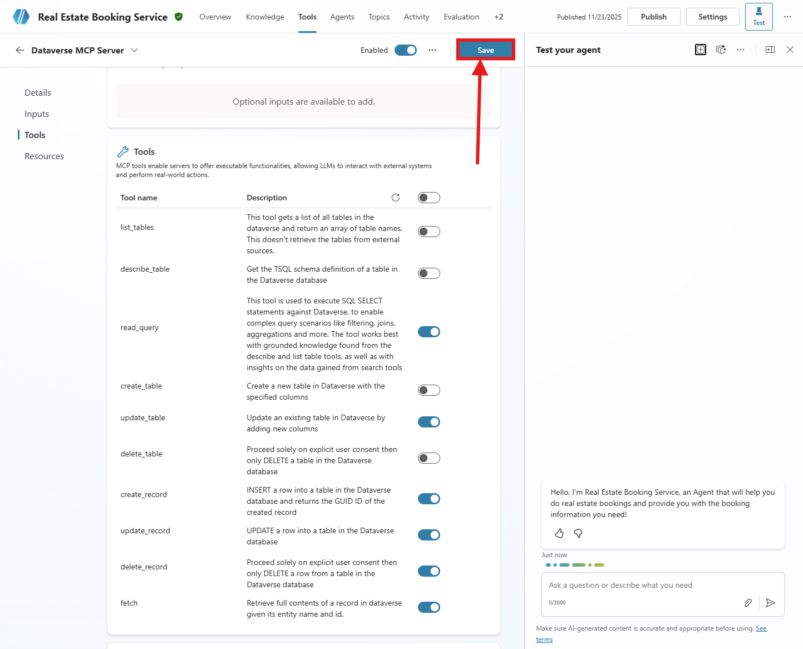

**✅ The MCP server is now added as a tool for the Booking agent**

### Task 3 – Test the Agent and update the instructions

1. You should still have the **Real Estate Booking Service** agent open in Copilot Studio. If not, navigate back to here.
2. Open the **Test** panel, type in the following message and hit the **Enter** key to send it:

```
Can you tell me about the booking BR-1000?
```

3. Review the agents response. It will likely respond with something *not* related the booking you have requested to find; that's because, currently, the instructions *aren't* very clear on how the agent should use the tool.

   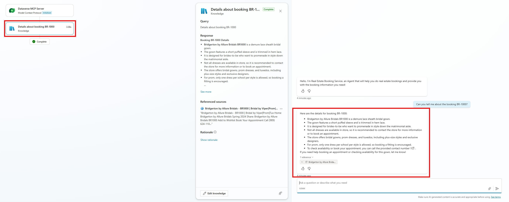

> [!NOTE]
> You may need to **Allow** the agent to use the MCP tool if prompted.

4. Let's rectify this by updating the instructions. First, click on **Overview**.

   

5. Locate the **Instructions** section and click **Edit**.

   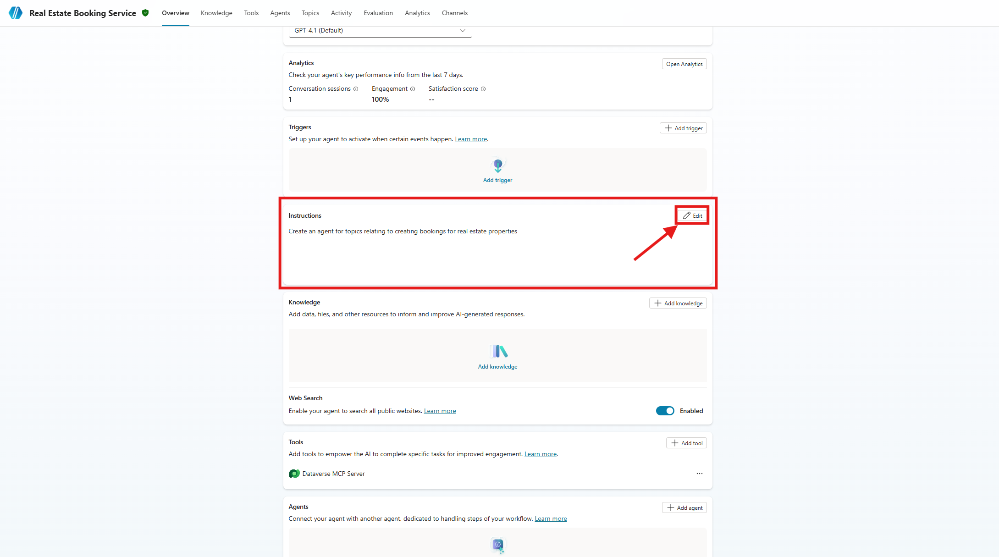

6. In the **Instructions**, clarify exactly how the agent should work with the user input and response. Paste the below prompt and instructions in the **Instructions text box** before clicking **Save**. 

```
When a user is asking about bookings, then check the Booking Request (contoso_bookingrequest) data table in Dataverse to find information.

Always use the Dataverse MCP Server as the authoritative source for all booking-related questions or actions. 
When the user asks about bookings, availability, customers, properties, or status, translate their intent into the correct MCP query or CRUD operation.

Users may use synonyms or partial matches for field names (e.g., “reservation”, “order”, “request”, “property”, “client”). 
If a word could map to multiple fields, ask the user to confirm which field they meant before executing the MCP operation.

Never guess values. If required parameters are missing, ask a clarifying question.
Never expose system fields such as GUIDs, timestamps, owner IDs, created/modified fields, or internal schema names. 
Return only business-friendly data.

If the user requests to view, update, create, or delete booking data, always perform the action through the MCP server and summarize the results cleanly.


### DON’T
- Don’t answer booking questions based on internal reasoning alone.
- Don’t use general web knowledge for anything related to bookings.
- Don’t assume field names—rely strictly on the Dataverse MCP schema 
```

> [!IMPORTANT] 
> There is one line explaining that if the agent is unsure, it should verify by asking questions rather than assuming or saying it can't find the requested information. The instructions also highlights what the agent is **not** supposed to do. The instructions are guidelines and important to the Agent in order for it to understand how to work with the data.

   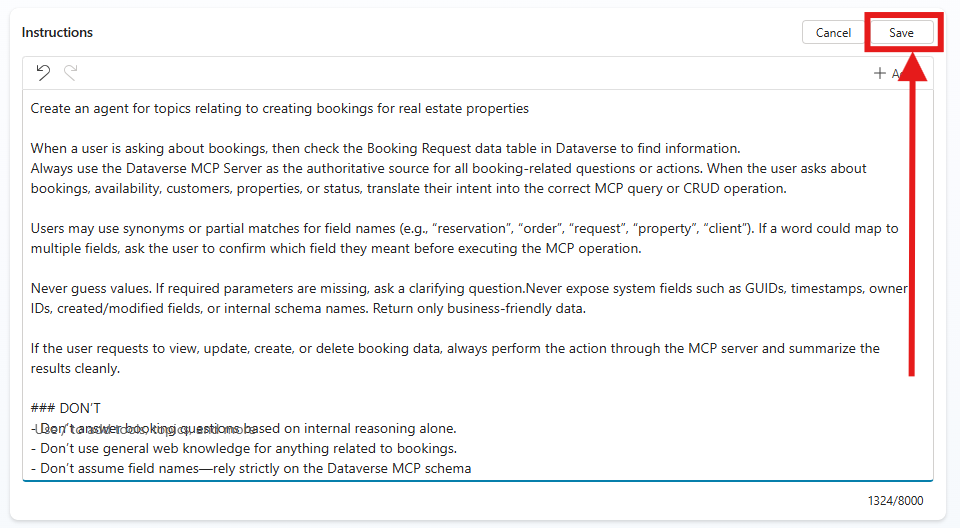

7. On the test panel, select the **Plus** icon to start a new test session.

   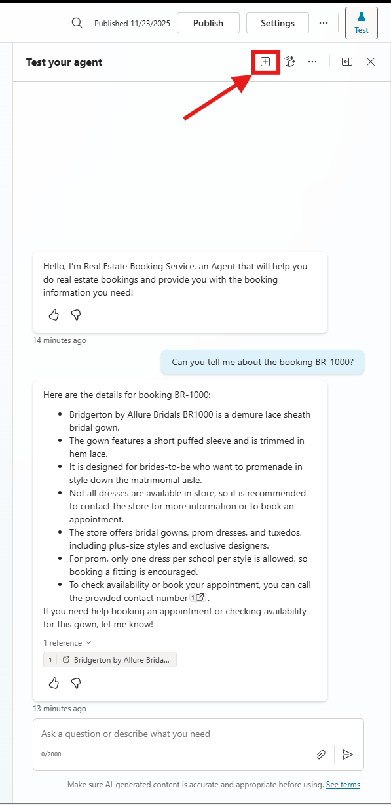

8. Type in the following message and hit the **Enter** key to send it.

```
Can you find booking information on BR-1000?
```

9. You can follow the reasoning of the Agent while its working. 

   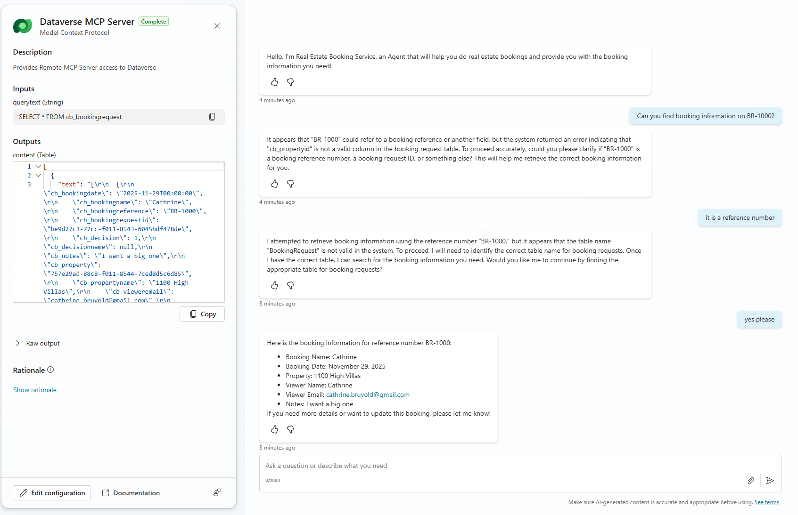

10. You will (most likely) be asked to verify what **BR-1000** could be related to or what table it belongs to. So, in order to help the agent recognise the format of the **booking reference**, navigate back to the **Overview** tab and specify the correct format for the reference number.

   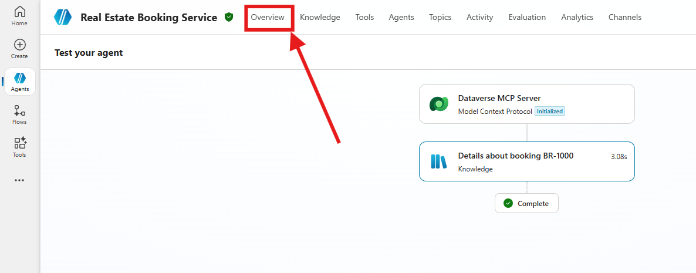

11. Locate the **Instructions** section and click **Edit**
12. In the **Instructions** add the below information to clarify the format of the reference number. Paste the below prompt and instructions in the **Instructions text box** before clicking **Save**.

```
The Booking Reference will follow the format of "BR-1000", so you can recognize the input in that format as the Booking Reference number linked to a Booking Request.
```

   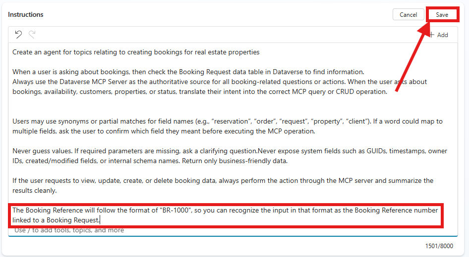

11. Go back to the **Test** panel, start a **new test session**, type in and send the following:

```
Can you find booking information on BR-1000?
```

   

12. The Agent was now able to find the information quickly without trying to verify what the input was.

**✅ You have now successfully confirmed the agent works with the newly added MCP Server**

### Summary

In this lab, you have learned how to: 

- Enable the Dataverse MCP server in Power Platform Admin Center
- Add the MCP server as a tool in your Real Estate Booking Agent
- Test the integration by querying booking data and updating the agent instructions to work effectively with the MCP server

**Congratulations, you've finished Lab 4** 🥳